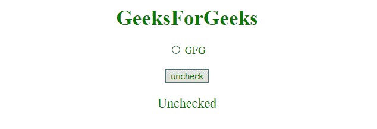

# 如何使用 JavaScript/jQuery 取消选中一个单选按钮？

> 原文:[https://www . geesforgeks . org/how-uncheck-a-radio-button-use-JavaScript-jquery/](https://www.geeksforgeeks.org/how-to-unchecked-a-radio-button-using-javascript-jquery/)

为了取消选中一个**单选按钮**，有很多方法可用，但我们将看到最首选的方法。

**示例 1:** 本示例通过使用 **Javascript checked** 属性取消选中**单选按钮**。JavaScript 单选按钮选中属性用于设置或返回输入单选按钮的选中状态。此属性用于反映 HTML 选中的属性。

```
<!DOCTYPE html> 
<html> 
    <head> 
        <title> 
            JavaScript | uncheck a radio button
        </title> 
    </head> 

    <body style = "text-align:center;" id = "body"> 

        <h1 style = "color:green;" > 
            GeeksForGeeks 
        </h1> 

        <input id = "radio" type="radio" name="GFG"
                value="GeeksForGeeks" checked>GFG

        <br><br>

        <button onclick = "gfg_Run()"> 
            uncheck
        </button>

        <p id="GFG_DOWN" style="color:green;font-size:20px;"></p>

        <script>
            var el_down = document.getElementById("GFG_DOWN");

            function gfg_Run() {
                var radioButton = document.getElementById("radio");
                radioButton.checked = false;
                el_down.innerHTML = "Unchecked";
            }
        </script> 
    </body> 
</html>                    
```

**输出:**

*   **点击按钮前:**
    
*   **点击按钮后:**
    

**示例 2:** 本示例使用 **[jQuery prop()方法](https://www.geeksforgeeks.org/jquery-prop-with-examples/)** 取消选中**单选按钮**。jQuery 中的 prop()方法，用于设置或返回所选元素的属性和值。

```
<!DOCTYPE html>  
<html>  
    <head> 
        <title> 
            JQuery | Uncheck a radio button
        </title>

        <script src=
"https://ajax.googleapis.com/ajax/libs/jquery/3.4.0/jquery.min.js">
        </script>
    </head> 

    <body style = "text-align:center;" id = "body">  

        <h1 style = "color:green;" >  
            GeeksForGeeks  
        </h1> 

        <input id = "radio" type="radio" name="GFG" 
                value="GeeksForGeeks" checked>GFG

        <br><br>

        <button onclick = "gfg_Run()"> 
            uncheck
        </button>

        <p id="GFG_DOWN" style="color:green;font-size:20px;"></p>

        <script>
            var el_down = document.getElementById("GFG_DOWN");

            function gfg_Run() {
                $("#radio").prop("checked", false);
                el_down.innerHTML = "Unchecked";
            }
        </script> 
    </body>  
</html>
```

**输出:**

*   **点击按钮前:**
    
*   **点击按钮后:**
    