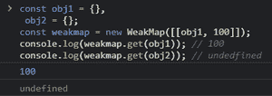
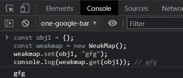
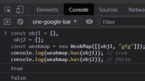

# 如何理解 JavaScript 中的 WeakMap？

> 原文:[https://www . geesforgeks . org/如何理解-weakmap-in-javascript/](https://www.geeksforgeeks.org/how-to-understand-weakmap-in-javascript/)

WeakMap 对象存储键/值对。键应该是对象，值也可以是任何东西。在 JavaScript 中，一个映射 API 可以用两个数组来设计，一个用于键，一个用于由四个 API 函数共享的值。在这个映射上设置部分需要同时在每个数组的顶部插入一个键和值。因此，键和值索引将对应于每个数组。

若要从映射中获取值，请遍历所有键，直到找到匹配项，然后使用该匹配项的索引从值数组中提取相关项。Map 和 key 之间的优势在于，key 应该是对象，并且只能被 debile 引用。这表明，如果没有任何额外的对键的健壮引用，垃圾收集器可以删除 WeakMap 中的部分。

**语法:**

```
new WeakMap([iterable])
```

**参数:**WeakMap 对象()接受一个参数，该参数可以是任何可迭代的对象。例如，包含作为双元素数组的键/值对的数组。

**示例 1:获取与键相关的值–**使用*。get()* 函数检索一个与键连接的值。如果没有值与键相关联，它将返回 undefined。

## java 描述语言

```
<script>
    const obj1 = {},
        obj2 = {};

    const weakmap = new WeakMap([[obj1, 100]]);

    // Printing values
    console.log(weakmap.get(obj1)); // 100
    console.log(weakmap.get(obj2)); // undedfined
</script>
```

**输出:**



**示例 2:在键上赋值–**使用*。set()* 功能为键赋值。它返回 WeakMap 对象，允许您使用 chain.set()命令。

## java 描述语言

```
<script>
    const obj1 = {};

    const weakmap = new WeakMap();
    weakmap.set(obj1, "gfg");

    // Printing value
    console.log(weakmap.get(obj1));
</script>
```

**输出:**



**示例 3:使用*键验证是否有元素–***。has() 功能可以想象一个带有精确键的元素是否存在于 WeakMap 中。如果出现，则返回真，否则返回假。

## java 描述语言

```
<script>
    const obj1 = {},
        obj2 = {};

    const weakmap = new WeakMap([[obj1, "gfg"]]);

    // Printing values
    console.log(weakmap.has(obj1)); // true
    console.log(weakmap.has(obj2)); // false
</script>
```

**输出:**



**示例 4:使用键删除一个**元素**–**要使用精确键删除一个元素，请使用*。删除()*方法。如果组件存在并被移除，则返回 true 否则，返回 false。

## java 描述语言

```
<script>
    const obj1 = {};

    const weakmap = new WeakMap([[obj1, "gfg"]]);

    // Printing values
    console.log(weakmap.delete(obj1)); // true
    console.log(weakmap.has(obj1)); // false
</script>
```

**输出:**

