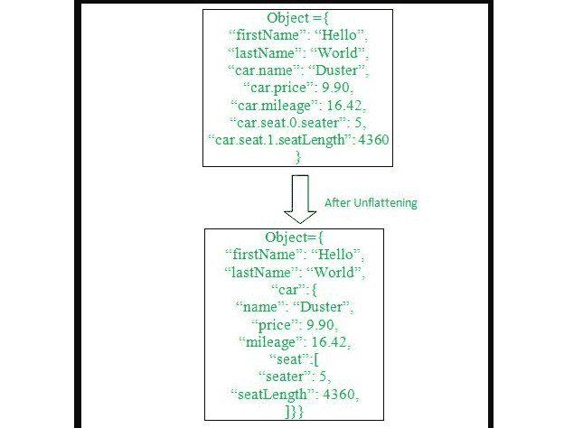

# 如何在 JavaScript 中用键的路径取消对象的标记？

> 原文:[https://www . geeksforgeeks . org/how-to-unfluent-一个带有 javascript 中键路径的对象/](https://www.geeksforgeeks.org/how-to-unflatten-an-object-with-the-paths-for-keys-in-javascript/)

在本文中，我们将学习如何用 JavaScript 中的键路径去标记一个对象，该对象中有一定数量的键-值对。

**问题陈述:**给你一个有几个键值对的对象。有些键在一个点之后有不同的键名，你基本上需要取消那个对象的标记。您可以实现一种路径，通过这种路径可以更容易地分别区分键及其值。

让我们借助下面的图画来理解。



对象未衰减

**方法:**我们首先需要声明一个对象，它最初会有不同的键值对。有几个键名，我们需要在包含特定键及其值的同一个主对象下隔离和显示。

例如，“car.seat.0.seater”表示 car 对象中的嵌套对象，该对象进一步是由“seater”键在其对应于其值的第一索引处组成的数组。

让我们首先试着理解如何创建一个在 JavaScript 中有几个键值对的对象。

**示例 1:** 以下代码片段将帮助我们创建一个对象。

## java 描述语言

```
<script> 
 let object = {
    "firstName": "Hello",
    "lastName": "World",
    "car.name": "Duster",
    "car.price": 9.9,
    "car.mileage": 16.42,
    "car.seat.0.seater": 5,
    "car.seat.1.seatLength": 4360,
  };
  console.log(object);
 </script>
```

**输出:**

```
{
  'firstName': 'Hello',
  'lastName': 'World',
  'car.name': 'Duster',
  'car.price': 9.9,
  'car.mileage': 16.42,
  'car.seat.0.seater': 5,
  'car.seat.1.seatLength': 4360
}
```

在创建了具有几个键值对的对象之后，现在我们将分析我们可以通过哪些方法来实现未被关注的对象。以下是实现上述目标的一些方法。

**方法 1:**

*   在这种方法中，我们将使用 [for-in](https://www.geeksforgeeks.org/javascript-for-in-loop/) 循环，该循环将遍历我们的对象，此后我们将把我们的键存储在一个变量中，每当我们遇到一个点时，我们将使用 [**split()**](https://www.geeksforgeeks.org/javascript-string-prototype-split-function) 方法来获得所有的键名。
*   我们将使用 [reduce()](https://www.geeksforgeeks.org/javascript-array-reduce-method/) 方法，该方法将帮助我们在将字符串转换为数字后检查下一个键是否是数字。
*   然后我们将使用 [JSON.stringify()](https://www.geeksforgeeks.org/javascript-json-stringify-method/) 方法，该方法将通过将对象的所有值转换为相应的字符串值来帮助我们更有效地打印我们的对象。

## java 描述语言

```
<script>
  let object = {
    firstName: "Hello",
    lastName: "World",
    "car.name": "Duster",
    "car.price": 9.9,
    "car.mileage": 16.42,
    "car.seat.0.seater": 5,
    "car.seat.0.seatLength": 4360,
  };

  let unflattenObject = (data) => {
    let result = {};
    for (let i in data) {
      let keys = i.split(".");
      keys.reduce((acc, value, index) => {
        return (
          acc[value] ||
          (acc[value] = isNaN(Number(keys[index + 1]))
            ? keys.length - 1 === index
              ? data[i]
              : {}
            : [])
        );
      }, result);
    }
    return result;
  };
  console.log(JSON.stringify(
    unflattenObject(object), null, 4));
</script>
```

**输出:**

```
{
    "firstName": "Hello",
    "lastName": "World",
    "car": {
        "name": "Duster",
        "price": 9.9,
        "mileage": 16.42,
        "seat": [
            {
                "seater": 5,
                "seatLength": 4360
            }
        ]
    }
}
```

**方法 2:**

*   在这种方法中，我们将首先迭代我们的对象，并且每当任何键名后面有一个点时，也使用 *split()* 方法。
*   在循环分割后获得的子串时，我们将首先检查下一个子串是否是数字。
*   如果它不是一个数字，那么它将代表一个对象的键名之一，否则它是一个数组的索引，因此我们将相应地在一个空对象或一个空数组中添加我们的值。

## java 描述语言

```
<script> 
 let object = {
    firstName: "Hello",
    lastName: "World",
    "car.name": "Duster",
    "car.price": 9.9,
    "car.mileage": 16.42,
    "car.seat.0.seater": 5,
    "car.seat.0.seatLength": 4360,
  };
  let unflatten = (obj) => {
    let result = {},
      temp,
      substrings,
      property,
      i;
    for (property in obj) {
      substrings = property.split(".");
      temp = result;
      for (i = 0; i < substrings.length - 1; i++) {
        if (!(substrings[i] in temp)) {
          if (isFinite(substrings[i + 1])) {
            temp[substrings[i]] = [];
          } else {
            temp[substrings[i]] = {};
          }
        }
        temp = temp[substrings[i]];
      }
      temp[substrings[substrings.length - 1]] = obj[property];
    }
   return result;
  };
 console.log(JSON.stringify(unflatten(object), null, 4));
</script>
```

**输出:**

```
{
    "firstName": "Hello",
    "lastName": "World",
    "car": {
        "name": "Duster",
        "price": 9.9,
        "mileage": 16.42,
        "seat": [
            {
                "seater": 5,
                "seatLength": 4360
            }
        ]
    }
}
```