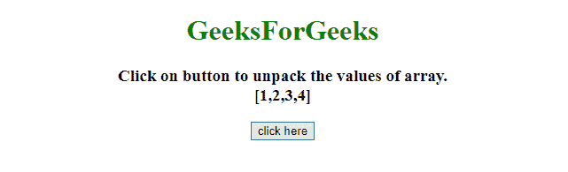
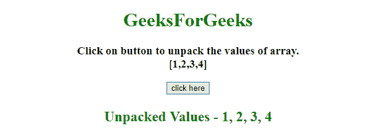

# 如何用 JavaScript 将数组元素解包成单独的变量？

> 原文:[https://www . geesforgeks . org/如何使用 javascript 将数组元素解包为单独的变量/](https://www.geeksforgeeks.org/how-to-unpack-array-elements-into-separate-variables-using-javascript/)

给定一个数组，任务是通过使用 javascript 的首选方法将数组的值解包到单独的变量中。

**进场:**

*   将数组的元素存储到数组变量中。
*   现在使用 ES6 脚本来声明一个变量，并将数组的值解包到单独的变量中。

**示例 1:** 本示例使用 let 关键字声明一个变量，将数组元素解包为单独的变量。

```
<!DOCTYPE HTML> 
<html> 

<head> 
    <title> 
        How to unpack array elements into separate
        variables using JavaScript ?
    </title>
</head> 

<body style = "text-align:center;"> 

    <h1 style = "color:green;" > 
        GeeksForGeeks 
    </h1>

    <p id = "GFG_UP" style = 
        "font-size: 19px; font-weight: bold;">
    </p>

    <button onclick = "GFG_Fun()">
        click here
    </button>

    <p id = "GFG_DOWN" style = 
        "color: green; font-size: 24px; font-weight: bold;">
    </p>

    <script>
        var el_up = document.getElementById("GFG_UP");
        var el_down = document.getElementById("GFG_DOWN");
        var ar = [1, 2, 3, 4];
        el_up.innerHTML = "Click on button to unpack the "
                + "values of array.<br> [" +ar + "]";

        function GFG_Fun() {
            let [a, b, c, d] = ar;
            el_down.innerHTML = "Unpacked Values - " + a +
                    ", " + b + ", " + c + ", " + d;
        }
    </script> 
</body> 

</html>
```

**输出:**

*   **点击按钮前:**
    
*   **点击按钮后:**
    

**示例 2:** 本示例使用 var 关键字声明一个变量，将数组元素解包为单独的变量。

```
<!DOCTYPE HTML> 
<html> 

<head> 
    <title> 
        How to unpack array elements into separate
        variables using JavaScript ?
    </title>
</head> 

<body style = "text-align:center;"> 

    <h1 style = "color:green;" > 
        GeeksForGeeks 
    </h1>

    <p id = "GFG_UP" style = 
        "font-size: 19px; font-weight: bold;">
    </p>

    <button onclick = "GFG_Fun()">
        click here
    </button>

    <p id = "GFG_DOWN" style = 
        "color: green; font-size: 24px; font-weight: bold;">
    </p>

    <script>
        var el_up = document.getElementById("GFG_UP");
        var el_down = document.getElementById("GFG_DOWN");
        var ar = [1, 2, 3, 4];

        el_up.innerHTML = "Click on button to unpack the"
                + " values of array.<br> [" +ar + "]";

        function GFG_Fun() {
            var [a, b, c, d] = ar;
            el_down.innerHTML = "Unpacked Values - " + a +
                    ", " + b + ", " + c + ", " + d;
        }
    </script> 
</body>

</html>
```

**输出:**

*   **点击按钮前:**
    
*   **点击按钮后:**
    