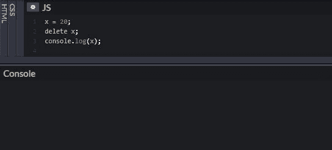
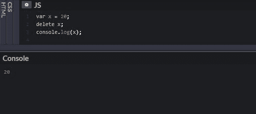

# 如何取消 JavaScript 变量的设置？

> 原文:[https://www . geesforgeks . org/how-unset-JavaScript-variables/](https://www.geeksforgeeks.org/how-to-unset-javascript-variables/)

要知道如何取消变量设置，我们必须先知道什么是 JS 变量，以及如何声明变量。JavaScript 变量是存储数据值的容器。可以使用“var”关键字声明变量。

**示例:**

```
var x = 5;
```

在上面的代码声明中，值 5 被赋给了变量“x”。变量的不设置意味着一旦它在代码中的目的实现了，就销毁它。

**这里出现了一个问题，一旦 JavaScript 中的变量的工作完成，我们真的需要取消它们的设置吗？**
答案是‘不’。另外，应该记住，在全局范围内设置的变量不能被删除。建议在 JS 中使用 var 来声明变量，但是使用 **var** 关键字声明的属性也不能删除。但是，如果变量 x 是在没有使用' var '关键字的情况下定义的，那么使用这个方法删除它是可能的。

```
nxt = undefined;

// window is used in JS to access
//  the global variables
window.nxt = 'I am next'; 
delete window.nxt;
```

就内存管理而言，JavaScript 解释器执行自动垃圾收集来进行内存管理。垃圾收集器的工作是跟踪内存分配，并发现分配的内存何时不再需要，在这种情况下，内存将自动释放。**“垃圾收集器”**将程序员从对象销毁或重新分配的烦恼中解放出来。

此外，如上所述，变量不能在 JavaScript 中被销毁。那么，现在能做些什么呢？一些开发人员可能会建议使用“删除”，但删除操作符会从对象中移除属性。它不能移除变量。那么，在 JS 中最接近解除变量设置的方法是什么呢？

**我们不能不声明一个变量。然而，我们可以将其值设置为未定义的目的**

```
nxt = undefined;
```

**示例 1:** 本示例描述了在不使用 var 时删除关键词。

```
<script>
x = 20;
delete x;
console.log(x);
</script>
```

**输出:**


控制台中没有输出，因为在这种情况下 x 被删除了。但是，当 var 将用于声明 x 的值时，delete 函数将不起作用。

**例 2:** 使用 var 时删除不起作用。

```
<script>
var x = 20;
delete x;
console.log(x);
</script>
```

**输出:**

控制台会显示输出为 20。“var”已用于初始化 x 的值，因此“delete”函数在这种情况下将不起作用。