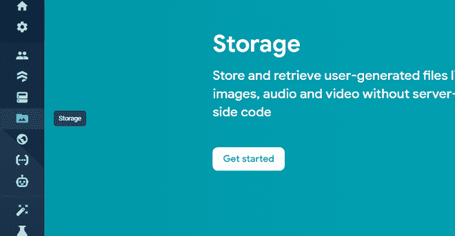
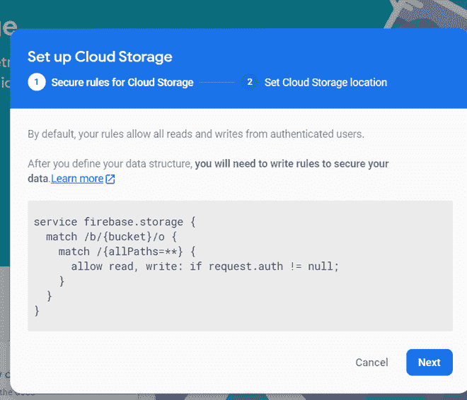
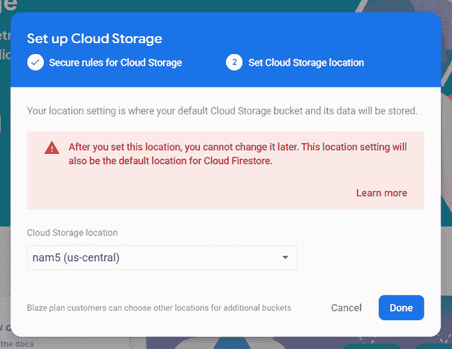
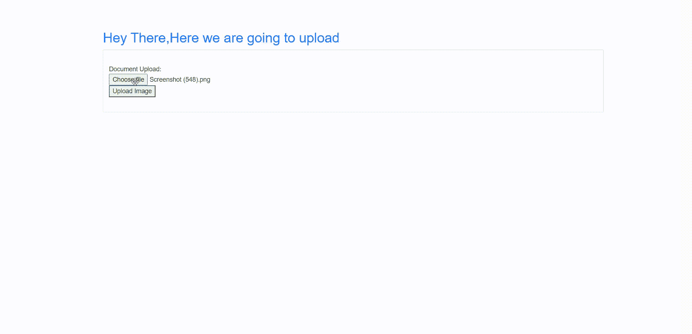
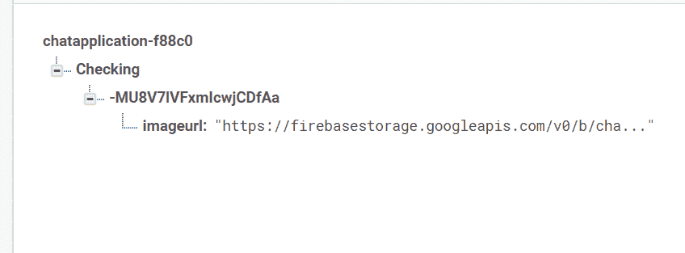

# 如何在 firebase 中使用 HTML 和 JavaScript 上传图片？

> 原文:[https://www . geesforgeks . org/如何使用 html 和 javascript 加载图像-in-firebase/](https://www.geeksforgeeks.org/how-to-upload-image-using-html-and-javascript-in-firebase/)

**Firebase** 是谷歌的一款产品，帮助开发者轻松构建、管理和开发他们的应用。它帮助开发者以更快、更安全的方式构建他们的应用程序。在 firebase 端不需要编程，这使得更有效地使用它的特性变得容易。它提供云存储。它使用 NoSQL 存储数据。

在这里，我们将学习如何在 firebase 中使用 HTML 和 JavaScript 上传图像。使用数据库时，我们可能还需要上传一个图像文件。

**分步实施**

**第一步:**如果你是新手，那么请参考[这个](https://www.geeksforgeeks.org/create-a-website-using-html-css-and-javascript-that-stores-data-in-firebase/)。

**激活火焰基地储存:**

点击左侧的存储按钮，点击**开始。**



之后，这个盒子会弹出来。点击**下一步**。



然后点击**完成**。



**第二步:**这里我们要写的是连接 Html 代码和 Firebase 数据库的 Html 和 JavaScript 代码。

## 超文本标记语言

```
<!DOCTYPE html>
<html lang="en">

<head>
    <meta charset="UTF-8">
    <title>Collecting Data</title>
    <link rel="stylesheet"
          href=
"https://cdn.jsdelivr.net/npm/bootstrap@4.5.3/dist/css/bootstrap.min.css"
          integrity=
"sha384-TX8t27EcRE3e/ihU7zmQxVncDAy5uIKz4rEkgIXeMed4M0jlfIDPvg6uqKI2xXr2"
          crossorigin="anonymous">

</head>

<body class="container"
      style="margin-top: 50px;
             width: 50% height:auto; ">

    <h2 class="text-primary"
        style="margin-left: 15px; margin-bottom: 10px">
              Hey There,Here we are going to upload
    </h2>
    <form class="container" id="contactForm">
        <div class="card">
            <div class="card-body">

                <div class="form-group"
                     style="margin-left: 15px;
                            margin-top: 10px;
                            display:none;>
    <label for=" exampleFormControlSelect1 ">Select Type</label>
    <select class="form-control " id="types ">
      <option>1</option>
    </select>
  </div>

<br>
    Document Upload:
    <br>
    <!-- click here to choose file -->
    <input type="file " name="files[] " id="files ">
    <!-- click here to upload file -->
    <input type="hidden "
           name="url "
           id="url ">   
           <button type="button " onclick="uploadimage() ">
               Upload Image
            </button>
           <br><br>
  </div>
</div>

<button type="submit "
        class="btn btn-primary "
        style="margin-left: 15px; margin-top: 10px; display:none; ">
                Submit
  </button>

</form>
</body>
<script src="https://www.gstatic.com/firebasejs/3.7.4/firebase.js ">
</script>
<script src=
"https://ajax.googleapis.com/ajax/libs/jquery/1.9.1/jquery.min.js ">
</script>

<link type="text/css " rel="stylesheet " href=
"https://cdnjs.cloudflare.com/ajax/libs/twitter-bootstrap/3.3.7/css/bootstrap.css " />

<script src=
"https://maxcdn.bootstrapcdn.com/bootstrap/3.3.7/js/bootstrap.min.js ">
</script>

<script>

 // adding firebase data
   var firebaseConfig = {
    apiKey: "*********************- ",
    authDomain: "-********************* ",
    databaseURL: "********************* ",
    projectId: "********************* ",
    storageBucket: "********************* ",
    messagingSenderId: "********************* ",
    appId: "********************* "
  };
  firebase.initializeApp(firebaseConfig);
  var messagesRef = firebase.database().ref('Checking');
  document.getElementById(
     'contactForm').addEventListener('submit', submitForm);
 //uploading file in storage
  function uploadimage(){
     var type = getInputVal('types');
  var storage = firebase.storage();
  var file=document.getElementById("files ").files[0];
  var storageref=storage.ref();
  var thisref=storageref.child(type).child(file.name).put(file);
  thisref.on('state_changed',function(snapshot) {

  }, function(error) {

 }, function() {
  // Uploaded completed successfully, now we can get the download URL
  thisref.snapshot.ref.getDownloadURL().then(function(downloadURL) {
    //getting url of image
    document.getElementById("url ").value=downloadURL;
    alert('uploaded successfully');
    saveMessage(downloadURL);
   });
  });

  // Get values
  var url = getInputVal('url');
  // Save message
  // saveMessage(url);
}
function getInputVal(id){
    document.getElementById('contactForm').reset();

}

// Function to get get form values
function getInputVal(id){
  return document.getElementById(id).value;
}

// Save message to firebase database
function saveMessage(url){
  var newMessageRef = messagesRef.push();
  newMessageRef.set({
   imageurl:url,
  });
}
</script>
</html>
```

编写完代码后，您可以在终端中使用下面的命令运行它

```
python manage.py runserver 
```

在这里，我们将在任何网络浏览器上运行后看到以下屏幕。

使用**选择文件**按钮选择图像后，我们可以选择任何文件，然后点击**上传图像**按钮在 firebase 中上传图像



在**实时数据库**中，我们可以看到图像上传成功。

