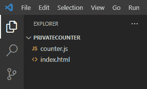

# 如何在 JavaScript 中使用闭包创建私有计数器？

> 原文:[https://www . geesforgeks . org/如何使用闭包来创建私有的 javascript 中的计数器/](https://www.geeksforgeeks.org/how-to-use-a-closure-to-create-a-private-counter-in-javascript/)

一个**闭包**是一个捆绑在一起的函数(封闭的)和对其周围状态(词法环境)的引用的组合。换句话说，闭包使您可以从内部函数访问外部函数的范围。

**示例:**这里，内部与外部形成闭合。 *str* 变量可以被称为私有成员，其值我们可以访问，但不能直接修改。

## java 描述语言

```html
<script>
    function outer() {
        let str = "GeeksforGeeks";
        function inner() {
            console.log(str);
        }
        return inner;
    }
    const fun = outer();
    fun();
</script>
```

**输出:**

```html
GeeksforGeeks
```

私有计数器的概念意味着我们不能公开/全局地直接修改计数器变量。下面的分步指南将教你如何实现一个带闭包的私有计数器并理解它。

**第一步:**创建 *counter.js* 和*index.html*文件。您可以给文件指定任何允许的名称。



**步骤 2:** 首先从*index.html*文件开始，创建一个前端来查看计数器。我们将创建一个<分区>来显示计数器的值和两个按钮，一个用于递增，另一个用于递减计数器。

## index.html

```html
<!DOCTYPE html>
<html lang="en">

<head>
    <!-- counter.js becomes available
    at execution time-->
    <script src="counter.js"></script>
</head>

<body>
    <h1 style="color: blue;">
        Private Counter using Closure
    </h1>

    <!-- This div displays the value of
    private counter-->
    <div id="counter_div" style=
        "margin-left: 5%; color: red;">

        <!-- Default value of counter is zero-->
        <h2>0</h2>
    </div>

    <!-- Buttons for incrementing and 
    decrementing the value of private counter-->
    <button onclick="counterHandler(this)" 
        value="1">
        Increment
    </button>

    <button onclick="counterHandler(this)" 
        value="0">
        Decrement
    </button>
</body>

</html>
```

这里我们使用 JavaScript 文件中的*计数器处理程序*函数来处理按钮点击。按钮的值帮助我们区分哪个按钮被点击了。并且有一个 div 的 *id* ，这样我们就可以用它来更新 JavaScript 代码。

**第三步:**让我们现在与一起工作 *counter.js* 文件并实现幕后功能。

## counter.js

```html
// Global function which would form
// closure with modify function
function counter() {

  // Private counter variable
  let count = 0;

  // To increment the value of counter
  function increment() {
    count++;
  }

  // To decrement the value of counter
  function decrement() {
    count--;
  }

  // Modify function forms closure
  // here which is used outside
  function modify(val) {

    // To check increment or decrement
    // button has been clicked
    if (val === "1") increment();
    else if (val === "0") decrement();

    // Return the counter
    return count;
  }

  // Returning to make it available
  // outside counter function
  return modify;
}

// Storing the closure modify
const closure = counter();

// This function handles the button
// click, objButton to get value
function counterHandler(objButton) {

  // Storing the value return by modify
  let count = closure(objButton.value);

  // Getting div by it's id
  // and modifying its inner html
  document.getElementById("counter_div")
    .innerHTML = "<h2>" + count + "</h2>";
}
```