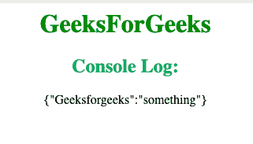

# 如何在 JavaScript 对象文字中为键使用变量？

> 原文:[https://www . geeksforgeeks . org/如何使用变量替换 javascript 中的键对象文字/](https://www.geeksforgeeks.org/how-to-use-a-variable-for-a-key-in-a-javascript-object-literal/)

在 ES5 和更早的版本中，不能在对象文本中使用变量作为属性名。唯一的选择是创建对象文字，为变量属性名赋值，并将结果对象传递给动画方法。ES6 将“计算属性名”定义为对象文字语法的一部分，这有助于将变量用作关键字。通过将表达式放在方括号中，可以在 ES6 中动态分配对象键。

**语法:**

```
var key="your_choice";
var object = {};
object[key] = "your_choice";
console.log(object);
```

**示例 1:** 这显示了如何为键使用变量。

```
<html>

<head>
    <title>
        How to use a variable for a
      key in a JavaScript object literal?
    </title>
</head>

<body style="text-align:center;">
    <h1 style="color:green;">  
GeeksForGeeks  
</h1>
    <script>
        var key = "Geeksforgeeks";
        var object = {};
        object[key] = "something";
        console.log(object);
    </script>
</body>

</html>
```

**输出:**
