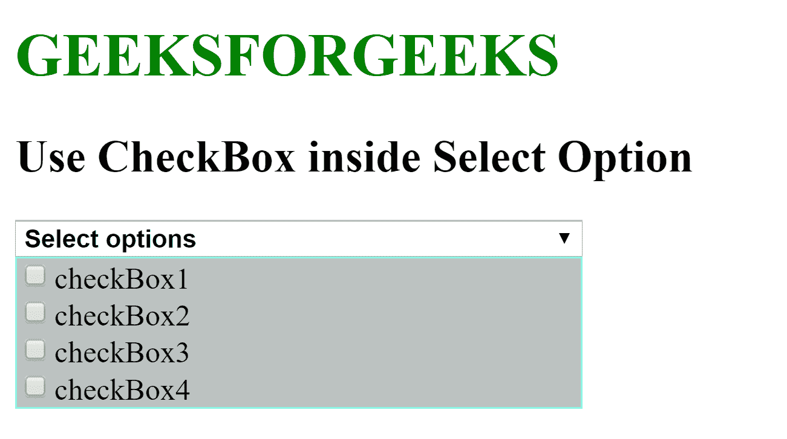

# 如何使用 JavaScript 在选择选项中使用复选框？

> 原文:[https://www . geesforgeks . org/使用方法-复选框-内部-选择-选项-使用-javascript/](https://www.geeksforgeeks.org/how-to-use-checkbox-inside-select-option-using-javascript/)

给定一个 HTML 文档，任务是使用 JavaScript 在选择选项中添加复选框。

**进场:**

*   创建一个显示“选择选项”的选择元素，并创建一个包含复选框和使用 CSS 样式的 div。
*   添加当用户单击包含 select 元素的 div 时调用的 javaScript 功能。

**语法:**

```html
function showCheckboxes() {
    var checkboxes = document.getElementById("checkBoxes");

    if (show) {
        checkboxes.style.display = "block";
        show = false;
    } else {
        checkboxes.style.display = "none";
        show = true;
    }
}
```

**完整代码:**

```html
<!DOCTYPE html>
<html>

<head>
    <title>
        How to use Checkbox inside Select 
        Option using JavaScript?
    </title>

    <style>
        h1 {
            color: green;
        }

        .multipleSelection {
            width: 300px;
            background-color: #BCC2C1;
        }

        .selectBox {
            position: relative;
        }

        .selectBox select {
            width: 100%;
            font-weight: bold;
        }

        .overSelect {
            position: absolute;
            left: 0;
            right: 0;
            top: 0;
            bottom: 0;
        }

        #checkBoxes {
            display: none;
            border: 1px #8DF5E4 solid;
        }

        #checkBoxes label {
            display: block;
        }

        #checkBoxes label:hover {
            background-color: #4F615E;
        }
    </style>
</head>

<body>
    <h1>GEEKSFORGEEKS</h1>

    <h2>Use CheckBox inside Select Option</h2>

    <form>
        <div class="multipleSelection">
            <div class="selectBox" 
                onclick="showCheckboxes()">
                <select>
                    <option>Select options</option>
                </select>
                <div class="overSelect"></div>
            </div>

            <div id="checkBoxes">
                <label for="first">
                    <input type="checkbox" id="first" />
                    checkBox1
                </label>

                <label for="second">
                    <input type="checkbox" id="second" />
                    checkBox2
                </label>
                <label for="third">
                    <input type="checkbox" id="third" />
                    checkBox3
                </label>
                <label for="fourth">
                    <input type="checkbox" id="fourth" />
                    checkBox4
                </label>
            </div>
        </div>
    </form>

    <script>
        var show = true;

        function showCheckboxes() {
            var checkboxes = 
                document.getElementById("checkBoxes");

            if (show) {
                checkboxes.style.display = "block";
                show = false;
            } else {
                checkboxes.style.display = "none";
                show = true;
            }
        }
    </script>
</body>

</html>
```

**输出:**
