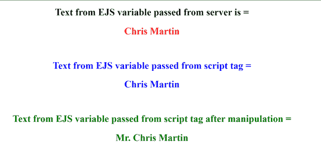

# 如何在 JavaScript 中使用 Ejs？

> 原文:[https://www.geeksforgeeks.org/how-to-use-ejs-in-javascript/](https://www.geeksforgeeks.org/how-to-use-ejs-in-javascript/)

EJS 或嵌入式 Javascript 模板是 Node.js 使用的模板引擎。模板引擎有助于用最少的代码创建一个 HTML 模板。此外，它可以在客户端将数据注入到 HTML 模板中，并生成最终的 HTML。

**安装:**使用以下命令安装模块:

```
npm install ejs --save        

```

**注意:**上面命令中的 npm 代表节点包管理器，一个安装所有依赖项的地方。`–save`Node 5 . 0 . 0 版本后不再需要标志，因为我们现在安装的所有模块都将被添加到依赖项中。

现在，我们需要做的第一件事是用 Express 将 EJS 设置为我们的模板引擎，Express 是一个 Node.js web 应用服务器框架，专门设计用于构建单页、多页和混合 web 应用程序。它已经成为 node.js 的标准服务器框架。

从服务器传递的数据被发送到 EJS 文件，然后我们可以使用下面的行访问该数据，它会将该数据提供给 h、p 或另一个文本标签。

```
<%= data %>

```

如果我们想将这些数据用于正常的 js 操作，如 if-else 和 loops 或其他编程语句，我们可以用下面的形式编写它:

```
<% if(data == "1")else%>

```

现在要访问 EJS 文件或。js 文件您所需要做的就是将数据传递到另一个变量中，如下所示:

```
let data = '<%-data%>'

```

现在，您可以对与 EJS 传递的数据变量具有相同值的数据变量执行任何操作。

**文件名:index.js**

```
// Set express as Node.js web application 
// server framework. 

// Install it using 'npm install express' command 
// and require like this:
var express = require('express'); 
var app = express(); 

// Set EJS as templating engine 
app.set('view engine', 'ejs'); 

app.get("/", function(req, res) {  
  res.render("home", {name:'Chris Martin'});
});

// Server setup
app.listen(3000, function(req, res) {
  console.log("Connected on port:3000");
});
```

EJS 的默认行为是在“视图”文件夹中查找要渲染的模板。因此，让我们在我们的主节点项目文件夹中创建一个“视图”文件夹，并创建一个名为“home.ejs”的文件，该文件将在我们的节点项目中满足一些期望的请求。

**档案名称:home . ejs】t1**

```
<!DOCTYPE html>
<html lang="en">

<head>
    <meta charset="UTF-8">
    <meta name="viewport" content=
        "width=device-width, 
        initial-scale=1.0">
</head>

<body>
    <center>

        <!-- Text from EJS variable 
            passed from server -->
        <h2>
            Text from EJS variable passed 
            from server is = 
        </h2>
        <h2 style="color:red"><%=name%></h2>
        <br>

        <!-- Text from EJS variable 
            passed from script tag -->
        <h2 style="color: blue;">
            Text from EJS variable passed 
            from script tag =
        </h2>
        <h2 style="color: blue;" 
            id="text_from_script">
        </h2>
        <br>

        <!-- Text from EJS variable passed 
            from script tag after manipulation -->
        <h2 style="color: green;">
            Text from EJS variable passed from 
            script tag after manipulation =
        </h2>
        <h2 style="color: green;" 
            id="text_from_script_manipulated">
        </h2>
    </center>

    <script>
        let name = '<%-name%>'
        let heading = document
            .getElementById('text_from_script');

        heading.innerText = name;
        name = "Mr. " + name;
        let heading_man = document.getElementById(
                'text_from_script_manipulated');
        heading_man.innerText = name;
    </script>
</body>

</html>
```

Name 变量已从服务器传递到 name.ejs 文件，并使用 h2 标记显示，要在脚本标记中使用 name 变量，我们只需声明一个变量，然后使用以下命令将 ejs 变量传递给声明的变量:

```
let name = '<%-name%>'
```

**运行程序的步骤:**

*   创建完所有文件后，转到项目文件夹的根目录。
*   在此目录中运行命令提示符。
*   键入以下命令运行您的程序，并查看显示的输出。

    ```
    node index.js

    ```

**输出:**

