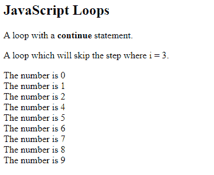

# 如何在 Javascript 中使用 goto？

> 原文:[https://www . geesforgeks . org/如何使用-goto-in-javascript/](https://www.geeksforgeeks.org/how-to-use-goto-in-javascript/)

javascript 中没有**goto 关键字**。原因是它提供了一种以任意和非结构化方式进行分支的方法。这可能会使 goto 语句难以理解和维护。但还是有其他方法可以达到预期的效果。
JavaScript 中获取 goto 结果的方法是使用 **Break** 和 **Continue** 。
除了在 switch 语句中使用外，break 语句还可以用来提供*“开化”*形式的 goto。通过使用这种形式的中断，您可以中断一个或多个代码块。这些块不需要是某个循环或开关的一部分，只需要是任何代码块。您还可以精确地指定执行将在哪里继续，因为这种形式的中断与标签一起工作。所以结论是**破****续**是用来给你后藤的好处而没有它的弊端。

**标记断点的一般语法是:**

```
break label;
```

**继续类似操作。**
*这里的标签可以是代码块的名称，它可以是任何变量但不是 javascript 关键字。*

**转换示例:**

```
var number = 0;

Start_Position
document.write("Anything you want to print");

number++;
if (number & lt; 100) goto start_position;
```

**注意:**这不是代码。只是一个你想使用 goto 语句的例子。

**现在这将在 JavaScript 中实现如下:**

```
var number = 0;

start_position: while (true) {
    document.write("Anything you want to print");
    number++;

    if (number & lt; 100) continue start_position;
    break;
}

```

在这里，Continue 和 break 都与标签一起使用，将控制转移到程序的不同部分。它可以在循环中用于将控制传递给其他部分，在检查某些条件后运行良好，并且可以应用于更多的逻辑语句。
现在如果我们想要在某个条件下脱离循环，那么我们可以使用 break 关键字。

**以上面的例子为例，在一定条件下加入 break。**

```
var i;
for (i = 1; i & lt; = 10; i++) {
    document.write(i);
    if (i === 9) {
        break;
    }
}
document.write( & quot; < br > Learnt something new ");

```

**输出:**

```
123456789
```

这里我们只是使用 break 关键字来摆脱循环。

**现在再举上面的例子，添加 continue 语句。**

```
var i;
for(i=1;i<=10;i++){
    if (i===4 || i===2) {
        continue;
    }
    document.write(i);
    if(i===6){
        break;
    }
}
document.write("
Learnt something new");

```

**输出:**

```
1356
```

因此，相同的输出可以用 break 或 continue 来实现，两者都用来代替 JavaScript 中的 goto。
**例:**

```
<html>

<body>

    <h2>JavaScript break</h2>

    <p id="demo"></p>

    <script>
        var cars = [
          "BMW", "Volvo", "Maruti", "Honda"];
        var text = "";

        list: {
            text += cars[0] + "<br>";
            text += cars[1] + "<br>";
            break list;
            text += cars[2] + "<br>";
            text += cars[3] + "<br>";
        }

        document.getElementById(
          "demo").innerHTML = text;
    </script>

</body>

</html>
```

**输出**:

```
BMW
Volvo
```

下面给出了继续的另一个程序。

```
<html>

<body>

    <h2>JavaScript Loops</h2>

    <p>A loop with a <b>continue</b> statement.</p>

    <p>A loop which will skip the step where i = 3.</p>

    <p id="demo"></p>

    <script>
        var text = "";
        var i;
        for (i = 0; i < 10; i++) {
            if (i === 3) {
                continue;
            }
            text += "The number is " + i + "<br>";
        }
        document.getElementById("demo").innerHTML = text;
    </script>

</body>

</html>
```

**输出** :
