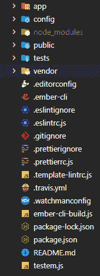
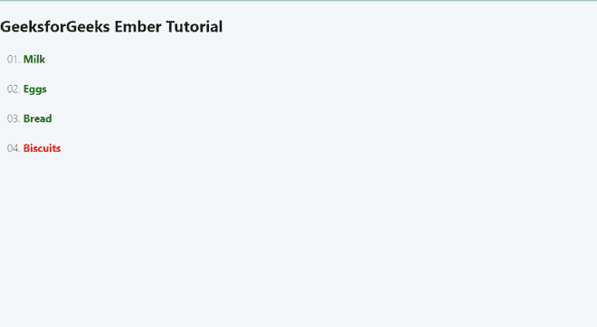
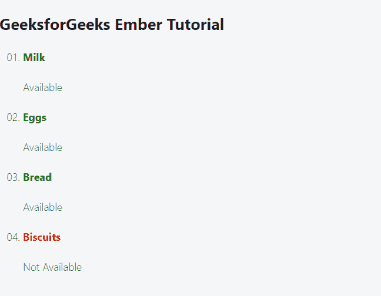

# 如何在 Ember.js 中使用 if、else 和 not 语句？

> 原文:[https://www . geesforgeks . org/if-else-and-not-statements-in-ember-js/](https://www.geeksforgeeks.org/how-to-use-if-else-and-not-statements-in-ember-js/)使用方法

Ember.js 是一个网络开发框架。它使用工具加快了开发和原型制作的过程。我们可以用它创建动态网页。根据动态数据，我们可能会也可能不会显示某些数据或某些用户界面或修改用户界面。因此，我们将学习在 Ember.js 应用程序中使用 If、Else 和 Not。

### 创建项目

**步骤 1:** 在终端或命令提示符下输入以下命令，创建新项目。

```
ember new ember_tutorial
```

**项目结构:**您的项目结构可能如下图所示。



项目结构

**方法:**我们的示例项目的想法是将一些数据传递给我们的模板(车把)文件。车把会处理数据，并在此基础上显示相同的数据。

**第二步:**那么让我们创建一些数据。在 app\routes 文件夹中创建一个新文件，并将其命名为 application.js。下面是一个项目列表，这些项目的可用性为真或假。我们已经用模型挂钩出口了这些商品。这样，我们可以将数据传递给 Ember.js 中的模板文件。这也是我们的应用程序将从数据库或其他地方获取代码的地方。

**<u>app \ routes \ application . js</u>**

## java 描述语言

```
import Route from '@ember/routing/route';

export default class ApplicationRoute extends Route {
  async model() {
    return {
      items: [
        {
          name: 'Milk',
          available: true,
        },
        {
          name: 'Eggs',
          available: true,
        },
        {
          name: 'Bread',
          available: true,
        },
        {
          name: 'Biscuits',
          available: false,
        },
      ],
    };
  }
}
```

**第三步:**这是我们的项目数据。现在让我们实现**应用程序. hbs** 文件。在 application.hbs 文件中，运行一个每个循环来列出每个项目。在这里，我们首先使用#每个助手来迭代项目列表。然后我们对项目使用{{#if 条件} } . available 来检查当前项目是否可用。如果可用，我们的项目将具有可用的 else 类，我们在代码的 else 部分使用了{{else}}标记。如果该项目不可用，我们的项目将具有“不可用”类别。接下来在 **app.css** 文件中，添加以下代码用于样式设计。

## 超文本标记语言

```
<ul class="items">
  {{#each @model.items as |item|}}
  <li>
    {{#if item.available}}
    <h4 class="available">
      {{item.name}}
    </h4>
    {{else}}
    <h4 class="notavailable">
      {{item.name}}
    </h4>
    {{/if}}
  </li>
  {{/each}}
</ul>
{{outlet}}
```

## 半铸钢ˌ钢性铸铁(Cast Semi-Steel)

```
.items li {
  list-style: decimal-leading-zero;
}
.items li .available {
  color: green;
}
.items li .notavailable {
  color: red;
}
```

**运行应用程序的步骤:**通过在终端/命令提示符下运行以下命令来运行项目。

```
ember serve
```

**输出:**



**步骤 4:** 现在让我们在 Ember.js 中实现 NOT

```
{{#unless}}{{/unless}}
```

除非和如果正好相反。我们也可以在除非中使用 ELSE。因此，我们将在每个项目下放置一个文本，以告知该项目是否可用。

**<u>app \ templates \ application . HBS</u>**

## 超文本标记语言

```
{{page-title 'EmberTutorial'}}
<h2>
  GeeksforGeeks Ember Tutorial
</h2>
<ul class="items">
  {{#each @model.items as |item|}}
  <li>
    {{#if item.available}}
    <h4 class="available">
      {{item.name}}
    </h4>
    {{else}}
    <h4 class="notavailable">
      {{item.name}}
    </h4>
    {{/if}}
    {{#unless item.available}}
    <p>
      Not Available
    </p>
    {{else}}
    <p>
      Available
    </p>
    {{/unless}}
  </li>
  {{/each}}
</ul>
{{outlet}}
```

**运行应用程序的步骤:**再次保存代码。通过在终端/命令提示符下运行以下命令来运行项目。

```
ember serve
```

**输出:**

