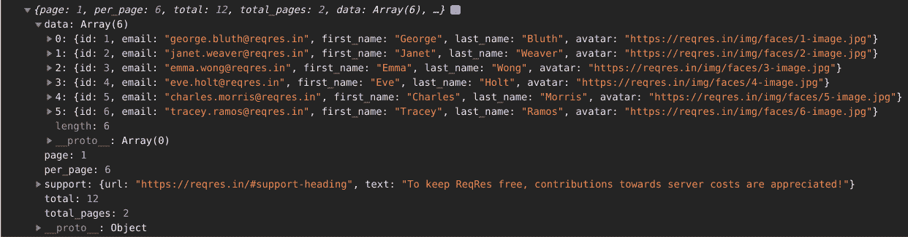
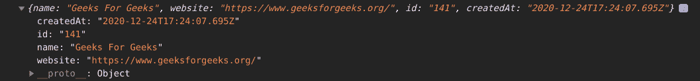

# 如何使用 JavaScript Fetch API 获取数据？

> 原文:[https://www . geesforgeks . org/如何使用-JavaScript-fetch-API-to-get-data/](https://www.geeksforgeeks.org/how-to-use-javascript-fetch-api-to-get-data/)

获取应用编程接口提供了一个 JavaScript 接口，使用户能够操作和访问 HTTP 管道的部分，如响应和请求。

Fetch API 有很多丰富而令人兴奋的选项，比如方法、头、主体、引用、模式、凭证、缓存、重定向、完整性等等。然而，我们使用的最突出的是方法、头和体。

方法用于创建、读取、更新和删除数据，因此我们有像 GET、POST、PUT 和 delete 这样的方法。

作为一个例子，我们将使用 API:[https://reqres.in/arpi/users](https://reqres.in/api/user)，它会给我们关于一个人的随机数据，我们在这里的目标是看看这些数据中呈现了什么。

**语法:**

```
fetch(URL, options)
```

**参数:**该方法接受两个参数，如上所示，如下所述:

1.  **URL:** 这是要从中获取数据的资源的端点。
2.  **选项:**这是一个可选参数，它是一个选项对象，可以有以下值:
    *   **方法:**表示方法类型，可以是任何 HTTP 请求类型，如 GET、POST、PUT、DELETE 等。
    *   **Headers:** 如果我们向服务器传递数据，我们需要另外告诉 fetch 我们将以 json/text 等形式传递数据。
    *   **Body:** 在这部分中，我们实际上是以 JSON 的形式传递数据。

**示例 1:** 获取请求演示。

## java 描述语言

```
fetch("https://reqres.in/api/users")
.then(res => res.json())
.then(data => console.log(data))
```

**输出:**这是 API 返回给我们的，一些关于人的随机数据。



**示例 2:** 开机自检请求演示。现在我们将借助 post 方法，自行发布一些随机数据。

## java 描述语言

```
fetch("https://reqres.in/api/users", {
  // Defining method type as POST
  method: 'POST', 
  // Fetch knows, what type of data are we dealing with
  headers: {
    'Content-Type': 'application/json' 
  },
  // Data needs to be parsed into JSON
  body: JSON.stringify({ 
    name: 'Geeks For Geeks',
    website: 'https://www.geeksforgeeks.org/',
  })
}).then(res => {
  return res.json()
}).then(data => console.log(data));
```

**输出:**在这里，我们看到已经使用 fetch API 成功发出了 POST 请求。

