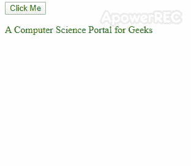
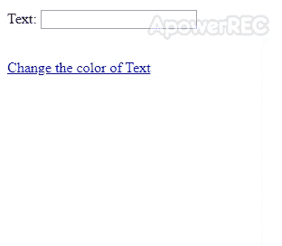

# 如何在 jQuery 选择器中使用 JavaScript 变量？

> 原文:[https://www . geesforgeks . org/how-用法-JavaScript-变量-in-jquery-selecters/](https://www.geeksforgeeks.org/how-to-use-javascript-variables-in-jquery-selectors/)

在本文中，我们将讨论如何在 jQuery 选择器中使用 JavaScript 变量。在下面的例子中，可以看到我们使用了 JavaScript 变量中存储的值，这些值在 jQuery 选择器中使用。

**示例 1:** 为了使用存储在 JavaScript 变量中的值，可以应用串联技术。在以下示例中，每当单击按钮时， **[< span >](https://www.geeksforgeeks.org/span-tag-html/)** 元素内呈现的内容都会追加到 **[< p >](https://www.geeksforgeeks.org/html-paragraph/)** 元素中。然后我们将使用 [**ready()方法**](https://www.geeksforgeeks.org/jquery-ready-with-examples/) 帮助加载整个页面，然后执行剩下的代码。

```
<!DOCTYPE html>

<html>

<head>
    <title>JavaScript variables in jQuery slectors</title>

    <script src="https://code.jquery.com/jquery-3.4.1.js"
            integrity=
"sha256-WpOohJOqMqqyKL9FccASB9O0KwACQJpFTUBLTYOVvVU=" 
            crossorigin="anonymous">
    </script>
</head>

<body>
    <div>
        <button id="button"
                style="color: green;">
            Click Me
        </button>

        <p id="firstpara">
            <span id="span" 
                  style="color: green;">
                A Computer Science Portal fo Geeks<br> 
            </span>
        </p>
    </div>
    <script>
        $(document).ready(function() {
            $("#button").click(function() {
                var paraId = "firstpara";
                var spanId = "span";
                $("#" + paraId).append($("#" + spanId).html());
            });
        })
    </script>
</body>

</html>
```

**输出:**


**示例 2:** 以下示例在按下链接时更改文本的颜色。本例中，**[JavaScript:void(0)；](https://www.geeksforgeeks.org/what-does-javascriptvoid0-mean/)** 是用在 **[<里面的一个>](https://www.geeksforgeeks.org/html-a-tag/)** 元素。然后我们将使用 [**ready()方法**](https://www.geeksforgeeks.org/jquery-ready-with-examples/) 帮助加载整个页面然后执行剩下的代码。

```
<!DOCTYPE html>
<html>

<head>
    <title>JavaScript variables in jQuery slectors</title>

    <script src="https://code.jquery.com/jquery-3.4.1.js"
            integrity=
"sha256-WpOohJOqMqqyKL9FccASB9O0KwACQJpFTUBLTYOVvVU=" 
            crossorigin="anonymous">
    </script>
</head>

<body>
    <form>
        <p> 
          Text:
          <input type="text"> 
        </p>
        <br>

        <a href="javascript:void(0);">
          Change the color of Text 
        </a>
    </form>
    <script>
        $(document).ready(function() {

            $("a").click(function() {
                var type = $("input").attr("type");
                var attribute = "color";
                var color = "green";

                $("input[type=" + type + "]")
                .css(attribute, color);
            });
        })
    </script>
</body>

</html>
```

**输出:**


jQuery 是一个开源的 JavaScript 库，它简化了 HTML/CSS 文档之间的交互，它以其“少写多做”的理念而闻名。
跟随本 [jQuery 教程](https://www.geeksforgeeks.org/jquery-tutorials/)和 [jQuery 示例](https://www.geeksforgeeks.org/jquery-examples/)可以从头开始学习 jQuery。