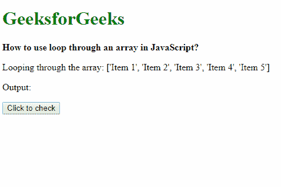
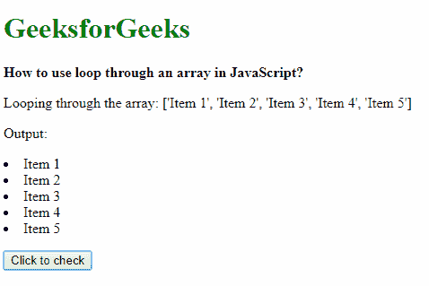

# 如何在 JavaScript 中通过数组使用循环？

> 原文:[https://www . geesforgeks . org/如何使用 javascript 中的数组循环/](https://www.geeksforgeeks.org/how-to-use-loop-through-an-array-in-javascript/)

**方法 1:使用 forEach()方法:**forEach()方法用于通过循环遍历数组中的每个元素来执行每个元素的代码。

**语法:**

```
array.forEach( arrayElement => {
    // lines of code to execute
});
```

**示例:**

```
<!DOCTYPE html>
<html>

<head>
    <title>
        How to use loop through an
        array in JavaScript?
    </title>
</head>

<body>
    <h1 style="color: green">
        GeeksforGeeks
    </h1>

    <b>
        How to use loop through an
        array in JavaScript?
    </b>

    <p>
        Looping through the array: ['Item 1',
        'Item 2', 'Item 3', 'Item 4', 'Item 5']
    </p>

    <p>Output: <div class="output"></div></p>

    <button onclick="loopArray()">
        Click to check
    </button>

    <script type="text/javascript">
        function loopArray() {
            list = ['Item 1', 'Item 2', 'Item 3',
                    'Item 4', 'Item 5'];

            list.forEach(element => {
                document.querySelector('.output').innerHTML
                        += '<li>' + element + '</li>';
            });
        }
    </script>
</body>

</html>                    
```

**输出:**

*   **点击按钮前:** 
*   **点击按钮后:** 

**方法 2:使用语句的 for…语句:**语句的 for…可用于循环遍历可迭代对象并执行所需功能。可迭代对象包括数组、字符串和其他类似数组的对象。

**语法:**

```
for (arrayElement of array) {
    // lines of code to execute
}
```

**示例:**

```
<!DOCTYPE html>
<html>

<head>
    <title>
        How to use loop through an
        array in JavaScript?
    </title>
</head>

<body>
    <h1 style="color: green">
        GeeksforGeeks
    </h1>

    <b>
        How to use loop through an
        array in JavaScript?
    </b>

    <p>
        Looping through the array: ['Item 1',
        'Item 2', 'Item 3', 'Item 4', 'Item 5']
    </p>

    <p>Output: <div class="output"></div></p>

    <button onclick="loopArray()">
        Click to check
    </button>

    <script type="text/javascript">
        function loopArray() {
            list = ['Item 1', 'Item 2', 'Item 3',
                    'Item 4', 'Item 5'];

            for (element of list) {
                document.querySelector('.output').innerHTML
                    += '<li>' + element + '</li>';
            }
        }
    </script>
</body>

</html>                    
```

**输出:**

*   **点击按钮前:** 
*   **点击按钮后:** 

**方法 3:使用基本 for 循环:**默认 for 循环可用于迭代数组，每个元素可通过其各自的索引进行访问。

**语法:**

```
for (i = 0; i < list.length; i++) {
    // lines of code to execute
}
```

**示例:**

```
<!DOCTYPE html>
<html>

<head>
    <title>
        How to use loop through an
        array in JavaScript?
    </title>
</head>

<body>
    <h1 style="color: green">
        GeeksforGeeks
    </h1>

    <b>
        How to use loop through an
        array in JavaScript?
    </b>

    <p>
        Looping through the array: ['Item 1',
        'Item 2', 'Item 3', 'Item 4', 'Item 5']
    </p>

    <p>Output: <div class="output"></div></p>

    <button onclick="loopArray()">
        Click to check
    </button>

    <script type="text/javascript">
        function loopArray() {
            list = ['Item 1', 'Item 2', 'Item 3',
                    'Item 4', 'Item 5'];

            for (i = 0; i < list.length; i++) {
                document.querySelector('.output').innerHTML
                        += '<li>' + element + '</li>';
            }
        }
    </script>
</body>

</html>                    
```

**输出:**

*   **点击按钮前:** 
*   **点击按钮后:** 