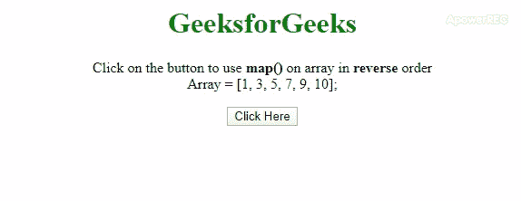
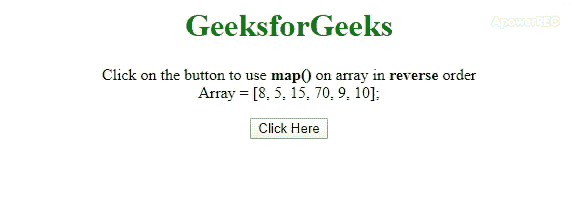

# 如何用 JavaScript 在数组上逆序使用 map()？

> 原文:[https://www . geeksforgeeks . org/如何使用带 javascript 的逆序数组映射/](https://www.geeksforgeeks.org/how-to-use-map-on-an-array-in-reverse-order-with-javascript/)

给定一个 JavaScript 数组，任务是应用 **[map()方法](https://www.geeksforgeeks.org/javascript-array-map-method/)** 但是在数组的反面高效。这里讨论了几种方法。如果您不想更改原始阵列，那么您可以创建该阵列的一个浅拷贝，然后再执行任务。

**进场 1:** 思路是用 **[。反向()方法](https://www.geeksforgeeks.org/javascript-array-prototype-reverse/)** 只是在应用 **[之后。切片()法](https://www.geeksforgeeks.org/javascript-array-slice/)** 。然后使用 **[。map()方法](https://www.geeksforgeeks.org/javascript-array-map-method/)** 在反转的阵列上执行任务。

*   **示例:**该示例实现了上述方法。

    ```
    <!DOCTYPE HTML>
    <html>

    <head>
        <title>
            How to use map() on an array in
            reverse order with JavaScript ?
        </title>

        <style>
            body {
                text-align: center;
            }
            h1 {
                color: green;
            }
            #geeks {
                font-weight: bold;
            }
        </style>
    </head>

    <body>
        <h1>GeeksforGeeks</h1>

        <p>
            Click on the button to use
            <b>map()</b> on array in 
            <b>reverse</b> order<br>
            Array = [1, 3, 5, 7, 9, 10];
        </p>

        <button onclick="gfg_Run()">
            Click Here
        </button>

        <p id="geeks"></p>

        <script>
            var el_down = document.getElementById("geeks");
            var arr = [1, 3, 5, 7, 9, 10];

            /* Main function */
            function gfg_Run() {
                newArr = arr.slice(0).reverse().map(
                    function(val, index) {
                        return val * 2;
                    }
                );

                el_down.innerHTML = "New Array = ["
                                    + newArr + "]";
            }
        </script>
    </body>

    </html>
    ```

*   **输出:**
    

**方法 2:** 在这个方法中我们将使用 **[。映射()方法](https://www.geeksforgeeks.org/javascript-array-map-method/)** 并用 2 个[参数**(值，索引)**](https://www.geeksforgeeks.org/javascript-array-indexof/) 调用该方法中的一个函数。现在我们需要访问值，我们将从反面访问它(例如..arr[arr . length–1–index])，这是不可变的操作(它不会改变原始数组)。

*   **示例:**该示例实现了上述方法。

    ```
    <!DOCTYPE HTML>
    <html>

    <head>
        <title>
            How to use map() on an array in
            reverse order with JavaScript ?
        </title>

        <style>
            body {
                text-align: center;
            }
            h1 {
                color: green;
            }
            #geeks {
                font-weight: bold;
            }
        </style>
    </head>

    <body>
        <h1>GeeksforGeeks</h1>

        <p>
            Click on the button to use 
            <b>map()</b> on array in 
            <b>reverse</b> order<br>
            Array = [8, 5, 15, 70, 9, 10];
        </p>

        <button onclick="gfg_Run()">
            Click Here
        </button>

        <p id="geeks"></p>

        <script>
            var el_down = document.getElementById("geeks");
            var arr = [8, 5, 15, 70, 9, 10];

            /* Main function */
            function gfg_Run() {
                newArr = arr.map((val, index, array) => 
                        1/2*arr[arr.length - 1 - index]);

                el_down.innerHTML = "New Array = ["
                                    + newArr + "]";
            }
        </script>
    </body>

    </html>
    ```

    *   **输出:**
    