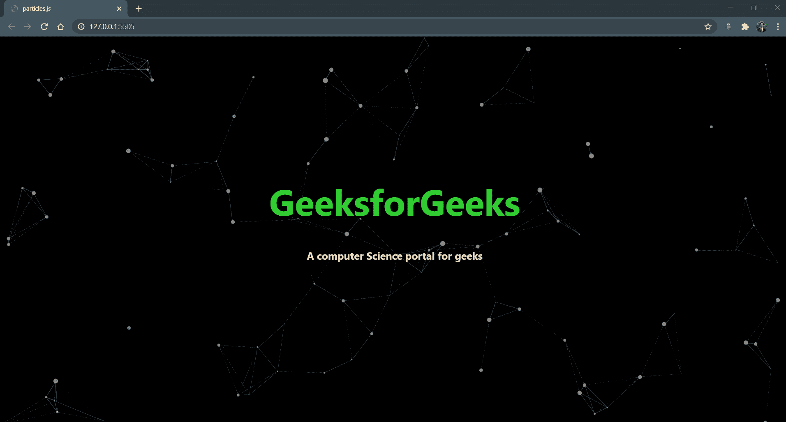
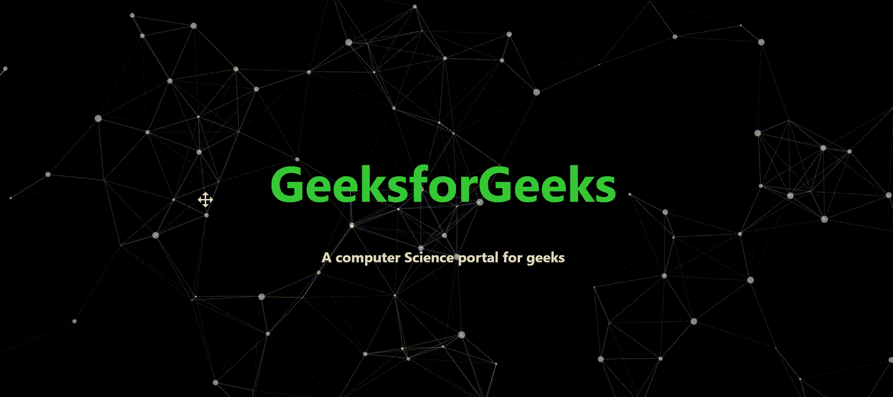

# 如何在 JavaScript 项目中使用粒子. js？

> 原文:[https://www . geesforgeks . org/how-用法-粒子-js-in-javascript-project/](https://www.geeksforgeeks.org/how-to-use-particle-js-in-javascript-project/)

**粒子. js** 是一个轻量级的 JavaScript 库，用来创建看起来像多边形顶点的粒子。我们也可以通过悬停在粒子上进行交互，并通过单击粒子来创建更多的粒子。

下面是**粒子. js** 的例子



我们可以在我们的投资组合中使用这个库，这肯定会吸引很多用户，在网站上也会很好看。

**安装过程:**

1.从以下链接下载**粒子. js** 库，解压并复制到你的项目文件夹中。[https://vincentgarreau.com/particles.js/](https://vincentgarreau.com/particles.js/)

2.创建两个文件**index.html**和 **style.css.**

在**index.html**文件中编写以下代码。

## 超文本标记语言

```html
<!DOCTYPE html>
<html lang="en">

<head>
    <title>particles.js</title>

    <!-- Import style.css from root directory -->
    <link rel="stylesheet" href="./style.css" />
</head>

<body>
    <!-- Particles.js div -->
    <div id="particles-js">
        <div class="heading">
            <h1>GeeksforGeeks</h1>
            <h3>
                A computer Science 
                portal for geeks
            </h3>
        </div>
    </div>

    <!-- Import Particles.js and app.js files -->
    <script src=
        "particles.js-master/particles.js">
    </script>
    <script src=
        "/particles.js-master/demo/js/app.js">
    </script>
</body>

</html>
```

**文件名:style.css**

```html
body {
    margin: 0;
    font-family: -apple-system, BlinkMacSystemFont, 
      'Segoe UI', Roboto, Oxygen, Ubuntu, Cantarell,
      'Open Sans', 'Helvetica Neue', sans-serif;
}
.heading {
    position: absolute;
    text-align: center;
    top: 30%;
    width: 100%;
}
.heading h1 {
    color: limegreen;
    font-size: 70px;
}
.heading h3 {
    color: wheat;
    font-size: 20px;
}
#particles-js {
    background: black;
    height: 100vh;
}
```

3.将上述代码保存在各自的文件中，并运行**index.html**文件。

**注意:**如果你使用的是节点 app，那么我们只需按照命令下载**粒子. js** 节点模块即可。

```html
npm install particles.js
```

并从 node_modules 文件夹导入**粒子. js** 和 **app.js** 文件，编写 html 代码。

## 超文本标记语言

```html
<!DOCTYPE html>
<html lang="en">

<head>
    <title>particles.js</title>
    <!-- Import style.css from root directory -->
    <link rel="stylesheet" href="./style.css" />
</head>

<body>
    <!-- Particles.js div -->
    <div id="particles-js">
        <div class="heading">
            <h1>GeeksforGeeks</h1>
            <h3>A computer Science portal for geeks</h3>
        </div>
    </div>

    <!-- Import Particles.js and app.js files -->
    <script src=
        "/node_modules/particles.js/particles.js">
    </script>
    <script src=
        "/node_modules/particles.js/demo/js/app.js">
    </script>
</body>

</html>
```

我们可以通过修改 **app.js** 来改变粒子属性和交互性，然后看到魔法。

**输出:**
