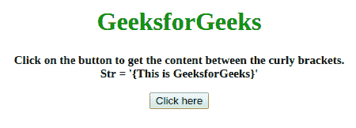
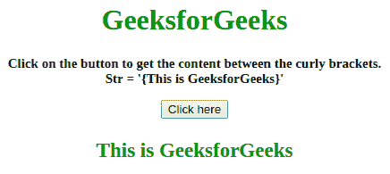
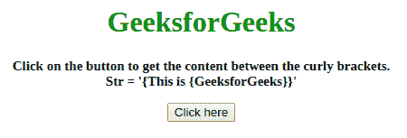
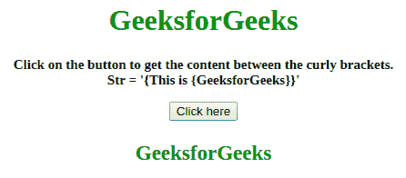

# 如何用 JavaScript 用 Regex 获取花括号之间的字符串？

> 原文:[https://www . geeksforgeeks . org/如何使用-regex-获取花括号之间的字符串-使用-javascript/](https://www.geeksforgeeks.org/how-to-use-regex-to-get-the-string-between-curly-braces-using-javascript/)

问题是获取花括号之间的字符串。在这里，我们将看到不同的正则表达式来获取字符串。

**方法 1:**

*   选择外部大括号之间的字符串。
*   **正则表达式**选择所有花括号，删除它们，然后获取内容。

**示例:**该示例说明了上述方法。

```
<!DOCTYPE HTML>
<html>

<head>
    <title>
        How to use Regex to get the string between
        curly braces using JavaScript ?
    </title>
</head>

<body style="text-align:center;">

    <h1 id="h1" style="color:green;"> 
        GeeksforGeeks 
    </h1>

    <p id="GFG_UP" style=
        "font-size: 15px; font-weight: bold;">
    </p>

    <button onclick="gfg_Run()">
        Click here
    </button>

    <p id="GFG_DOWN" style=
        "font-size: 23px; font-weight: bold; color: green; ">
    </p>

    <script>
        var el_up = document.getElementById("GFG_UP");
        var el_down = document.getElementById("GFG_DOWN");
        var st = '{This is GeeksforGeeks}';

        el_up.innerHTML =
            "Click on the button to get the content between"
            + " the curly brackets.<br> Str = '" + st + "'";

        function gfg_Run() {
            st = st.replace(/\{|\}/gi, '');
            el_down.innerHTML = st;
        }
    </script>
</body>

</html>
```

**输出:**

*   **点击按钮前:**
    
*   **点击按钮后:**
    

**方法 2:**

*   在这种方法中，我们选择花括号之间的字符串。
*   **正则表达式**从右侧选择字符串。它从最右边的花括号中查找开始的花括号，并将其打印为字符串。

**示例:**该示例说明了上述方法。

```
<!DOCTYPE HTML>
<html>

<head>
    <title>
        How to use Regex to get the string between
        curly braces using JavaScript ?
    </title>
</head>

<body style="text-align:center;">

    <h1 style="color:green;"> 
        GeeksforGeeks 
    </h1>

    <p id="GFG_UP" style=
        "font-size: 15px; font-weight: bold;">
    </p>

    <button onclick="gfg_Run()">
        Click here
    </button>

    <p id="GFG_DOWN" style=
        "font-size: 23px; font-weight: bold; color: green; ">
    </p>

    <script>
        var el_up = document.getElementById("GFG_UP");
        var el_down = document.getElementById("GFG_DOWN");
        var st = '{This is {GeeksforGeeks}}';

        el_up.innerHTML = "Click on the button to get the "
                + "content between the curly brackets.<br>"
                + "Str = '" + st + "'";

        function gfg_Run() {
            st = st.replace(/.*\{|\}/gi, '');
            el_down.innerHTML = st;
        }
    </script>
</body>

</html>
```

**输出:**

*   点击按钮前:
    [](https://media.geeksforgeeks.org/wp-content/uploads/20190902140913/Screenshot-from-2019-09-02-14-07-35.png)
*   点击按钮后:
    [](https://media.geeksforgeeks.org/wp-content/uploads/20190902140915/Screenshot-from-2019-09-02-14-07-36.png)