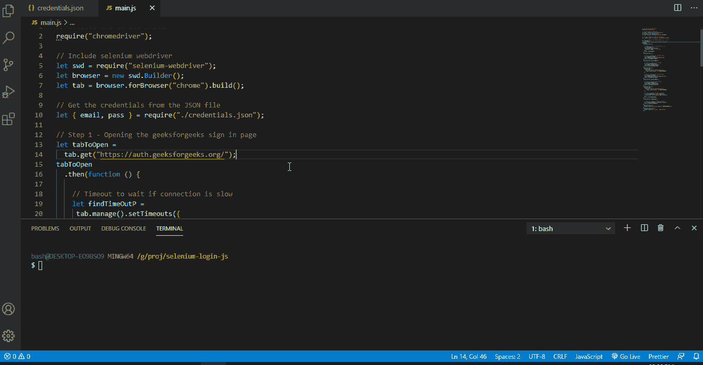

# 如何使用 Selenium Web Driver 和 JavaScript 登录任意网站？

> 原文:[https://www . geesforgeks . org/使用方法-selenium-web-driver-JavaScript-to-log in-any-网站/](https://www.geeksforgeeks.org/how-to-use-selenium-web-driver-and-javascript-to-login-any-website/)

本文展示了借助 **Selenium Web Driver** 和 **JavaScript** 使用自动化登录任何网站的方法。承诺的概念将用于这种方法。这将通过登录极客网站来演示。必须遵循以下步骤。

**步骤 1:** 按照 [Windows](https://www.geeksforgeeks.org/installation-of-node-js-on-windows/) 或 [Linux](https://www.geeksforgeeks.org/installation-of-node-js-on-linux/) 的步骤安装最新的 Node.js 运行时。

**步骤 2:** 创建一个 package.json 文件，用于创建 Node 应用程序。这可以通过运行下面的命令并遵循所需的步骤来完成。

```
npm init
```

**步骤 3:** 安装 Selenium 网络驱动程序包。这可以通过在安装节点的同一目录中打开终端/命令提示符并运行以下命令来完成。

```
npm install selenium-webdriver
```

**第 4 步:**为浏览器安装驱动程序，这些驱动程序将用于自动化浏览器。本文中使用的浏览器是 Chrome，因此需要安装 chromedriver 包。这可以使用下面的命令来完成。

```
npm install chromedriver
```

**第 5 步:**创建一个 JSON 文件(如 credentials.json)来存储用户名/电子邮件和密码。以下格式可用于保存凭据。

```
{
  "email": "your-username",
  "pass": "your-password"
}
```

**步骤 6:** 在与凭证文件相同的目录下创建一个 JavaScript 文件。该文件将包含控制浏览器和自动登录的代码。按照以下步骤登录极客博客页面。这是写在这个主 JavaScript 文件中的。

1.  进入登录页面。
2.  在页面上找到用于输入用户名的文本框。
3.  输入给定的用户名。
4.  在页面上找到用于输入密码的文本框。
5.  输入给定的密码。
6.  找到登录按钮。
7.  单击登录按钮。

**第 7 步:**使用下面的命令启动包含脚本的 JavaScript 文件。

```
node scriptfile.js
```

**完整代码:**

## java 描述语言

```
// Include the chrome driver
require("chromedriver");

// Include selenium webdriver
let swd = require("selenium-webdriver");
let browser = new swd.Builder();
let tab = browser.forBrowser("chrome").build();

// Get the credentials from the JSON file
let { email, pass } = require("./credentials.json");

// Step 1 - Opening the geeksforgeeks sign in page
let tabToOpen =
    tab.get("https://auth.geeksforgeeks.org/");
tabToOpen
    .then(function () {

        // Timeout to wait if connection is slow
        let findTimeOutP =
            tab.manage().setTimeouts({
                implicit: 10000, // 10 seconds
            });
        return findTimeOutP;
    })
    .then(function () {

        // Step 2 - Finding the username input
        let promiseUsernameBox =
            tab.findElement(swd.By.css("#luser"));
        return promiseUsernameBox;
    })
    .then(function (usernameBox) {

        // Step 3 - Entering the username
        let promiseFillUsername =
            usernameBox.sendKeys(email);
        return promiseFillUsername;
    })
    .then(function () {
        console.log(
            "Username entered successfully in" +
            "'login demonstration' for GEEKSFORGEEKS"
        );

        // Step 4 - Finding the password input
        let promisePasswordBox =
            tab.findElement(swd.By.css("#password"));
        return promisePasswordBox;
    })
    .then(function (passwordBox) {

        // Step 5 - Entering the password
        let promiseFillPassword =
            passwordBox.sendKeys(pass);
        return promiseFillPassword;
    })
    .then(function () {
        console.log(
            "Password entered successfully in" +
            " 'login demonstration' for GEEKSFORGEEKS"
        );

        // Step 6 - Finding the Sign In button
        let promiseSignInBtn = tab.findElement(
            swd.By.css(".btn.btn-green.signin-button")
        );
        return promiseSignInBtn;
    })
    .then(function (signInBtn) {

        // Step 7 - Clicking the Sign In button
        let promiseClickSignIn = signInBtn.click();
        return promiseClickSignIn;
    })
    .then(function () {
        console.log("Successfully signed in GEEKSFORGEEKS!");
    })
    .catch(function (err) {
        console.log("Error ", err, " occurred!");
    });
```

**输出:**

