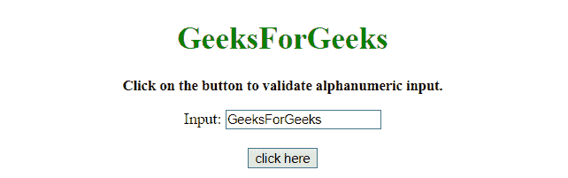
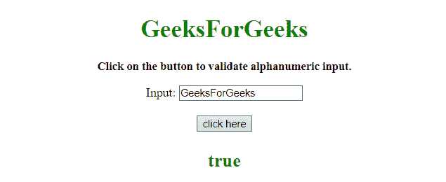
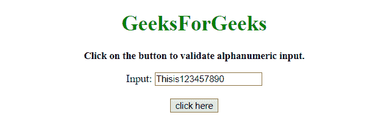
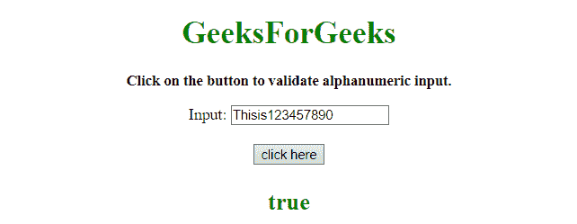

# 如何使用 JavaScript 验证输入是否为字母数字？

> 原文:[https://www . geesforgeks . org/如何验证输入是字母数字还是不使用 javascript/](https://www.geeksforgeeks.org/how-to-validate-an-input-is-alphanumeric-or-not-using-javascript/)

给定一个输入元素，任务是检查输入元素是否是字母数字。有两种方法可以解决这个问题，讨论如下:

**方法 1:**

*   正则表达式用于验证输入。
*   RegExp 用于检查不包含(a-z)字母和所有要验证的数字的无效字符串。
*   非运算符用于期望的输出。

**示例 1:** 该示例实现了上述方法。

```
<!DOCTYPE HTML> 
<html> 

<head> 
    <title> 
        How to validate an input is alphanumeric
        or not using JavaScript?
    </title>
</head> 

<body align = "center"> 

    <h1 style = "color:green;" > 
        GeeksForGeeks 
    </h1> 

    <p id = "GFG_UP" style = 
        "font-size: 15px; font-weight: bold;"> 
    </p>

    <form id = "formElement">
        Input: <input id = "input1" type = "text" />
    </form>

    <br>

    <button onclick = "GFG_Fun()">
        click here
    </button>

    <p id = "GFG_DOWN" style = 
        "font-size: 24px; font-weight: bold; color:green;"> 
    </p>

    <script> 
        var el_up = document.getElementById('GFG_UP');
        var el_down = document.getElementById('GFG_DOWN');
        var input = document.getElementById('input1');

        el_up.innerHTML = "Click on the button to "
                    + "validate alphanumeric input.";     

        function GFG_Fun() {
            var val = input.value;
            var RegEx = /[^a-z\d]/i;
            var Valid = !(RegEx.test(val));
            el_down.innerHTML = Valid;
        }
    </script> 
</body> 

</html>
```

**输出:**

*   **点击按钮前:**
    
*   **点击按钮后:**
    

**方法 2:**

*   不同的正则表达式用于验证输入。
*   RegExp 正在检查要验证的(a-z)字母和(0-9)数字。

**示例 2:** 该示例实现了上述方法。

```
<!DOCTYPE HTML> 
<html> 

<head> 
    <title> 
        JavaScript | Validate If input is alphanumeric or not?
    </title>
</head> 

<body id = "body" align = "center"> 

    <h1 style = "color:green;" > 
        GeeksForGeeks 
    </h1> 

    <p id = "GFG_UP" style = 
        "font-size: 15px; font-weight: bold;"> 
    </p>

    <form id = "formElement">
        Input: <input id = "input1" type = "text" />
    </form>

    <br>

    <button onclick = "GFG_Fun()">
        click here
    </button>

    <p id = "GFG_DOWN" style = 
        "font-size: 24px; font-weight: bold; color:green;"> 
    </p>

    <script> 
        var el_up = document.getElementById('GFG_UP');
        var el_down = document.getElementById('GFG_DOWN');
        var input = document.getElementById('input1');

        el_up.innerHTML = "Click on the button to "
                + "validate alphanumeric input.";     

        function GFG_Fun() {
            var val = input.value;
            var RegEx = /^[a-z0-9]+$/i;
            var Valid = RegEx.test(val);
            el_down.innerHTML = Valid;
        }
    </script> 
</body> 

</html>
```

**输出:**

*   **点击按钮前:**
    
*   **点击按钮后:**
    