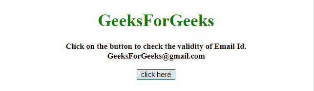
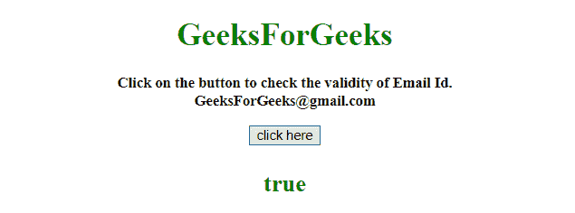
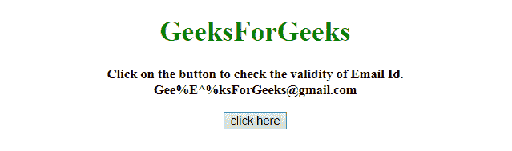
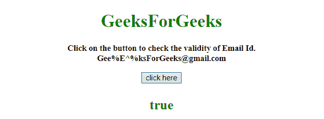

# 如何在 JavaScript 中使用 RegExp 验证电子邮件地址？

> 原文:[https://www . geesforgeks . org/如何验证-电子邮件地址-使用-regexp-in-javascript/](https://www.geeksforgeeks.org/how-to-validate-email-address-using-regexp-in-javascript/)

给定一个电子邮件 id，任务是验证电子邮件 id 是否有效。电子邮件验证是在正则表达式的帮助下完成的。

**方法 1:**

*   正则表达式–它检查电子邮件标识中的有效字符(如数字、字母、少数特殊字符。)
*   它允许电子邮件中的每个特殊符号-id(像，！、#、$、%、^、&、*)符号，但不允许在 Id 中出现第二个@符号。

**示例:**该示例实现了上述方法。

```
<!DOCTYPE html> 
<html> 

<head> 
    <title> 
        How to validate email address
        using RegExp in JavaScript ?
    </title> 
</head>

<body style = "text-align:center;"> 

    <h1 style = "color:green;"> 
        GeeksForGeeks 
    </h1> 

    <p id = "GFG_UP" style = 
            "font-size: 15px; font-weight: bold;"> 
    </p>

    <button onclick = "GFG_Fun()"> 
        click here 
    </button> 

    <p id = "GFG_DOWN" style = 
        "font-size: 24px; font-weight: bold; color: green;"> 
    </p> 

    <script> 
        var up = document.getElementById('GFG_UP'); 
        var down = document.getElementById('GFG_DOWN'); 
        var email = 'GeeksForGeeks@gmail.com';

        up.innerHTML = "Click on the button to check the "
                    + "validity of Email Id.<br>" + email; 

        function isEmail(email) {

            // Regular Expression (Not accepts second @ symbol
            // before the @gmail.com and accepts everything else)
            var regexp = /^(([^<>()\[\]\\.,;:\s@"]+(\.[^<>()\[\]\\.,;:\s@"]+)*)|(".+"))@((\[[0-9]{1,3}\.[0-9]{1,3}\.[0-9]{1,3}\.[0-9]{1,3}\])|(([a-zA-Z\-0-9]+\.)+[a-zA-Z]{2,}))$/;

            // Converting the email to lowercase
            return regexp.test(String(email).toLowerCase());
        }

        function GFG_Fun() { 
            down.innerHTML = isEmail(email);
        } 
    </script> 
</body> 

</html>
```

**输出:**

*   **点击按钮前:**
    
*   **点击按钮后:**
    

**方法 2:**

*   正则表达式–它检查模式，如**任何东西@任何东西。任何东西**
*   与前面的例子不同，正则表达式多次接受每个字符和特殊字符。

**示例 2:** 该示例实现了上述方法。

```
<!DOCTYPE HTML> 
<html> 

<head> 
    <title> 
        How to validate email address
        using RegExp in JavaScript ?
    </title> 
</head>

<body style = "text-align:center;"> 

    <h1 style = "color:green;"> 
        GeeksForGeeks 
    </h1> 

    <p id = "GFG_UP" style = 
            "font-size: 15px; font-weight: bold;"> 
    </p>

    <button onclick = "GFG_Fun()"> 
        click here 
    </button> 

    <p id = "GFG_DOWN" style = 
        "font-size: 24px; font-weight: bold; color: green;"> 
    </p> 

    <script> 
        var up = document.getElementById('GFG_UP'); 
        var down = document.getElementById('GFG_DOWN'); 
        var email = 'Gee%E^%ksForGeeks@gmail.com';

        up.innerHTML = "Click on the button to check the "
                +   "validity of Email Id.<br>" + email; 

        function isEmail(email) {

            // Regular Expression (Accepts every special
            // character along with @ symbol)
            var regexp = /\S+@\S+\.\S+/;

            // Converting the email to lowercase
            return regexp.test(String(email).toLowerCase());
        }

        function GFG_Fun() { 
            down.innerHTML = isEmail(email);
        } 
    </script> 
</body> 

</html>
```

**输出:**

*   **点击按钮前:**
    
*   **点击按钮后:**
    