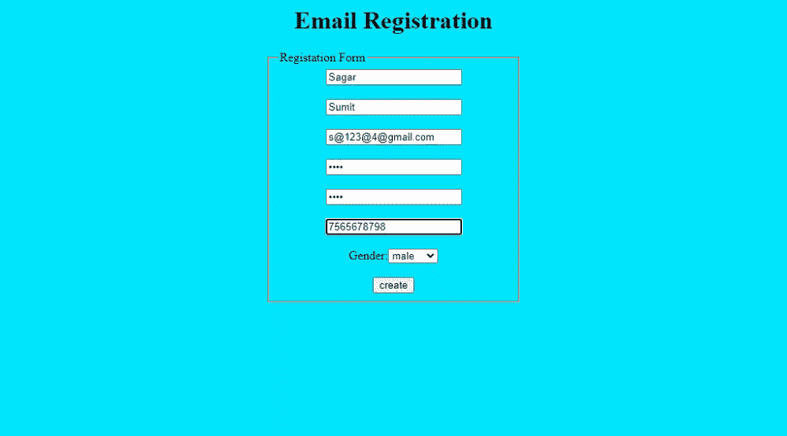
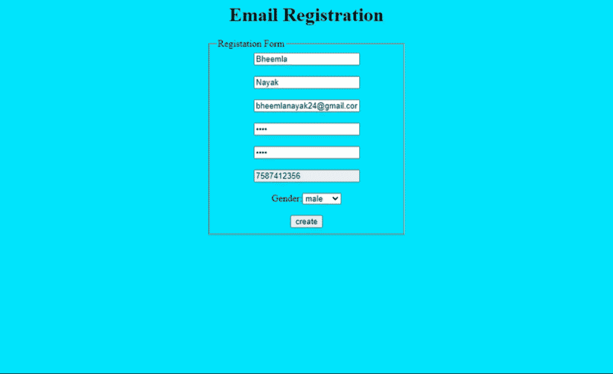
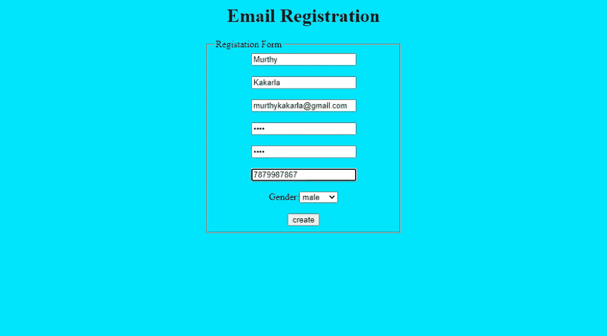

# 如何在 JavaScript 中使用正则表达式验证表单？

> 原文:[https://www . geesforgeks . org/如何使用 javascript 正则表达式验证表单/](https://www.geeksforgeeks.org/how-to-validate-form-using-regular-expression-in-javascript/)

JavaScript 是一种脚本编程语言，也有助于验证用户的信息。你听说过验证表单吗？这里进入图片 JavaScript，用于验证和确认的脚本语言。为了更深入地了解这个话题，让我们用例子来理解。

**表单验证:**表单验证是验证最终用户在表单提交过程中输入的值。对于验证表单，正则表达式起着至关重要的作用。让我们看看正则表达式是什么意思。

**正则表达式:**正则表达式是描述字符模式的对象。正则表达式用于对文本执行模式匹配和搜索替换功能。因此，在这一领域，JavaScript 在验证这些值方面起着重要作用。为了对术语有更多的了解，让我们来看一个例子。

让我们通过例子来了解如何在 JavaScript 中使用正则表达式来验证表单。

**示例 1:** **表单验证(验证电子邮件)**

假设注册表单包含最终用户的基本详细信息，如姓名、电话号码、电子邮件 id 和地址。当用户输入不带域名和“@”符号的电子邮件 id 时，表单会显示一个错误，显示“域名不包括在内”。有没有想过这是怎么发生的？这是因为 JavaScript 中的正则表达式。正则表达式可以被定义为对不正确的值的阻止(模式匹配)，即“当最终用户输入错误的细节而不是给定的正则表达式时指示错误”。使用的一些字符是“[abc],[^abc],\w,\W,\S".因此，验证最终用户输入的电子邮件地址是通过 JavaScript 完成的。

## index.html

```html
<!DOCTYPE html>
<html>

<head>
    <title>creating mailing system</title>
    <style>
        legend {
            display: block;
            padding-left: 2px;
            padding-right: 2px;
            border: none;
        }
    </style>
    <script type="text/javascript">
        function validate() {

            var user = document.getElementById("e").value;
            var user2 = document.getElementById("e");
            var re = /^\w+([\.-]?\w+)*@\w+([\.-]?\w+)*(\.\w{2,3})+$/;
            if (re.test(user)) {
                alert("done");
                return true;
            }
            else {
                user2.style.border = "red solid 3px";
                return false;
            }
        }
    </script>
</head>

<body bgcolor="cyan">
    <center>
        <h1>Email Registration</h1>
        <form>
            <fieldset style="width:300px">
                <legend>Registation Form</legend>
                <table>
                    <tr>
                        <input type="text" 
                            placeholder="firstname" 
                            maxlength="10">
                    </tr>
                    <br><br>
                    <tr>
                        <input type="text" 
                            placeholder="lastname" 
                            maxlength="10">
                    </tr>
                    <br><br>
                    <tr>
                        <input type="email" 
                            placeholder="username@gmail.com" id="e">
                    </tr>
                    <br><br>
                    <tr>
                        <input type="password" placeholder="password">
                    </tr>
                    <br><br>
                    <tr>
                        <input type="password" placeholder="confirm">
                    </tr>
                    <br><br>
                    <tr>
                        <input type="text" placeholder="contact">
                    </tr>
                    <br><br>
                    <tr>
                        <label>Gender:</label>
                        <select id="gender">
                            <option value="male">male</option>
                            <option value="female">female</option>
                            <option value="others">others</option>
                        </select>
                    </tr>
                    <br><br>
                    <tr><input type="submit" 
                        onclick="validate()" value="create">
                    </tr>
                </table>
            </fieldset>
        </form>
    </center>
</body>

</html>
```

**输出:**

这张图片显示，用户输入了一个完美的电子邮件地址，因此表单被接受，注册完成。当有人输入了错误的电子邮件时，电子邮件的文本框会以红色边框突出显示，表示这是一个错误。



无效电子邮件



提交正确的电子邮件和表格

**示例 2:表单验证(验证电话号码)**

假设同样的登记表。有没有想过为什么数字只能从 6、7、8、9 开始，而不是剩下的数字。这里，图片也由正则表达式播放，这有助于验证一个人的正确手机号码。限制用户只输入 10 位数字，其中数字“6，7，8，9”的第一位应该是数字，其余所有数字可以是 0-9 之间的任何数字，这完全是通过正则表达式“[^6-9][,0-9]”来实现的，正则表达式有助于验证表单中输入的信息是否与指定的模式相关。

## index.html

```html
<!DOCTYPE html>
<html>

<head>
    <style>
        legend {
            display: block;
            padding-left: 2px;
            padding-right: 2px;
            border: none;
        }
    </style>

    <script type="text/javascript">
        function validate() {

            var user = document.getElementById("c").value;
            var user2 = document.getElementById("c");
            var re = /^[7-9][0-9]{9}$/;
            if (re.test(user)) {
                alert("done");
                return true;
            }
            else {

                user2.style.border = "red solid 3px";
                return false;
            }
        }
    </script>
</head>

<body bgcolor="cyan">
    <center>
        <h1>Email Registration</h1>
        <form>
            <fieldset style="width:300px">
                <legend>Registation Form</legend>
                <table>
                    <tr>
                        <input type="text" 
                            placeholder="firstname" 
                            maxlength="10">
                    </tr>
                    <br><br>
                    <tr>
                        <input type="text" 
                            placeholder="lastname" 
                            maxlength="10">
                    </tr>
                    <br><br>
                    <tr>
                        <input type="email" 
                            placeholder="username@gmail.com">
                    </tr>
                    <br><br>
                    <tr>
                        <input type="password" 
                            placeholder="password">
                    </tr>
                    <br><br>
                    <tr>
                        <input type="password" 
                            placeholder="confirm">
                    </tr>
                    <br><br>
                    <tr>
                        <input type="text" 
                            placeholder="contact" id="c">
                    </tr>
                    <br><br>
                    <tr>
                        <label>Gender:</label>
                        <select id="gender">
                            <option value="male">male</option>
                            <option value="female">female</option>
                            <option value="others">others</option>
                        </select>
                    </tr>
                    <br><br>
                    <tr>
                        <input type="submit" 
                            onclick="validate()" value="create">
                    </tr>
                </table>
            </fieldset>
        </form>
    </center>
</body>

</html>
```

**输出:**

这张图片显示用户输入了一个完美的电话号码，因此表单被接受并完成注册。输入错误的电话号码时，电话号码的文本框会以红色边框突出显示，表示这是一个错误。



更正联系人和电子邮件，以便提交表格


无效的电子邮件和联系人

因此，可以通过网页中的 JavaScript 来验证表单。它应该与标记语言 HTML 联系在一起。尽管许多其他语言也参与了验证，但 JavaScript 是学习如何理解网页中执行的验证的基本方法。