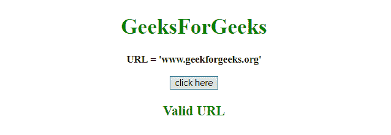
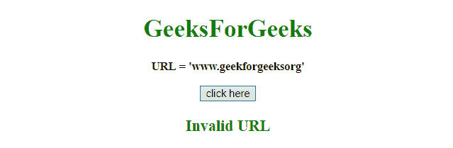

# 如何在 JavaScript 中使用正则表达式验证 URL？

> 原文:[https://www . geesforgeks . org/如何使用 javascript 正则表达式验证 URL/](https://www.geeksforgeeks.org/how-to-validate-url-using-regular-expression-in-javascript/)

给定一个网址，任务是验证它。在这里，我们将通过使用 JavaScript 将网址**与正则表达式进行匹配来声明网址**有效**或**无效**。我们要讨论几个方法。**

**示例 1:** 本示例通过使用**正则表达式**来验证**的网址。**

```
<!DOCTYPE HTML>
<html>

<head>
    <title>
        JavaScript 
      | Regular expression to match a URL.
    </title>
</head>

<body style="text-align:center;" id="body">
    <h1 style="color:green;">  
            GeeksForGeeks  
        </h1>
    <p id="GFG_UP" style="font-size: 15px;
                          font-weight: bold;">
    </p>
    <button onclick="gfg_Run()">
        click here
    </button>
    <p id="GFG_DOWN" style="color:green; 
                            font-size: 20px; 
                            font-weight: bold;">
    </p>
    <script>
        var el_up = document.getElementById("GFG_UP");
        var el_down = document.getElementById("GFG_DOWN");

        var expression = 
/[-a-zA-Z0-9@:%_\+.~#?&//=]{2,256}\.[a-z]{2,4}\b(\/[-a-zA-Z0-9@:%_\+.~#?&//=]*)?/gi;
        var regex = new RegExp(expression);
        var url = 'www.geeksforgeeks.org';
        el_up.innerHTML = "URL = '" + url + "'";

        function gfg_Run() {
            var res = "";
            if (url.match(regex)) {
                res = "Valid URL";
            } else {
                res = "Invalid URL";
            }
            el_down.innerHTML = res;
        }
    </script>
</body>

</html>
```

**输出:**

*   **点击按钮前:**
    
*   **点击按钮后:**
    

**示例 2:** 本示例通过使用与上一个不同的**正则表达式**来验证**URL = ' https://www . geeksforgeeksorg '(这是错误的)**。

```
<!DOCTYPE HTML>
<html>

<head>
    <title>
        JavaScript 
      | Regular expression to match a URL.
    </title>
</head>

<body style="text-align:center;"
      id="body">
    <h1 style="color:green;">  
            GeeksForGeeks  
        </h1>
    <p id="GFG_UP" style="font-size: 15px; 
                          font-weight: bold;">
    </p>
    <button onclick="gfg_Run()">
        click here
    </button>
    <p id="GFG_DOWN" style="color:green;
                            font-size: 20px; 
                            font-weight: bold;">
    </p>
    <script>
        var el_up = document.getElementById("GFG_UP");
        var el_down = document.getElementById("GFG_DOWN");

        var expression = 
/(https?:\/\/(?:www\.|(?!www))[a-zA-Z0-9][a-zA-Z0-9-]+[a-zA-Z0-9]\.[^\s]{2,}|www\.[a-zA-Z0-9][a-zA-Z0-9-]+[a-zA-Z0-9]\.[^\s]{2,}|https?:\/\/(?:www\.|(?!www))[a-zA-Z0-9]+\.[^\s]{2,}|www\.[a-zA-Z0-9]+\.[^\s]{2,})/gi;
        var regex = new RegExp(expression);
        var url = 'www.geekforgeeksorg';
        el_up.innerHTML = "URL = '" + url + "'";

        function gfg_Run() {
            var res = "";
            if (url.match(regex)) {
                res = "Valid URL";
            } else {
                res = "Invalid URL";
            }
            el_down.innerHTML = res;
        }
    </script>
</body>

</html>
```

**输出:**

*   **点击按钮前:**
    
*   **点击按钮后:**
    