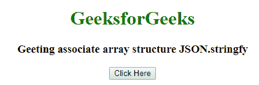
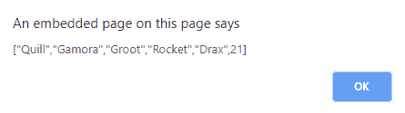
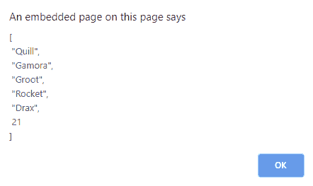
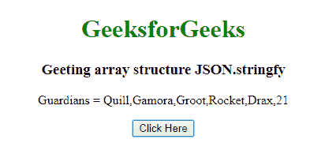
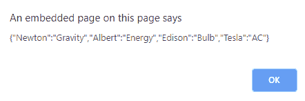
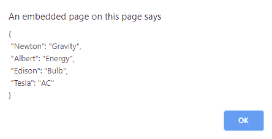
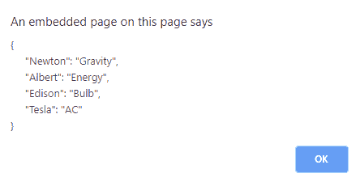

# 如何在 JavaScript 中查看一个结构的数组？

> 原文:[https://www . geesforgeks . org/如何查看 javascript 结构数组/](https://www.geeksforgeeks.org/how-to-view-array-of-a-structure-in-javascript/)

Javascript 数组是异构的。数组的结构是一样的，用两个方括号 **[ ]** 括起来，字符串应该用**“双引号”**或者**“单引号”**括起来。你可以通过使用 [JSON.stringify()](https://www.geeksforgeeks.org/javascript-json-stringify-with-examples/) 或者不使用来得到的结构，这里你会看到 JSON.stringify()的使用。其他程序[可以查看此链接](https://www.geeksforgeeks.org/how-to-get-array-structure-with-alert-in-javascript/)。
**语法:**

```
JSON.stringify(value, replacer, space)
```

alert()的功能是首先向用户提供信息，然后再继续。所以，在下面的代码中，点击**功能(Alert())** 的按钮有两个提醒(Alert())，在显示完所有的提醒后，它会进一步进入网页。通过点击警报框中的**‘确定’**，它将显示下一个警报，直到所有警报完成。
**我们来看看可以应用的预警类型:**

*   **alert(JSON . stringify(guarders)):**显示为数组结构。
*   **alert(JSON . stringify(guarders，9，1)):** 显示定制的结构，其中 **9** 充当替代者，使数组元素垂直打印， **1** 充当空格号，并在元素之间提供一个空格。
*   **alert(JSON . stringify(guarders，""，5))** :显示定制的结构， **""** 作为替换，使数组元素垂直打印， **5** 作为空格数，元素之间提供五个空格。

**例 1:**

## java 描述语言

```
<!DOCTYPE html>
<html>

<head>
    <title>
        How to view array of a
        structure in JavaScript?
    </title>
</head>

<body style="text-align:center;">

    <h1 style="color:Green;">
        GeeksforGeeks
    </h1>

    <h3>
        Getting array structure JSON.stringify
    </h3>

    <p id="d1"></p>

    <input type="button" onclick="Alert()"
                value="Click Here" />

    <script>
        function Alert() {

            // Array structure
            var guardians = ["Quill", "Gamora",
                    "Groot", "Rocket", "Drax", 21];

            // Prints the array elements with a comma
            // separated but not the structure
            document.getElementById("d1").innerHTML
                    = "Guardians = " + guardians;

            // Alerts the window with the array
            alert(JSON.stringify(guardians))

            // Alerts the window with a customized array
            alert(JSON.stringify(guardians, 9, 1))
        }
    </script>
</body>

</html>
```

**输出:**

*   **点击按钮前:**



*   **点击按钮后:**



*   **点击确定后:**



*   **最终打印结果:**



**例 2:** 你也可以很容易的得到一个 Associate 数组的结构。

## 超文本标记语言

```
<!DOCTYPE html>
<html>

<head>
    <title>
        How to view array of a
        structure in JavaScript?
    </title>
</head>

<body style="text-align:center;">

    <h1 style="color:Green;">
        GeeksforGeeks
    </h1>

    <h3>
        Getting associate array
        structure JSON.stringify
    </h3>

    <p id="d1"></p>

    <input type="button" onclick="Alert()"
                value="Click Here" />

    <script>
        function Alert() {

            // Array structure
            var guardians = {
                "Newton": "Gravity",
                "Albert": "Energy",
                "Edison": "Bulb",
                "Tesla": "AC"
            };

            // Alerts the window with the array
            alert(JSON.stringify(guardians))

            // Alerts the window with a
            // customized array
            alert(JSON.stringify(guardians, 9, 1))

            // Alerts the window with a
            // customized array
            alert(JSON.stringify(guardians,"",5))
        }
    </script>
</body>

</html>          
```

**输出:**

*   **点击按钮前:**


*   **点击按钮后:**



*   **点击确定后:**



*   **点击 2nd ok 后:**

