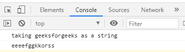
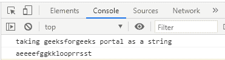

# 如何编写一个函数，在 JavaScript 中返回一个按字母顺序传递的字符串？

> 原文:[https://www . geesforgeks . org/如何编写一个函数，该函数返回一个带有字母的字符串，按照 javascript 中的字母顺序排列/](https://www.geeksforgeeks.org/how-to-write-a-function-that-returns-a-passed-string-with-letters-in-alphabetical-order-in-javascript/)

假设我们需要将字符串转换为字母顺序–

例如:

```
geeksforgeeks -> eeeefggkkorss
```

**方法:**任务是创建一个函数，该函数接受一个字符串并返回该字符串的字母顺序。

因此为了实现这一点，我们将在 javascript 中使用[](https://www.geeksforgeeks.org/javascript-string-prototype-split-function/)****[排序](https://www.geeksforgeeks.org/javascript-sort-method/)，以及** [**加入**](https://www.geeksforgeeks.org/javascript-array-join-method/) 的方法。**

****步骤 1:** 借助 javascript snd 中的 **split()** 方法将给定字符串拆分成字符，并将其存储在数组中**

****第二步:**借助 **sort()** 功能，按字母顺序对字符数组进行排序**

****第三步:**借助 **join()** 方法将字符连接成一个字符串**

****示例:****

## **java 描述语言**

```
<script>
  function alpha(str) {
    var arr = str.split(""); // splits the string
    res = arr.sort().join(""); // sort the array and joins to form a string
    return res; // returns the result
  }
  console.log("taking geeksforgeeks as a string");
  console.log(alpha("geeksforgeeks"));
</script>
```

****输出:****

****

****例外情况:****

**如果我们试图在传递的字符串之间放入空白，这将导致在结果字符串的开头放入空白。就像上面的例子一样，字符串有 1 个空格，在结果字符串中它是无用的，所以为了消除这一点，我们可以使用空格正则表达式，即 **\s+** 来选择空格，并用空字符串替换它。**

****示例:****

## **java 描述语言**

```
<script>
  function alpha(str) {
    var arr = str.split("");
    res = arr.sort().join("");
    rws = res.replace(/\s+/g, "");
    return rws;
  }

  console.log("taking geeksforgeeks portal as a string");
  console.log(alpha("geeksforgeeks portal"));
</script>
```

****输出:****

****