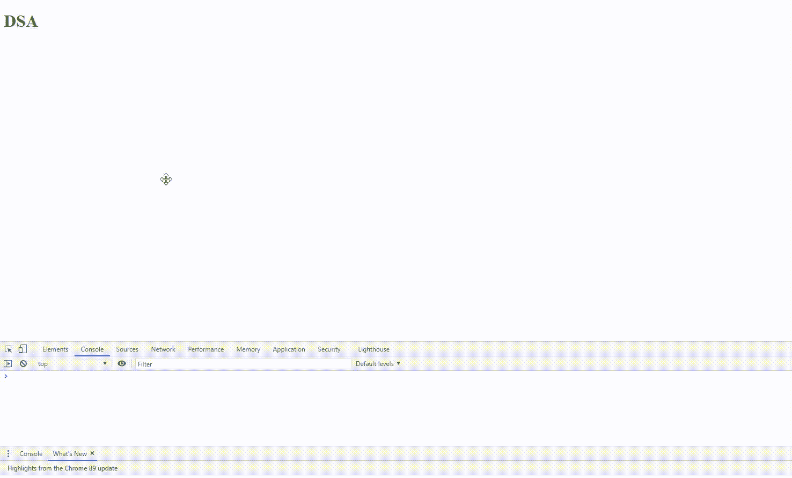

# 如何编写一个在 JavaScript 中页面底部可见时会返回 true 的程序？

> 原文:[https://www . geesforgeks . org/如何编写一个在 javascript 中页面底部可见的情况下将返回真的程序/](https://www.geeksforgeeks.org/how-to-write-a-program-that-will-return-true-if-the-bottom-of-the-page-is-visible-in-javascript/)

任务是如果页面底部可见，则返回 true。我们可以通过简单地使用窗口的高度和滚动窗口的高度来实现。

**进场:**

*   在这里，我们将首先创建一个函数，每当您使用[滚动](https://www.geeksforgeeks.org/html-dom-onscroll-event/)时都会调用该函数。
*   现在我们将使用[窗口高度](https://www.geeksforgeeks.org/javascript-bom-window-screen/)和滚动窗口高度检查每次调用函数时底部是否可见。
*   我们将结果存储在标志变量中，并将其打印到控制台上。

## 超文本标记语言

```
<!DOCTYPE html>
<html lang="en">

<head>
    <meta charset="UTF-8">
    <meta http-equiv="X-UA-Compatible"
          content="IE=edge">
    <meta name="viewport"
          content="width=device-width,
                   initial-scale=1.0">
    <title>Bottom Visible Javascript</title>
</head>

<body>
    <h1 style="margin-bottom: 1000px; color:green">DSA</h1>
    <script>
        window.onload = function() {
            window.onscroll = function() {

                let flag =
                document.documentElement.clientHeight + window.scrollY >=
                    (document.documentElement.scrollHeight ||
                    document.documentElement.clientHeight);

                console.log(flag);
                console.log("GFG scrolled ");

            };
        };
    </script>
</body>

</html>
```

**输出:**

