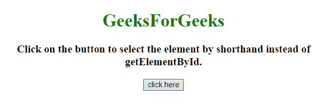
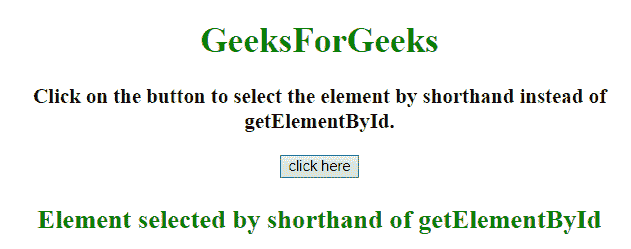

# 如何用 JavaScript 编写 document.getElementById()方法的速记？

> 原文:[https://www . geesforgeks . org/how-write-document-getelementbyid-method-in-JavaScript/](https://www.geeksforgeeks.org/how-to-write-shorthand-for-document-getelementbyid-method-in-javascript/)

任务是在 JavaScript 的帮助下，使用 document.getElementById 的简写来选择 id 为的元素。我们将讨论一些技巧。
**进场 1:**

*   定义一个返回**文档的函数。**
*   该方法以 **IDName** 作为第一个也是唯一一个参数。
*   调用以 **ID** 为自变量的方法。

**示例 1:** 在本例中，创建了一个函数，该函数返回**文档。**

```
<!DOCTYPE HTML>
<html>

<head>
    <title>
        How to write shorthand for 
        document.getElementById()
        method in JavaScript ?
    </title>
</head>

<body style="text-align:center;">

    <h1 style="color:green;"> 
        GeeksForGeeks
    </h1>

    <p id="GFG_UP" style=
        "font-size: 19px; font-weight: bold;">
    </p>

    <button onclick="GFG_Fun()">
        click here
    </button>

    <p id="GFG_DOWN" style=
        "color: green; font-size: 24px; font-weight: bold;">
    </p>

    <script>
        var ID = function(elementId) {
            return document.getElementById(elementId);
        };

        var el_up = ID("GFG_UP");
        var el_down = ID("GFG_DOWN");

        el_up.innerHTML = "Click on the button to select"
                    + " the element by shorthand instead"
                    + " of getElementById.";

        function GFG_Fun() {
            el_down.innerHTML = "Element selected by "
                    + "shorthand of getElementById";
        }
    </script>
</body>

</html>
```

**输出:**

*   **点击按钮前:**
    
*   **点击按钮后:**
    

**方法 2:**

*   定义一个原型= **文档。**
*   通过将 **IDName** 作为**文档的第一个且唯一的参数来使用这个原型。**

**示例 2:** 在本例中，创建了一个 HTMLDocument 原型，然后使用它通过 **IDName** 选择元素。

```
<!DOCTYPE HTML>
<html>

<head>
    <title>
        How to write shorthand for 
        document.getElementById()
        method in JavaScript ?
    </title>
</head>

<body style="text-align:center;">

    <h1 style="color:green;"> 
        GeeksForGeeks
    </h1>

    <p id="GFG_UP" style=
        "font-size: 19px; font-weight: bold;">
    </p>

    <button onclick="GFG_Fun()">
        click here
    </button>

    <p id="GFG_DOWN" style=
        "color: green; font-size: 24px; font-weight: bold;">
    </p>

    <script>
        HTMLDocument.prototype.e = document.getElementById;
        var el_up = document.e("GFG_UP");
        var el_down = document.e("GFG_DOWN");

        el_up.innerHTML = "Click on the button to select"
                + " the element by shorthand instead of "
                + "getElementById.";

        function GFG_Fun() {
            el_down.innerHTML = "Element selected by "
                    + "shorthand of getElementById";
        }
    </script>
</body>

</html>
```

**输出:**

*   **点击按钮前:**
    
*   **点击按钮后:**
    