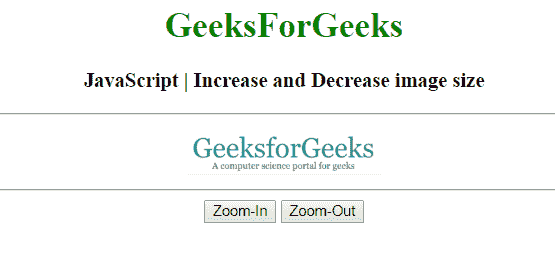
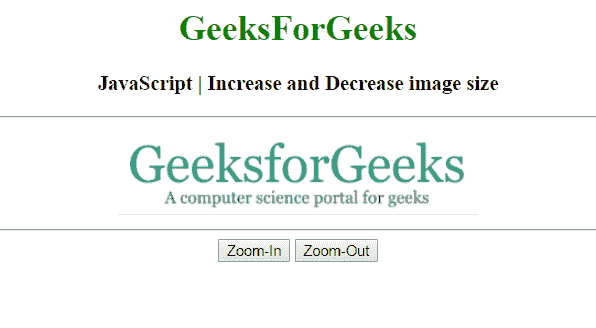
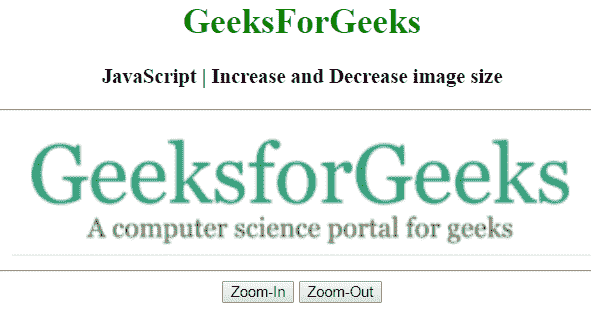

# 如何用 JavaScript 放大缩小图像？

> 原文:[https://www . geesforgeks . org/如何使用 javascript 放大和缩小图像/](https://www.geeksforgeeks.org/how-to-zoom-in-and-zoom-out-image-using-javascript/)

给定一个图像，任务是使用 JavaScript 增加和减少图像大小。使用以下属性增加和减少图像。

**使用宽度属性:**用于更改新值以调整元素的宽度。

**语法:**

```
object.style.width = "auto|length|%|initial|inherit"
```

**进场:**

*   使用**获取所需图像的选择器。getElementById(选择器)**。
*   使用**将当前宽度值存储在变量中。clientWidth** 。
*   现在使用**将宽度值更改为新的。**
*   它将按比例增加和减少图像的尺寸。

**示例:**

```
<!DOCTYPE html>
<html>

<head>
    <title>
        How to zoom-in and zoom-out
        image using JavaScript ?
    </title>

    <script src=
"https://code.jquery.com/jquery-1.12.4.min.js">
    </script>
</head>

<body style="text-align:center;">

    <h1 style = "color:green;" > 
        GeeksForGeeks 
    </h1> 

    <h3>
        JavaScript | Increase and
        Decrease image size
    </h3>
    <hr>

    <div class="box">

        
    </div>
    <hr>

    <button type="button" onclick="zoomin()">
        Zoom-In
    </button>

    <button type="button" onclick="zoomout()"> 
        Zoom-Out
    </button>

    <script type="text/javascript">
        function zoomin() {
            var GFG = document.getElementById("geeks");
            var currWidth = GFG.clientWidth;
            GFG.style.width = (currWidth + 100) + "px";
        }

        function zoomout() {
            var GFG = document.getElementById("geeks");
            var currWidth = GFG.clientWidth;
            GFG.style.width = (currWidth - 100) + "px";
        }
    </script>
</body>

</html>           
```

**输出:**

*   **之前点击按钮:**
    
*   **点击放大按钮后:**
    
*   **点击缩小按钮后:**
    

**使用高度属性:**用于更改新值以调整元素的高度。

**语法:**

```
object.style.height = "auto|length|%|initial|inherit"
```

**进场:**

*   使用**获取所需图像的选择器。getElementById(选择器)**。
*   使用**将当前高度值存储在变量中。clientHeight** 。
*   现在使用 **.style.height** 将宽度值更改为新值。
*   它将按比例增加和减少图像的尺寸。

**示例:**

```
<!DOCTYPE html>
<html>

<head>
    <title>
        How to zoom-in and zoom-out
        image using JavaScript ?
    </title>

    <script src=
"https://code.jquery.com/jquery-1.12.4.min.js">
    </script>
</head>

<body style="text-align:center;">

    <h1 style = "color:green;" > 
        GeeksForGeeks 
    </h1> 

    <h3>
        JavaScript | Increase and 
        Decrease image size
    </h3>
    <hr>

    <div class="box">
        
    </div>
    <hr>

    <button type="button" onclick="zoomin()"> 
        Zoom-In
    </button>

    <button type="button" onclick="zoomout()"> 
        Zoom-Out
    </button>

    <script type="text/javascript">
        function zoomin() {
            var GFG = document.getElementById("geeks");
            var currHeight = GFG.clientHeight;
                GFG.style.height = (currHeight + 40) + "px";
        }
        function zoomout() {
            var GFG = document.getElementById("geeks");
            var currHeight = GFG.clientHeight;
                GFG.style.height = (currHeight - 40) + "px";
        }
    </script>
</body>

</html>
```

**输出:**

*   **之前点击按钮:**
    
*   **点击放大按钮后:**
    
*   **点击缩小按钮后:**
    