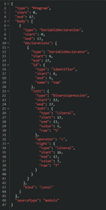
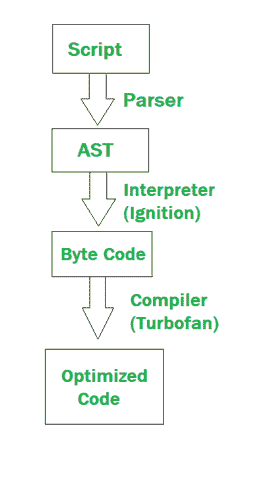

# V8 如何编译 JavaScript 代码？

> 原文:[https://www . geesforgeks . org/how-V8-编译-javascript-code/](https://www.geeksforgeeks.org/how-v8-compiles-javascript-code/)

V8 是 Google Chrome 和 Node.js 使用的一个高性能、开源的 JavaScript 和 WebAssembly 引擎，在本文中，我们将看到 V8 Architecture 场景背后发生了什么。

处理代码基本上包括三个步骤:

*   **解析代码**
*   **编译代码**
*   **执行代码**

现在让我们深入了解每个阶段。

**1。解析阶段:**在解析阶段，代码被分解成各自的标记。

**示例:**

```
const sum = 5 + 7
```

这里 const 是一个令牌，sum 是一个令牌，5 是一个令牌，'+'是一个令牌，7 是一个令牌。在代码被分解成标记后，它被交给语法分析器，语法分析器将代码转换成抽象语法树。

以下是为上述示例生成的 AST:



一种抽象语法树

**2。编译阶段:**编译是将人类可读代码转换为机器代码的过程。编译代码有两种方法:

*   **使用解释器:**解释器逐行扫描代码，并将其转换为字节码。示例:Python
*   **使用编译器:**编译器扫描整个文档，并将其编译为高度优化的字节码。示例:Java

与其他语言不同，V8 引擎同时使用编译器和解释器，并遵循**准时(JIT)编译**以提高性能。

**准时编译:**V8 引擎最初使用解释器来解释代码。在进一步的执行中，V8 引擎会找到诸如频繁执行的函数、频繁使用的变量等模式，并对它们进行编译以提高性能。假设性能下降或者传递给函数的参数改变了类型，那么 V8 只需反编译编译编译后的代码，然后返回解释器。

**示例:**如果编译器编译一个函数，假设从 API 调用中获取的数据是 String 类型，那么当接收到的数据是 object 类型时，代码就会失败。在这种情况下，编译器对代码进行解编译，返回解释器，并更新反馈。V8 引擎使用**点火**解释器，该解释器将抽象语法树作为输入，并将字节码作为输出，从而进一步进入执行阶段。当代码被解释时，编译器试图与解释器对话来优化代码。V8 引擎使用**涡扇**编译器，它以来自解释器的字节码和反馈(来自解释器)作为输入，并给出优化后的机器码作为输出。

**3。执行阶段:**字节代码通过使用 V8 引擎运行时环境的**内存堆和调用堆栈**来执行。**内存堆**是所有变量和函数分配内存的地方。**调用栈**是每个单独的函数在被调用时被推入栈，并在执行后弹出的地方。当解释器使用对象结构解释代码时，键是字节码，值是处理相应字节码的函数。V8 引擎在内存中以列表的形式对值进行排序，这些值被保存到一个地图中，从而节省了大量内存。

**示例:**

```
let Person = {name: "GeeksforGeeks"}
Person.age = 20;
```

在上面的示例中，一个地图保存了 Person 对象，该对象具有属性名称。第二行创建一个具有属性年龄的新对象，并将其链接回 Person 对象。上述方法的问题在于，搜索链表需要线性时间。为了解决这个问题，V8 为我们提供了线内缓存。

**内联缓存:**内联缓存是一种数据结构，用于跟踪对象上属性的地址，从而减少查找时间。它通过维护一个**反馈向量**，跟踪一个函数中的所有加载、存储和调用事件。反馈向量只是一个数组，用于跟踪特定函数的所有内联缓存。

**示例:**

```
const sum = (a, b) => {
    return a+b;
}
```

#### 对于上面的例子，集成电路是:

```
[{ slot: 0, icType: LOAD, value: UNINIT}]
```

这里，函数有一个类型为 LOAD 且值为 UNINIT 的 IC，这意味着函数尚未初始化。

#### 调用函数时:

```
sum(5, 10)
sum(5, "GeeksForGeeks")
```

#### 第一次呼叫时，集成电路变为:

```
[{ slot: 0, icType: LOAD, value: MONO(I) }]
```

这里的代码是以一种方式解释的，其中传递的参数只是整数类型的。即该函数只对整数值有效。

#### 第二次呼叫时，集成电路变为:

```
[{ slot: 0, icType: LOAD, value: POLY[I,S] }]
```

这里的代码是以一种方式解释的，其中传递的参数可以是整数类型或字符串。即该函数既适用于整数，也适用于字符串。因此，如果接收到的参数类型不被修改，函数的运行时间会更快。内联缓存跟踪它们的使用频率，并向涡扇编译器提供必要的反馈。编译器从解释器获取字节代码和类型反馈，并尝试优化代码，生成新的字节代码。假设编译器编译一个函数，假设从应用编程接口调用中获取的数据是字符串类型，当接收到的数据是对象类型时，代码会失败。在这种情况下，编译器对代码进行解编译，返回解释器，并更新反馈。

**JavaScript 代码的编译和执行是齐头并进的。**

下面是 JavaScript 代码编译的图示。



V8 引擎试图通过清除未使用的函数、清除超时、清除间隔等来释放内存堆。

现在，让我们了解垃圾收集的过程。

**垃圾收集:**它是编程的一个重要方面，垃圾收集器使用的技术改善了延迟、页面加载、暂停时间等。V8 引擎配备了奥里诺科河垃圾收集器，该收集器内部使用[标记和扫描算法](https://www.geeksforgeeks.org/mark-and-sweep-garbage-collection-algorithm/)从内存堆中释放空间。

奥里诺科河垃圾收集器使用三种方式收集垃圾:

*   **并行:**在并行收集中，主 JavaScript 线程利用几个助手线程的帮助并行清理垃圾，结果主执行只停止了一会儿。
*   **增量:**在增量收集中，主 JavaScript 线程轮流收集垃圾，即以增量方式。这种类型的收集用于进一步减少主线程的延迟。示例:JavaScript 线程首先收集垃圾一段时间，然后切换到主执行一段时间，然后切换回垃圾收集。这个过程一直持续到收集完所有垃圾。
*   **并发:**在并发收集中，主 JavaScript 线程不受干扰，整个垃圾由后台的辅助线程收集。