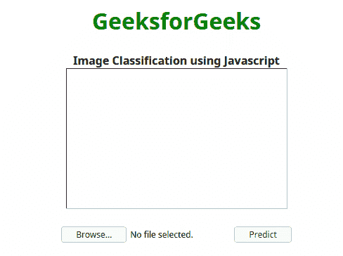

# 使用 JavaScript 的图像分类

> 原文:[https://www . geesforgeks . org/image-classification-use-JavaScript/](https://www.geeksforgeeks.org/image-classification-using-javascript/)

图像分类是机器学习最常见的应用之一。图像分类是一种计算机视觉技术，根据图像中的视觉内容对图像进行分类。这个例子我们可以训练一个图像分类器，它可以预测给定的图像是否是狗。在本文中，我们将使用 [ml5 js](https://ml5js.org) ，这是一个网络机器学习库。

**迁移学习:**在机器学习中，它是一种非常流行的技术。在这项技术中，我们使用为一项任务训练的机器学习模型，用于另一项类似的任务。在这里，我们将使用移动网络一个预先训练的机器学习模型进行图像分类任务。

*   **HTML 代码:**在这里，我们创建了一个 HTML 文件，并使用 **ml5 js cdn** 在我们的文件中使用它。我们已经创建了一个输入字段来上传图像文件。一个 **onchange** 事件监听器被设置为 **loadFile()函数**，我们将在一个单独的 javascript 文件中定义它。此外，还会添加一个空白图像字段来显示上传的图像。
    **index . html:**

    ```
    <html lang="en">
        <head>
            <meta charset="UTF-8" />
            <meta name="viewport" 
                  content="width=device-width,
                           initial-scale=1.0" />
            <title>Image Classifier using ML5 js</title>
            <script src=
    "https://unpkg.com/ml5@0.4.3/dist/ml5.min.js">
            </script>
        </head>
        <body>
            <center>
                <h1 style="color: green;">GeeksforGeeks</h1>
                <b>
                    Image Classification using Javascript
                </b>
                </br>
                
                </br></br>
                <input type="file" accept="image/*" 
                       onchange="loadFile(event)" 
                       name="image" id="file" />
                <button onclick="predict()">Predict</button>
            </center>
        </body>
    </html>
    ```

*   **JS 代码:**如果喜欢外部 JS 文件，可以在 **script.js** 文件中创建 loadFile 函数。首先，从 HTML 文件的输入字段中提取图像，并将图像设置在空白图像字段中。现在我们将启动我们的机器学习模型。然后 **ml5.imageClassifier 方法**被调用一个参数**“MobileNet”**被传递使得 MobileNet 被加载用于迁移学习，第二个参数是一个**回调函数**，记录“Model Loaded！”加载模型时在控制台中。现在在 js 部分创建一个预测函数，调用**分类器，预测方法**。第一个参数是需要分类的图像，第二个参数是回调函数。现在我们使用 alert 方法来显示模型的预测结果。单击预测按钮时，将调用该函数。

    ```
    <script>
          var loadFile = function (event) {
          var image = document.getElementById("image");
          image.src = URL.createObjectURL(event.target.files[0]);
           };
          const classifier = ml5.imageClassifier
           ("MobileNet", modelLoaded);

           // When the model is loaded
           function modelLoaded() {
           console.log("Model Loaded!");
           }

           function predict() {
           classifier.predict(document.getElementById("image"), 
                    function (err, results) {
                        alert(results[0].label);
                    });
                }
    </script>
    ```

**最终解决方案:**在本节中，我们将把上面的两个代码段合并为一个，以实现

```
<html lang="en">
    <head>
        <meta charset="UTF-8" />
        <meta name="viewport" 
              content="width=device-width, initial-scale=1.0" />
        <title>Image Classifier using ML5 js</title>
        <script src=
"https://unpkg.com/ml5@0.4.3/dist/ml5.min.js">
        </script>
     <script>
        var loadFile = function (event) {
        var image = document.getElementById("image");
        image.src = URL.createObjectURL(event.target.files[0]);
       };
       const classifier = ml5.imageClassifier
       ("MobileNet", modelLoaded);

       // When the model is loaded
       function modelLoaded() {
       console.log("Model Loaded!");
       }

       function predict() {
       classifier.predict(document.getElementById("image"), 
              function (err, results) {
                    alert(results[0].label);
                });
            }

        </script>
    </head>
    <body>
        <center>
            <h1 style="color: green;">GeeksforGeeks</h1>
            <b>
                Image Classification using Javascript
            </b>
            </br>
            
            </br></br>
            <input type="file" accept="image/*" 
                   onchange="loadFile(event)" 
                   name="image" id="file" />
            <button onclick="predict()">Predict</button>
        </center>
    </body>
</html>
```

**输出:** 