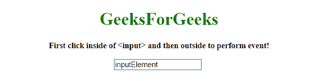
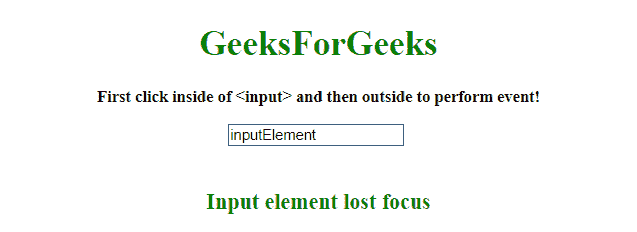

# 当一个元素失去焦点时实现一个 JavaScript】

> 原文:[https://www . geesforgeks . org/implement-a-JavaScript-当元素失去焦点时/](https://www.geeksforgeeks.org/implement-a-javascript-when-an-element-loses-focus/)

给定一个文档，任务是在元素失去焦点时实现功能。我们有两个选项，一个是**on bulr 事件**，另一个是 **onfocusout 事件** JavaScript。我们要讨论几个方法。
先了解几个方法。

*   **[onblur Event](https://www.geeksforgeeks.org/javascript-events/):**
    This event happens when an element is going to lose focus.

    **语法:**

    *   **在 HTML 中:**

    ```
    <element onblur="script">

    ```

*   **在 JavaScript 中:**

    ```
    object.onblur = function(){script};

    ```

*   **在 JavaScript 中，用 addEventListener()方法:**

    ```
    object.addEventListener("blur", script);

    ```

*   **[onfocusout Event](https://www.geeksforgeeks.org/javascript-events/):**
    This method appends a node as the last child of a node.

    **语法:**

    *   **在 HTML 中:**

        ```
        <element onfocusout="script">

        ```

    *   **在 JavaScript 中:**

        ```
        object.onfocusout = function(){script};

        ```

    *   **在 JavaScript 中，用 addEventListener()方法:**

        ```
        object.addEventListener("focusout", script);

        ```

    **示例 1:** 本示例向 **<输入>** 元素添加一个**on bulr 事件**，当它发生时，指定的代码运行。

    ```
    <!DOCTYPE HTML>
    <html>

    <head>
        <title>
            JavaScript 
          | Run JavaScript when an element loses focus.
        </title>
    </head>

    <body style="text-align:center;" 
          id="body">
        <h1 style="color:green;">  
                GeeksForGeeks  
            </h1>
        <p id="GFG_UP" 
           style="font-size: 15px;
                  font-weight: bold;">
        </p>
        <input type="text" 
               name="input" 
               value="inputElement" 
               onblur="gfg_Run();" />
        <br>
        <br>
        <p id="GFG_DOWN" 
           style="color:green; 
                  font-size: 20px;
                  font-weight: bold;">
        </p>
        <script>
            var el_up = document.getElementById("GFG_UP");
            var el_down = document.getElementById("GFG_DOWN");
            var today = 'First click inside of <input>'+
            ' and then outside to perform event!';
            el_up.innerHTML = today;

            function gfg_Run() {
                el_down.innerHTML = "Input element lost focus";
            }
        </script>
    </body>

    </html>
    ```

    **输出:**

    *   **点击按钮前:**
        
    *   **点击按钮后:**
        

    **示例 2:** 本示例向 **<输入>** 元素添加一个 **onfocusout 事件**，当它发生时，指定的代码运行。

    ```
    <!DOCTYPE HTML>
    <html>

    <head>
        <title>
            JavaScript 
          | Run JavaScript when an element loses focus.
        </title>
    </head>

    <body style="text-align:center;" id="body">
        <h1 style="color:green;">  
                GeeksForGeeks  
            </h1>
        <p id="GFG_UP" 
           style="font-size: 15px;
                  font-weight: bold;">
        </p>
        <input type="text" 
               name="input" 
               value="inputElement"
               onfocusout="gfg_Run();" />
        <br>
        <br>
        <p id="GFG_DOWN" 
           style="color:green; 
                  font-size: 20px;
                  font-weight: bold;">
        </p>
        <script>
            var el_up = document.getElementById("GFG_UP");
            var el_down = document.getElementById("GFG_DOWN");
            var today = 'First click inside of <input>'+
                ' and then outside to perform event!';
            el_up.innerHTML = today;

            function gfg_Run() {
                el_down.innerHTML = "Input element lost focus";
            }
        </script>
    </body>

    </html>
    ```

    **输出:**

    *   **点击按钮前:**
        
    *   **点击按钮后:**
        