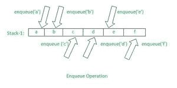
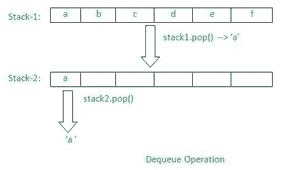

# 在 JavaScript 中只用两个栈实现入队和出队？

> 原文:[https://www . geesforgeks . org/implement-enqueue-and-queue-only-use-two-stacks-in-JavaScript/](https://www.geeksforgeeks.org/implement-enqueue-and-dequeue-using-only-two-stacks-in-javascript/)

在本文中，我们将仅使用 JavaScript 中的两个堆栈(以纯数组的形式)来实现队列的操作(入队和出队)。在直接开始理解问题陈述之前，让我们先简单了解一下什么是堆栈，什么是队列。

堆栈是基于后进先出(LIFO)概念的线性数据结构，其中最后出现的元素将首先被移除或取出。类似地，队列也是一种线性数据结构，它基于先进先出(FIFO)的概念，在这种结构中，首先出现的元素将首先被移除或取出。为了更好地理解堆叠的概念，一些真实的例子包括:将盘子一个放在另一个上面，直到最后一个盘子放在上面，等等。类似地，站在电影票收集排中，一个人首先收集电影票，直到那个人离开排，下一个人将不被允许收集电影票，这是队列的一个例子。

现在，您已经简要了解了堆栈和队列，让我们清楚地了解问题陈述，然后我们将看到问题陈述本身的解决方案。下面的图示将清楚地描述问题陈述，即仅使用两个堆栈来实现队列操作(入队和出队)



上面的图形表示表示了正在执行的入队操作，其中有几个元素(如 a、b、c 等)被插入到堆栈中(以普通数组的形式声明)。



上面的图示表示出了使用几个元素以及两个堆栈执行的出列操作，通过这两个堆栈，我们将首先从第一个堆栈中弹出(移除)最后一个元素，然后将移除的元素添加到另一个堆栈中，并进一步从另一个堆栈中移除或弹出该元素。基本上，移除和添加到另一个堆栈中是这样做的，这样它的工作方式与堆栈的工作方式相反，或者我们可以说，这里的反转是这样做的，以便使我们的逻辑类似于队列功能，而不是像堆栈本身一样工作。

现在，您已经非常清楚地理解了问题陈述，让我们继续查看解决上述问题陈述的方法。

**方法 1:**

*   在这种方法中，我们将首先初始化两个堆栈(以两个普通数组的形式)。
*   此后，我们将使用用户自己给出的几个元素在第一个堆栈中执行排队操作。
*   此外，在执行入队操作之后，我们将为第一个堆栈中的上述插入元素定义出队操作。
*   对于出列操作，我们首先必须从第一个堆栈中弹出或移除最后一个元素。
*   然后在从第一个堆栈中移除或弹出最后一个元素后，我们将把弹出的元素添加到另一个堆栈中(也是以数组的形式)。
*   然后，在将元素添加到新数组之后，我们将从下一个堆栈中弹出或移除该元素，这样我们就可以执行出列操作。

**示例:**

## java 描述语言

```
<script>

    // Two stacks declared in the form of plain array
    let stack1 = [];
    let stack2 = [];

    // Method that will perform our enqueue operation
    function enqueue(element) {
        stack1.push(element);
        console.log("Stack-1 elements are enqueue: ", stack1);
    }

    // Method that will perform our dequeue operation
    function dequeue() {
        if (stack2.length === 0) {
            if (stack1.length === 0) {
                console.log(
            "Dequeue not possible because queue is empty..");
            }
            while (stack1.length > 0) {
                let x = stack1.pop();
                stack2.push(x);
            }
        }
        console.log("Element after Dequeue: " + stack2.pop());
    }

    enqueue("a");
    enqueue("b");
    enqueue("c");
    dequeue();
    dequeue();
</script>
```

**输出:**

```
Stack-1 elements are enqueue:  [ 'a' ]
Stack-1 elements are enqueue:  [ 'a', 'b' ]
Stack-1 elements are enqueue:  [ 'a', 'b', 'c' ]
Element after Dequeue: a
Element after Dequeue: b
```

**方法 2:**

*   这种方法动态地用于多个入队和出队操作。
*   这里我们将处理多种情况，例如如果在入队之前调用出队，或者调用多个出队，或者如果在出队之后只调用入队，或者在出队之后只调用单个操作。
*   与这里的第一种方法类似，我们也将为入队和出队操作创建两个单独的函数或方法。
*   在这两种不同的方法中，我们将分别执行入队和出队的单独逻辑。

**示例:**

## java 描述语言

```
<script>
    // Two stacks declared in array form
    let stack1 = [];
    let stack2 = [];

    // Method to implement enqueue operation
    function enqueue(element) {

        // if dequeue was called before actual
        // enqueue operation
        if (stack2.length > 0) {
            let len = stack2.length;
            for (let i = 0; i < len; i++) {
                let p = stack2.pop();
                stack1.push(p);
            }
        }
        stack1.push(element);
        console.log("Elements after Enqueue: ", stack1);
    }

    // Method to implement dequeue operation......
    function dequeue() {

        // If dequeue was called consecutively, all
        // the elements would be in stack2
        if (stack2.length > 0) {
            console.log("Element after dequeue : "
                + stack2.pop());
        }

        // If enqueue was called right before
        // this dequeue, stack2 is empty
        else if (stack2.length === 0) {
            if (stack1.length === 0) {

                // If the first operation is
                // dequeue itself
                console.log("Queue is empty");
            } else if (stack1.length === 1) {

                // If a single operation as
                // enqueue was performed
                console.log(stack1.pop());
            }

            // If enqueue was called before this
            // operation, all the elements are in
            // stack1, so pop them and push the
            // elements into stack2,  then pop()
            else if (stack1.length > 0) {
                let len = stack1.length;
                for (let i = 0; i < len; i++) {
                    let p = stack1.pop();
                    stack2.push(p);
                }
                console.log("Element after dequeue: "
                    + stack2.pop());
            }
        }
    }
    enqueue("a");
    enqueue("b");
    enqueue("c");
    dequeue();
    enqueue("d");
    enqueue("e");
    dequeue();
    dequeue();
    dequeue();
    enqueue("f");
</script>
```

**输出:**

```
Elements after Enqueue:  [ 'a' ]
Elements after Enqueue:  [ 'a', 'b' ]
Elements after Enqueue:  [ 'a', 'b', 'c' ]
Element after dequeue: a
Elements after Enqueue:  [ 'b', 'c', 'd' ]
Elements after Enqueue:  [ 'b', 'c', 'd', 'e' ]
Element after dequeue: b
Element after dequeue : c
Element after dequeue : d
```