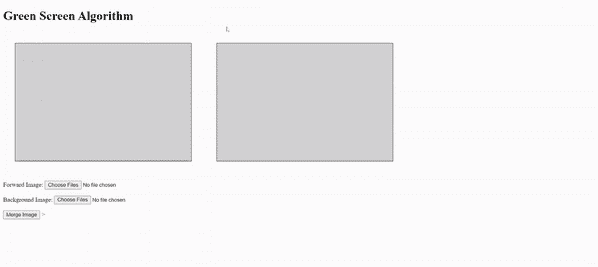

# 使用 JavaScript 实现绿屏算法

> 原文:[https://www . geesforgeks . org/implement-green-screen-algorithm-use-JavaScript/](https://www.geeksforgeeks.org/implement-green-screen-algorithm-using-javascript/)

绿屏算法(也称为 chromakey 算法)用于更改绿色背景图像，并用任何效果或其他图像替换它。基本上，我们正在做的是，用背景图像中的相应像素替换前向图像中的所有绿色像素。此外，我们必须记住输出图像的大小应该与前向图像相同。然后将前向图像中的像素复制到新图像中。背景图像的对应像素被复制，而不是绿色像素。

在实现以下代码之前，不要忘记在您的 HTML 代码中提到下面的源文件:

下面是实现这个算法的 JavaScript 代码。您必须自己编写 HTML 代码来实现它:

**示例:**

## 超文本标记语言

```html
<!DOCTYPE html>
<html>

<head>
    <script src=
"https://www.dukelearntoprogram.com/course1/common/js/image/SimpleImage.js">
    </script>

    <style>
        canvas {
            background: lightgray;
            border: 1px solid black;
            width: 450px;
            height: 300px;
            margin: 30px;
        }
    </style>
</head>

<body>

    <h1>Green Screen Algorithm</h1>

    <canvas id="pic1"></canvas> 
    <canvas id="pic2"></canvas>
    <br />

<p>
        Forward Image: <input type="file" 
        id="fgFile" multiple="false" 
        onChange="frontimg()">
    </p>

<p>
        Background Image: <input type="file" 
        id="bgFile" multiple="false" 
        onChange="backimg()">
    </p>

    <input type="button" value="Merge Image"
        onClick="merge()">

    <script type="text/javascript">
        var imgFG = null;
        var imgBG = null;

        // This function takes forward image as input
        function frontimg() {
            var fileInput = document.getElementById("fgFile");
            var canvas = document.getElementById("pic1");
            imgFG = new SimpleImage(fileInput);
            imgFG.drawTo(canvas);
        }

        // This function takes background image as output
        function backimg() {
            var fileInput = document.getElementById("bgFile");
            var canvas = document.getElementById("pic2");
            imgBG = new SimpleImage(fileInput);
            imgBG.drawTo(canvas);
        }

        // This function merges both the image and
        // produces the resultant image as output
        // Implementation of Green Screen Algorithm
        function merge() {
            clear();
            var pic1 = document.getElementById("pic1");

            var outputImage = new SimpleImage(
                    imgFG.width, imgFG.height);

            for (var pixel of imgFG.values()) {
                if (pixel.getGreen() > pixel.getRed() 
                                + pixel.getBlue()) {
                    var x = pixel.getX();
                    var y = pixel.getY();
                    var newPixel = imgBG.getPixel(x, y);
                    outputImage.setPixel(x, y, newPixel);
                }
                else {
                    outputImage.setPixel(pixel.getX(),
                            pixel.getY(), pixel);
                }
            }
            outputImage.drawTo(pic1);
        }

        // This function clears the previous 
        // fetched input and output.
        function clear() {
            var pic1 = document.getElementById("pic1");
            var pic2 = document.getElementById("pic2");
            var context = pic1.getContext("2d");
            context.clearRect(0, 0, pic1.width, pic1.height);
            context = pic2.getContext("2d");
            context.clearRect(0, 0, pic2.width, pic2.height);
        }
    </script>>
</body>

</html>
```

**输出:**



该算法以两幅图像作为输入。一个是背景中包含绿色的前向图像，另一个是要取代绿色背景的背景图像。

在将两幅图像都作为输入后，下面的代码合并了两幅图像，因此后向图像替换了前向图像的绿色背景。以上是实现绿屏算法的代码。