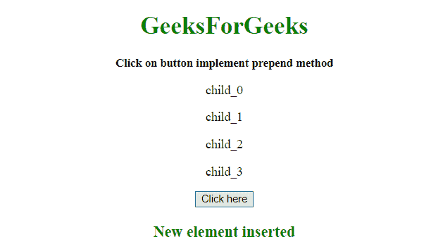
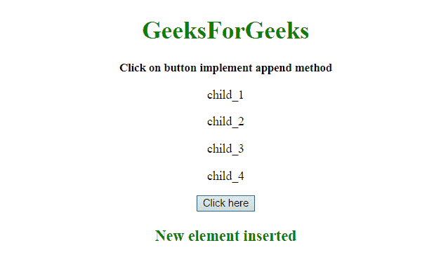

# 用常规 JavaScript 实现前置和追加

> 原文:[https://www . geesforgeks . org/implement-prepend-and-append-with-regular-JavaScript/](https://www.geeksforgeeks.org/implement-prepend-and-append-with-regular-javascript/)

任务是使用常规 JavaScript 实现 prepend()和 append()方法。我们要讨论几个方法。
首先要知道的几个方法

*   **[insertBefore() Method](https://www.geeksforgeeks.org/html-dom-insertbefore-method/):**
    This method inserts a node as a child, just before an existing child, which is specified.

    **语法:**

    ```
    node.insertBefore(newNode, existingNode)

    ```

    **参数:**

    *   **newNode:** 此参数为必选项。它指定要插入的节点对象。
    *   **existingNode:** 此参数为必选项。它指定要在它前面插入新节点的子节点。如果不使用，该方法将在末尾插入 newNode。

    **返回值:**
    返回一个节点对象，代表插入的节点。

*   **[appendChild() Method](https://www.geeksforgeeks.org/html-dom-appendchild-method/):**
    This method appends a node as the last child of a node.
    **Syntax:**

    ```
    node.appendChild(Node)

    ```

    **参数:**

    *   **节点:**此参数为必选项。它指定要追加的节点对象。

    **返回值:**
    返回一个节点对象，代表追加的节点。

**示例 1:** 本示例创建一个新的 **< p >** 元素，并使用 **insertBefore()方法**将其作为 **< div >** 元素的第一个子元素插入。

```
<!DOCTYPE HTML>
<html>

<head>
    <title>
        JavaScript 
      | implement prepend and 
      append with regular JavaScript.
    </title>
</head>

<body style="text-align:center;" id="body">
    <h1 style="color:green;">  
            GeeksForGeeks  
        </h1>
    <p id="GFG_UP" 
       style="font-size: 15px; font-weight: bold;">
    </p>
    <div id="parent">
        <p class="child">child_1</p>
        <p class="child">child_2</p>
        <p class="child">child_3</p>
    </div>
    <button onclick="gfg_Run()">
        Click here
    </button>
    <p id="GFG_DOWN"
       style="color:green; 
              font-size: 20px;
              font-weight: bold;">
    </p>
    <script>
        var el_up = document.getElementById("GFG_UP");
        var el_down = document.getElementById("GFG_DOWN");
        var today = 'Click on button implement prepend method';
        el_up.innerHTML = today;

        function gfg_Run() {
            var par = document.getElementById("parent");
            var child = document.getElementsByClassName("child");
            var newEl = document.createElement("p");
            newEl.innerHTML = "child_0";
            par.insertBefore(newEl, child[0]);
            el_down.innerHTML = "New element inserted";
        }
    </script>
</body>

</html>
```

**输出:**

*   **点击按钮前:**
    
*   **点击按钮后:**
    

**示例 2:** 本示例创建一个新的 **< p >** 元素，并使用 **appendChild()方法**将其作为 **< div >** 元素的最后一个子元素插入。

```
<!DOCTYPE HTML>
<html>

<head>
    <title>
        JavaScript 
      | implement prepend and append 
      with regular JavaScript.
    </title>
</head>

<body style="text-align:center;" id="body">
    <h1 style="color:green;">  
            GeeksForGeeks  
        </h1>
    <p id="GFG_UP"
       style="font-size: 15px;
              font-weight: bold;">
    </p>
    <div id="parent">
        <p class="child">child_1</p>
        <p class="child">child_2</p>
        <p class="child">child_3</p>
    </div>
    <button onclick="gfg_Run()">
        Click here
    </button>
    <p id="GFG_DOWN"
       style="color:green; 
              font-size: 20px;
              font-weight: bold;">
    </p>
    <script>
        var el_up = document.getElementById("GFG_UP");
        var el_down = document.getElementById("GFG_DOWN");
        var today = 'Click on button implement append method';
        el_up.innerHTML = today;

        function gfg_Run() {
            var par = document.getElementById("parent");
            var newEl = document.createElement("p");
            newEl.innerHTML = "child_4";
            par.appendChild(newEl);
            el_down.innerHTML = "New element inserted";
        }
    </script>
</body>

</html>
```

**输出:**

*   **点击按钮前:**
    
*   **点击按钮后:**
    