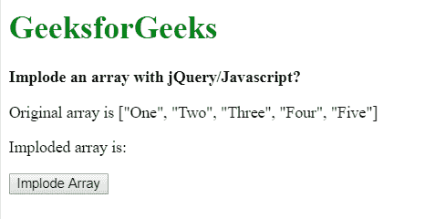
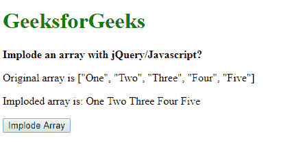
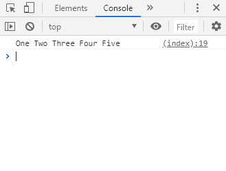
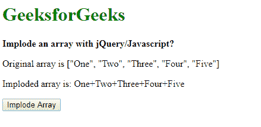
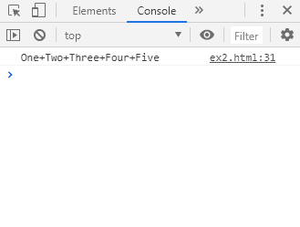

# 用 jQuery/JavaScript 内爆一个数组

> 原文:[https://www . geesforgeks . org/inter decd-a-array-with-jquery-JavaScript/](https://www.geeksforgeeks.org/implode-an-array-with-jquery-javascript/)

给定一个元素数组，任务是内爆(连接数组的元素)数组元素。

**方法 1:使用 join()方法:**join()方法可用于连接带有分隔符的数组，并将其作为字符串返回。join()方法接受分隔符的可选参数。如果未指定分隔符，则假定为逗号。如果数组只包含一个字符串，那么它将不带分隔符返回。

**语法:**

```
array.join(separator)
```

**示例:**

```
<!DOCTYPE html>
<html>

<head>
    <title>
        Implode an array with jQuery/Javascript?
    </title>
</head>

<body>
    <h1 style="color: green">
        GeeksforGeeks
    </h1>

    <b>
        Implode an array with jQuery/Javascript? 
    </b>

    <p>
        Original array is ["One",
        "Two", "Three", "Four", "Five"]
    </p>

    <p>
        Imploded array is: 
        <span class="output"></span>
    </p>

    <button onclick="implodeArray()">
        Implode Array
    </button>

    <script type="text/javascript">

        function implodeArray() {
            originalArray =
                ["One", "Two", "Three", "Four", "Five"];

            separator = ' ';
            implodedArray = originalArray.join(separator);

            console.log(implodedArray);
            document.querySelector('.output').textContent
                    = implodedArray;
        }
    </script>
</body>

</html>                    
```

**输出:**

*   **点击按钮前:**
    
*   **点击按钮后:**
    
*   **控制台输出:**
    

**方法 2:遍历数组并创建一个包含所有字符串和连接分隔符的新字符串:**通过遍历数组并将其连接到一个基本字符串，可以创建内爆函数。分隔符是在连接每个字符串后添加的，除非它是数组中的最后一个字符串。这可防止将分隔符添加到数组中最后一个字符串的末尾。
此方法比 join()方法慢，因为在连接基本字符串的过程中会临时创建大量字符串。

**示例:**

```
<!DOCTYPE html>
<html>

<head>
    <title>
        Implode an array with jQuery/Javascript? 
    </title>
</head>

<body>
    <h1 style="color: green">
        GeeksforGeeks
    </h1>

    <b>
        Implode an array with jQuery/Javascript? 
    </b>

    <p>
        Original array is ["One",
        "Two", "Three", "Four", "Five"]
    </p>

    <p>
        Imploded array is: 
        <span class="output"></span>
    </p>

    <button onclick="implodeArray()">
        Implode Array
    </button>

    <script type="text/javascript">

        function implodeArray() {
            originalArray =
            ["One", "Two", "Three", "Four", "Five"];

            separator = '+';
            implodedArray = '';

            for(let i = 0; i < originalArray.length; i++) {

                // add a string from original array
                implodedArray += originalArray[i];

                // unless the iterator reaches the end of
                // the array add the separator string
                if(i != originalArray.length - 1){
                    implodedArray += separator; 
                }
            }

            console.log(implodedArray);
            document.querySelector('.output').textContent
                    = implodedArray;
        }
    </script>
</body>

</html>                    
```

**输出:**

*   **点击按钮前:**
    
*   **点击按钮后:**
    
*   **控制台输出:**
    