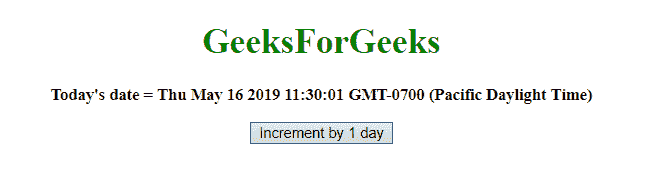
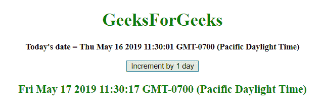
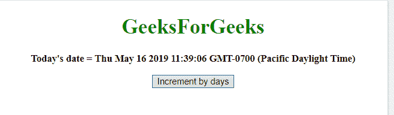
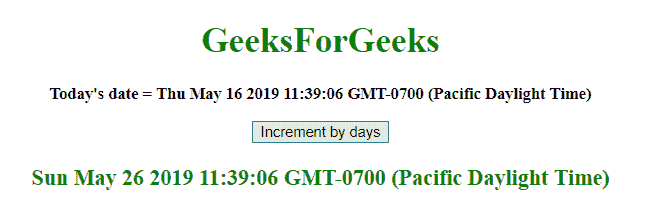

# 在 JavaScript 中增加给定的日期

> 原文:[https://www . geesforgeks . org/increment-a-给定日期-in-javascript/](https://www.geeksforgeeks.org/increment-a-given-date-in-javascript/)

给定一个日期，任务是增加它。为了在 javascript 中增加日期，我们将讨论一些技巧。首先要知道的几个方法:

*   **JavaScript getDate() method**
    This method returns the day of the month (from 1 to 31) for the defined date.
    **Syntax:**

    ```
    Date.getDate()

    ```

    **返回值:**
    返回一个数字，从 1 到 31，表示一个月中的某一天

*   **JavaScript setDate() method**
    This method sets the day of month to the date object.
    **Syntax:**

    ```
    Date.setDate(day)

    ```

    **参数:**

    *   **日:**此参数为必填项。它指定定义一个月中某一天的整数。预期值为 1-31，但小于 1 且大于 31 的值适用于上个月和下个月。

    **返回值:**
    它返回，表示日期对象和 1970 年 1 月 1 日午夜之间的毫秒数。

*   **JavaScript getTime() method**
    This method returns the number of milliseconds between midnight of January 1, 1970 and the specified date.
    **Syntax:**

    ```
    Date.getTime()

    ```

    **返回值:**
    返回一个数字，代表 1970 年 1 月 1 日午夜以来的毫秒数。

*   **JavaScript setTime()方法**
    该方法通过将定义的毫秒数加/减到/从 1970 年 1 月 1 日午夜开始来设置日期和时间。
    **语法:**

    ```
    Date.setTime(millisec)

    ```

    **参数:**

    *   **毫秒:**这个参数是必需的。它指定要加/减的毫秒数，1970 年 1 月 1 日午夜

    **返回值:**
    它返回，表示日期对象和 1970 年 1 月 1 日午夜之间的毫秒数。

    **示例 1:** 本示例通过使用**设置日期()和获取日期()方法**，将 1 天增加到**5 月 16 日**。

    ```
    <!DOCTYPE html>
    <html>

    <head>
        <title>
            JavaScript 
          | Incrementing a date.
        </title>
    </head>

    <body style="text-align:center;" id="body">
        <h1 style="color:green;">  
                GeeksForGeeks  
            </h1>
        <p id="GFG_UP"
           style="font-size: 15px;
                  font-weight: bold;">
        </p>
        <button onclick="gfg_Run()">
            Increment by 1 day
        </button>
        <p id="GFG_DOWN" 
           style="color:green; 
                  font-size: 20px; 
                  font-weight: bold;">
        </p>
        <script>
            var el_up = document.getElementById("GFG_UP");
            var el_down = document.getElementById("GFG_DOWN");
            var today = new Date();
            el_up.innerHTML = "Today's date = " + today;

            function gfg_Run() {
                var tomorrow = new Date();
                tomorrow.setDate(today.getDate() + 1);
                el_down.innerHTML = tomorrow;
            }
        </script>
    </body>

    </html>
    ```

    **输出:**

    *   **点击按钮前:**
        
    *   **点击按钮后:**
        

    **示例 2:** 本示例使用 **setTime()和 getTime()方法**将 10 天增加到**5 月 16 日**。

    ```
    <!DOCTYPE html>
    <html>

    <head>
        <title>
            JavaScript | Incrementing a date.
        </title>
    </head>

    <body style="text-align:center;"
          id="body">
        <h1 style="color:green;">  
                GeeksForGeeks  
            </h1>
        <p id="GFG_UP" 
           style="font-size: 15px; 
                  font-weight: bold;">
        </p>
        <button onclick="gfg_Run()">
            Increment by days
        </button>
        <p id="GFG_DOWN"
           style="color:green; 
                  font-size: 20px; 
                  font-weight: bold;">
        </p>
        <script>
            var el_up = document.getElementById("GFG_UP");
            var el_down = document.getElementById("GFG_DOWN");
            var today = new Date();
            var days = 10;
            el_up.innerHTML = "Today's date = " + today;

            function gfg_Run() {
                var tomorrow = new Date();
                tomorrow.setTime(today.getTime() + days * 86400000);
                el_down.innerHTML = tomorrow;
            }
        </script>
    </body>

    </html>
    ```

    **输出:**

    *   **点击按钮前:**
        
    *   **点击按钮后:**
        