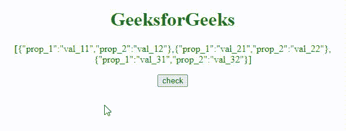
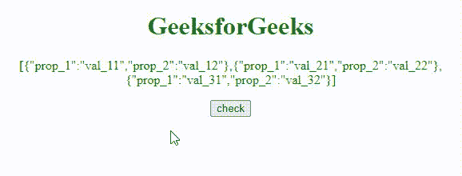
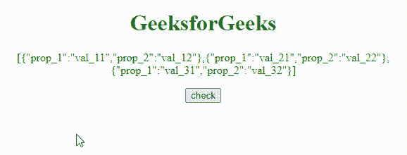

# JavaScript 中对象数组中方法的索引

> 原文:[https://www . geeksforgeeks . org/indexof-object-in-method-in-array-in-JavaScript/](https://www.geeksforgeeks.org/indexof-method-in-an-object-array-in-javascript/)

在本文中，我们将学习 Javascript 中对象数组中的 indexOf()方法。要从具有对象值的数组中访问对象的索引，我们将使用几个方法。

*   通过使用 [**地图()方法**](https://www.geeksforgeeks.org/javascript-array-map-method/)
*   通过使用 [**findIndex()** **方法**](https://www.geeksforgeeks.org/javascript-array-findindex-method/)

我们将通过例子来理解这两种方法。

**JavaScript map()方法:**该方法创建一个单独的数组，并为每个数组元素调用一个函数。此方法为数组中的每个元素调用一次指定的函数，保持顺序不变。

**语法:**

```
Array.map(function(cValue, ind, Arr), tValue)
```

**参数:**

*   **cvvalue:**此参数为必选项。当前元素的值
*   **ind:** 此参数可选。它指定当前元素的数组索引
*   **Arr:** 此参数可选。它指定当前元素所属的数组对象。
*   **t 值:**此参数可选。它指定要传递给函数的值作为其**“这个”**值。
    如果留空，将使用**“未定义”**。

**例 1:** 本例通过**地图()**方法获取 **val_32** 的索引。

## 超文本标记语言

```
<!DOCTYPE html>
<html>

<head>
    <title>JavaScript indexOf method in an object array.</title>
    <script src=
"https://ajax.googleapis.com/ajax/libs/jquery/3.4.0/jquery.min.js">
    </script>
</head>

<body style="text-align:center;" id="body">
    <h1 style="color:green;">  
            GeeksforGeeks  
    </h1>
    <p id="GFG_UP" style="color:green;"> </p>

    <button onclick="gfg_Run()"> check </button>
    <p id="GFG_DOWN" style="color:green; 
                            font-size: 20px;">
    </p>

    <script>
    var el_up = document.getElementById("GFG_UP");
    var el_down = document.getElementById("GFG_DOWN");
    var GFG_Array = [{
        prop_1: 'val_11',
        prop_2: 'val_12'
    }, {
        prop_1: 'val_21',
        prop_2: 'val_22'
    }, {
        prop_1: 'val_31',
        prop_2: 'val_32'
    }];
    el_up.innerHTML = JSON.stringify(GFG_Array);

    function gfg_Run() {
        var pos = GFG_Array.map(function(e) {
            return e.prop_2;
        }).indexOf('val_32');
        el_down.innerHTML = "Index of 'val_32' value object is = " 
        + pos;
    }
    </script>
</body>

</html>
```

**输出:**



地图()方法

**JavaScript findIndex()方法:**该方法返回满足条件的数组中第一个元素的索引。如果此方法找到函数返回真值的数组元素，则此方法返回该数组元素的索引并停止，否则返回-1。

**语法:**

```
Array.findIndex(function(cValue, ind, Arr), tValue)
```

**参数:**

*   **cvvalue:**此参数为必选项。当前元素的值
*   **ind:** 此参数可选。它指定当前元素的数组索引
*   **Arr:** 此参数可选。它指定当前元素所属的数组对象。
*   **t 值:**此参数可选。它指定要传递给函数的值作为其**“这个”**值。
    如果留空，将使用**“未定义”**。

**例 2:** 本例通过 **findIndex()** 方法获取 **val_11** 的索引。

## 超文本标记语言

```
<!DOCTYPE html>
<html>

<head>
    <title>JavaScript indexOf method in an object array.</title>
    <script src=
"https://ajax.googleapis.com/ajax/libs/jquery/3.4.0/jquery.min.js">
    </script>
</head>

<body style="text-align:center;" id="body">
    <h1 style="color:green;">  
            GeeksforGeeks  
        </h1>
    <p id="GFG_UP" style="color:green;"> </p>

    <button onclick="gfg_Run()"> check </button>
    <p id="GFG_DOWN" style="color:green;
              font-size: 20px;"> </p>

    <script>
    var el_up = document.getElementById("GFG_UP");
    var el_down = document.getElementById("GFG_DOWN");
    var GFG_Array = [{
        prop_1: 'val_11',
        prop_2: 'val_12'
    }, {
        prop_1: 'val_21',
        prop_2: 'val_22'
    }, {
        prop_1: 'val_31',
        prop_2: 'val_32'
    }];
    el_up.innerHTML = JSON.stringify(GFG_Array);

    function gfg_Run() {
        var pos = GFG_Array.findIndex(i => i.prop_1 === "val_11");
        el_down.innerHTML = "Index of 'val_11' value object is = " + pos;
    }
    </script>
</body>

</html>
```

**输出:**



findIndex()方法

**示例 3:** 这个示例没有得到值，所以返回-1 并打印**未找到！**。

## 超文本标记语言

```
<!DOCTYPE html>
<html>

<head>
    <title>JavaScript indexOf method in an object array.</title>
    <script src=
"https://ajax.googleapis.com/ajax/libs/jquery/3.4.0/jquery.min.js">
    </script>
</head>

<body style="text-align:center;" id="body">
    <h1 style="color:green;">  
            GeeksforGeeks  
        </h1>
    <p id="GFG_UP" style="color:green;"> </p>

    <button onclick="gfg_Run()"> check </button>
    <p id="GFG_DOWN" style="color:green; font-size: 20px;"> </p>

    <script>
    var el_up = document.getElementById("GFG_UP");
    var el_down = document.getElementById("GFG_DOWN");
    var GFG_Array = [{
        prop_1: 'val_11',
        prop_2: 'val_12'
    }, {
        prop_1: 'val_21',
        prop_2: 'val_22'
    }, {
        prop_1: 'val_31',
        prop_2: 'val_32'
    }];
    el_up.innerHTML = JSON.stringify(GFG_Array);

    function gfg_Run() {
        var pos = GFG_Array.findIndex(i => i.prop_1 === "val_41");
        if(pos != -1) {
            el_down.innerHTML = "Index of 'val_32' value object is = " 
            + pos;
        } else {
            el_down.innerHTML = "Not Found!";
        }
    }
    </script>
</body>

</html>
```

**输出:**



indexOf()方法