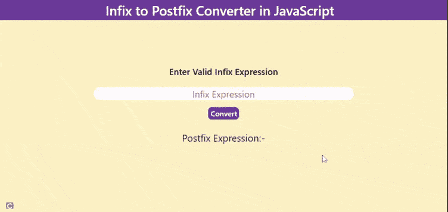

# 使用 JavaScript 的中缀到后缀转换器

> 原文:[https://www . geesforgeks . org/infix-to-postfix-converter-use-JavaScript/](https://www.geeksforgeeks.org/infix-to-postfix-converter-using-javascript/)

后缀表达式对于编译器来说更容易理解和计算。所以这是一个使用 JavaScript 将[中缀表达式转换为后缀表达式](https://www.geeksforgeeks.org/stack-set-2-infix-to-postfix/)的转换器。

**先决条件:**

*   [堆叠操作](https://www.geeksforgeeks.org/stack-data-structure-introduction-program/)
*   [中缀到后缀的转换](https://www.geeksforgeeks.org/stack-set-2-infix-to-postfix/)
*   基本 JavaScript

**进场:**

*   按钮**转换**调用函数**中缀 oPostfix()** 该函数使用 JavaScript 转换给定的中缀表达式。
*   显示后缀表达式。

**HTML 代码:**

## 超文本标记语言

```html
<!DOCTYPE html>
<html lang="en">

<head>

    <!-- link script.js file -->
    <script type="text/javascript" src="script.js"></script>
    <meta charset="UTF-8">
    <meta http-equiv="X-UA-Compatible" content="IE=edge">
    <meta name="viewport" content=
        "width=device-width, initial-scale=1.0">
    <link href=
"https://cdn.jsdelivr.net/npm/bootstrap@5.0.0-beta3/dist/css/bootstrap.min.css"
        rel="stylesheet"
        integrity=
"sha384-eOJMYsd53ii+scO/bJGFsiCZc+5NDVN2yr8+0RDqr0Ql0h+rP48ckxlpbzKgwra6"
        crossorigin="anonymous">

    <!-- Infix to Postfix & Prefix Converter title added  -->
    <title>Infix to Postfix & Prefix Converter</title>

    <!-- link style.css file -->
    <link href="infix.css" rel="stylesheet">
</head>

<body>
    <nav class="navbar navbar-light bg-light">
        <div class="container-fluid"
            style="justify-content: center;">
            <span class="navbar-brand mb-0 h1">
                Infix to Postfix Converter in JavaScript
            </span>
        </div>
    </nav>
    <div class="inputdata">

        <!-- Taking infix expression as input -->
        <span class="span1">
            Enter Valid Infix Expression
        </span>
        <br>
        <input type="text" placeholder="Infix Expression"
            id="infixvalue" class="input1">
        <br>

        <!-- InfixtoPostfix() function call-->
        <button onclick="InfixtoPostfix()" class="btn1">
            Convert</button>
    </div>
    <br>
    <div class="output">

        <!-- Postfix expression printed -->
        <span style="font-size:1.4vw;  font-size: 2.2vw;">
            Postfix Expression:-
            <span id="text"
                style="color: black; font-weight: 600;">
            </span>
        </span>
    </div>
</body>

</html>
```

**CSS 代码:**以下代码为上述 HTML 代码中使用的“infix.css”文件的内容。

## 半铸钢ˌ钢性铸铁(Cast Semi-Steel)

```html
body {
    background-color: #fff0c3;
}

.container-fluid {
    background-color: #6f459e;
    justify-content: center;
}

.navbar-brand mb-0 h1 {
    color: black;

}

.navbar-light .navbar-brand {
    color: white;
}

.navbar navbar-light bg-light {
    width: 100%;

}

.navbar {
    padding: 0%;
}

.navbar-brand {
    font-size: 1.8rem;
}

.navbar-light .navbar-brand:hover {
    color: white;
}

.inputdata {
    text-align: center;
    margin-top: 21vh;
}

.span1 {
    font-size: 2vw;
    font-weight: 500;
    color: black;
}

.input1 {
    width: 58vw;
    text-align: center;
    height: 3vw;
    place-items: center;
    font-size: 20px;
    border: 2px solid white;
    border-radius: 18px;
    margin-top: 2vw;
}

.btn1 {
    border: wheat;
    background-color: #6f459e;
    text-align: center;
    color: white;
    font-weight: 500;
    border-radius: 8px;
    margin-top: 1.5vw;
    width: 7vw;
    height: 6vh;
}

button:hover {
    background-color: #c694ff;
}

input:focus {
    outline: none;
}

.output {
    text-align: center;
}
```

**JavaScript 代码:**以下代码是上述 HTML 代码中使用的文件“script.js”的内容。

## java 描述语言

```html
// Created an empty array
var stackarr = [];

// Variable topp initialized with -1
var topp = -1;

// Push function for pushing
// elements inside stack
function push(e) {
    topp++;
    stackarr[topp] = e;
}

// Pop function for returning top element
function pop() {
    if (topp == -1)
        return 0;
    else {
        var popped_ele = stackarr[topp];
        topp--;
        return popped_ele;
    }
}

// Function to check whether the passed
// character is operator or not
function operator(op) {
    if (op == '+' || op == '-' ||
        op == '^' || op == '*' ||
        op == '/' || op == '(' ||
        op == ')') {
        return true;
    }
    else
        return false;
}

// Function to return the precedency of operator
function precedency(pre) {
    if (pre == '@' || pre == '(' || pre == ')') {
        return 1;
    }
    else if (pre == '+' || pre == '-') {
        return 2;
    }
    else if (pre == '/' || pre == '*') {
        return 3;
    }
    else if (pre == '^') {
        return 4;
    }
    else
        return 0;
}

// Function to convert Infix to Postfix
function InfixtoPostfix() {

    // Postfix array created
    var postfix = [];
    var temp = 0;
    push('@');
    infixval = document.getElementById("infixvalue").value;

    // Iterate on infix string
    for (var i = 0; i < infixval.length; i++) {
        var el = infixval[i];

        // Checking whether operator or not
        if (operator(el)) {
            if (el == ')') {
                while (stackarr[topp] != "(") {
                    postfix[temp++] = pop();
                }
                pop();
            }

            // Checking whether el is (  or not
            else if (el == '(') {
                push(el);
            }

            // Comparing precedency of el and
            // stackarr[topp]
            else if (precedency(el) > precedency(stackarr[topp])) {
                push(el);
            }
            else {
                while (precedency(el) <=
                    precedency(stackarr[topp]) && topp > -1) {
                    postfix[temp++] = pop();
                }
                push(el);
            }
        }
        else {
            postfix[temp++] = el;
        }
    }

    // Adding character until stackarr[topp] is @
    while (stackarr[topp] != '@') {
        postfix[temp++] = pop();
    }

    // String to store postfix expression
    var st = "";
    for (var i = 0; i < postfix.length; i++)
        st += postfix[i];

    // To print postfix expression in HTML
    document.getElementById("text").innerHTML = st;
}
```

**输出:**

