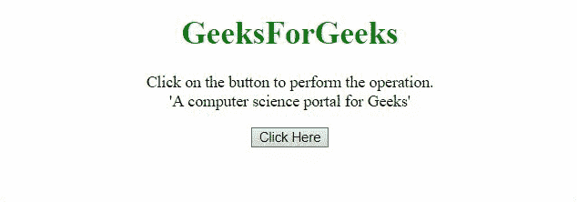

# 在 JavaScript 中每 n 个字符后插入一个字符

> 原文:[https://www . geesforgeks . org/在 javascript 中每 n 个字符后插入一个字符/](https://www.geeksforgeeks.org/insert-a-character-after-every-n-characters-in-javascript/)

这里给定一个字符串，任务是在该字符串中每 n 个字符后插入一个字符。下面讨论两个例子。

**方法 1:** 在这种方法中，通过使用 [**substr()方法**](https://www.geeksforgeeks.org/javascript-string-substr/) 将字符串分成大块，并通过 [**push()方法**](https://www.geeksforgeeks.org/javascript-array-push-method/) **将其推到数组中。**返回组块数组，然后使用 [**join()方法**](https://www.geeksforgeeks.org/javascript-array-join-method/) 对任意字符进行连接。

**示例:**

## 超文本标记语言

```
<!DOCTYPE HTML> 
<html> 
    <head>
        <title>
            Insert a character after
          every n characters in JavaScript
        </title>
        <script src=
"https://code.jquery.com/jquery-3.5.0.js">
         </script>
    </head>
    <body style = "text-align:center;"> 
        <h1 style = "color: green"> 
            GeeksForGeeks 
        </h1>
        <p id = "GFG_UP">
        </p>

        <button onclick = "gfg_Run()">
            Click Here
        </button>
        <p id = "GFG_DOWN">
        </p>

        <script>
            var el_up = document.getElementById("GFG_UP");
            var el_down = document.getElementById("GFG_DOWN");
            var str = "A computer science portal for Geeks";
            el_up.innerHTML = 
"Click on the button to perform the operation.<br>'" + str + "'";
            function partition(str, n) {
                var return = [];
                var i, l;
                for(i = 0, l = str.length; i < l; i += n) {
                   return.push(str.substr(i, n));
                }
                return return;
            };
            function gfg_Run() {
                el_down.innerHTML = partition(str, 5).join('@');
            }
        </script>
    </body> 
</html>
```

**输出:**



**方法 2:** 在这种方法中，使用一个**正则表达式**，它选择字符串的各个部分，然后使用 [**连接()方法**](https://www.geeksforgeeks.org/javascript-array-join-method/) **连接到任意字符上。**

**示例:**

## 超文本标记语言

```
<!DOCTYPE HTML> 
<html> 
    <head>
        <title>
            Insert a character after
         every n characters in JavaScript
        </title>
        <script src=
"https://code.jquery.com/jquery-3.5.0.js">
          </script>
    </head>
    <body style = "text-align:center;"> 
        <h1 style = "color: green"> 
            GeeksForGeeks 
        </h1>
        <p id = "GFG_UP">
        </p>

        <button onclick = "gfg_Run()">
            Click Here
        </button>
        <p id = "GFG_DOWN">
        </p>

        <script>
            var el_up = document.getElementById("GFG_UP");
            var el_down = document.getElementById("GFG_DOWN");
            var str = "A computer science portal for Geeks";
            el_up.innerHTML =
 "Click on the button to perform the operation.<br>'" + str + "'";
            function gfg_Run() {
               el_down.innerHTML = str.match(/.{1, 5}/g).join('@');
            }
        </script>
    </body> 
</html>
```

**输出:**

