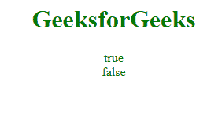
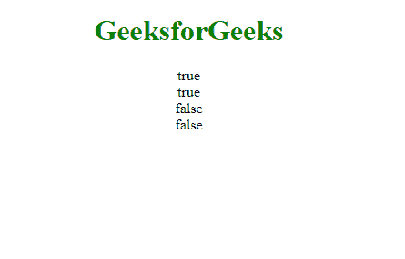
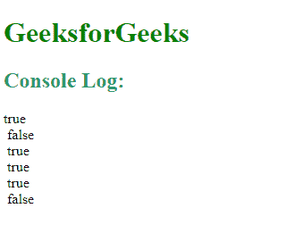

# 运算符的 JavaScript 实例

> 原文:[https://www . geesforgeks . org/instance of-operator-in-JavaScript/](https://www.geeksforgeeks.org/instanceof-operator-in-javascript/)

下面是 Instanceof 运算符的示例。

*   **例:**

    ```
    <!DOCTYPE html> 
    <html> 

    <body> 
        <center> 
            <h1 style="color:green">GeeksforGeeks</h1> 

            <p id="GFG"></p> 

            <script> 
                var a = ["Geeks", "for", "Geeks"]; 

                document.getElementById("GFG").innerHTML = 
                    (a instanceof Array) + "<br>" + 
                    (a instanceof Number); 
            </script> 
        </center> 
    </body> 

    </html> 
    ```

*   **输出:**
    

JavaScript 中的运算符的**实例用于在运行时检查对象的类型。它返回一个布尔值*如果为真，那么它表示该对象是一个特定类的实例，如果为假，那么它不是*。**

**语法:**

```
var gfg = objectName instanceof objectType
```

**参数:**
**对象名称:**陈述对象的名称。

**示例-1:** 对象类型。

```
<!DOCTYPE html>
<html>

<body>
    <center>
        <h1 style="color:green">GeeksforGeeks</h1>

        <p id="GFG"></p>

        <script>
            var fruits = ["Apple", "Mango", "Banana"];

            document.getElementById("GFG").innerHTML =
                (fruits instanceof Array) + "<br>" +
                (fruits instanceof Object) + "<br>" +
                (fruits instanceof String) + "<br>" +
                (fruits instanceof Number);
        </script>
    </center>
</body>

</html>
```

**输出:**


**示例-2:** 演示字符串和日期对象也是一种对象类型(从对象派生)。

```
<!DOCTYPE html>
<html>

<body>
    <h1 style="color:green">GeeksforGeeks</h1>

    <p id="GFG"></p>

    <script>
        var myString = new String();
        var myDate = new Date();

        console.log(myString instanceof Object);
        console.log(myString instanceof Date);
        console.log(myString instanceof String);
        console.log(myDate instanceof Date);
        console.log(myDate instanceof Object);
        console.log(myDate instanceof String);
    </script>
</body>

</html>
```

**输出**


**支持的浏览器:**

*   谷歌 Chrome
*   火狐浏览器
*   边缘
*   歌剧
*   苹果 Safari