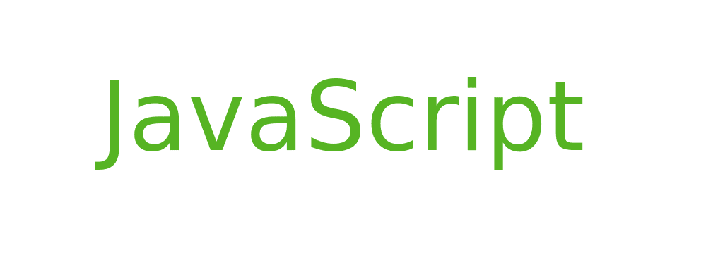

# 关于 Javascript 的有趣事实

> 原文:[https://www . geesforgeks . org/interior-facts-about-JavaScript/](https://www.geeksforgeeks.org/interesting-facts-about-javascript/)

**[JavaScript](https://www.geeksforgeeks.org/javascript-tutorial/)** (缩写为 JS)，是一种符合 ECMAScript 规范的解释型高级编程语言。这种语言还具有弱类型、动态、多范式和基于原型的特点。

**这里有一些关于 javascript 的有趣事实:**

1.  除了 HTML 和 CSS 之外，JavaScript 是万维网的三大主要功能之一。它支持交互式网页，因此是网络应用程序的重要组成部分。大多数网站都使用它，所有主要的网络浏览器都有专门的 JavaScript 引擎来执行它。
2.  JavaScript 是单线程的。这就是为什么许多使用多线程编程的人认为它的工作速度很慢，因为它不能正确地利用中央处理器的所有核心。
3.  尽管 JavaScript 和 Java 之间有相似之处，包括语言名称、各自的标准库和语法，但这两种语言是不同的，在设计上有很大的不同。
4.  像所有其他脚本语言一样，数组和对象可以用简单的快捷语法创建。这些文字构成了 JSON 数据格式的基础。
5.  JavaScript 以类似于 Perl 的方式支持正则表达式，Perl 为文本操作提供了简洁而强大的语法，比内置的字符串函数更加复杂。
6.  有一种被称为“JavaScript 劫持”的 CSRF 攻击，攻击者网站上的标签破坏了受害者网站上返回 JavaScript 或 JSON 等私人信息的页面(参考:维基百科)
7.  所有内置解释器的现代网络浏览器都支持 JavaScript。