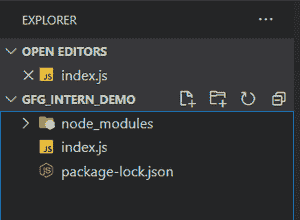

# 梦魇. js

的介绍与安装

> 原文:[https://www . geeksforgeeks . org/介绍和安装-梦魇-js/](https://www.geeksforgeeks.org/introduction-and-installation-of-nightmare-js/)

**梦魇**由 Segment 提供，是一个高级别的浏览器自动化库。这个噩梦的目标是跟随用户动作的路径(如转到、键入、点击等)。)，以便用一个感觉每个脚本块都是同步的 API 来公开一些简单的方法，而不是深度嵌套的回调。它被设计用于跨没有 API 的站点自动化任务，但现在最常用于爬行、UI 测试等。

**注意:**梦魇旨在 NodeJS 4.x 或更高版本上运行。

**噩梦的替代品**有很多替代品，最常见的一些噩梦替代品有:

*   操纵木偶的人
*   幽怪
*   法克斯足球俱乐部
*   片刻
*   洛拉斯
*   强调

**项目设置和安装所需模块:**

*   **步骤 1:** 使用以下命令安装 ***梦魇. js*** **和** ***Jquery*** 模块:

    ```
    npm install nightmare
    npm install jquery
    ```

*   **步骤 2:** 创建一个 **index.js** 文件，并使用以下方式要求模块:

    ```
    const Nightmare = require('nightmare');
    nightmare = Nightmare({ show: true});
    ```

这将创建一个可以导航到网络的梦魇实例。如上所示，可以在梦魇()中传递的 JSON 中放置可选参数。

**项目结构:**如下图。



**示例:**我们来看一个使用梦魇. js 进行 CraigLists 报废的示例:

**文件名:index.js**

## index.js

```
var jquery = require('jquery')
var Nightmare = require('nightmare'),
    nightmare = Nightmare()

var city = process.argv[2]

// Use the first argument passed as the city to be searched
nightmare.goto('http://' + city + 
'.craigslist.org/search/cpg?is_paid=yes&postedToday=1')

    // Visits the city specified by the user and gets all computer 
    // gigs posted that day
    .wait(2000)

    // Wait 2 seconds so page is guaranteed to be fully loaded
    .evaluate(function () {
        var gigs = [];

        // Create an array to hold all gigs gathered by following code
        $('.hdrlnk').each(function () {
            item = {}
            item["title"] = $(this).text()
            item["link"] = $(this).attr("href")
            gigs.push(item)
        })

        // Create a gig object with title and link, then push 
        // to the 'gigs' array
        return gigs
        // Pass the gigs array forward so it can be looped through later on
    })
    .end()
    .then(function (result) {
        for (gig in result) {
            console.log(result[gig].title);
        }
        // Print each gig to the console in a neat format
    })
```

使用以下命令运行 **index.js** 文件:

```
node index.js cityname
```

比如我们可以搜索*盐湖城*，如下图:

```
node index.js saltlakecity
```

**输出:**等待几秒，就会得到输出。
T3】