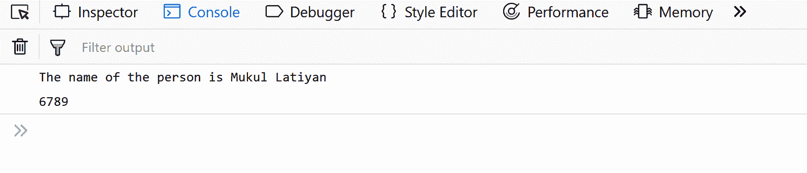
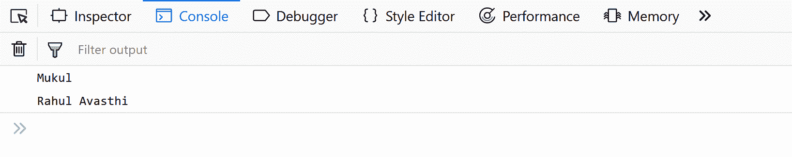
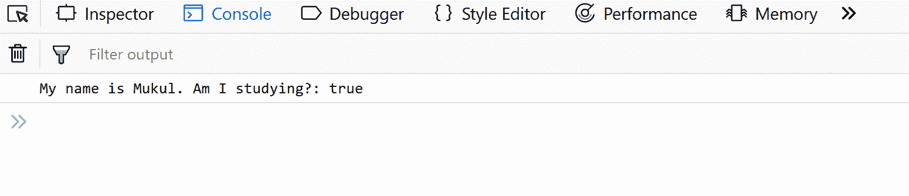
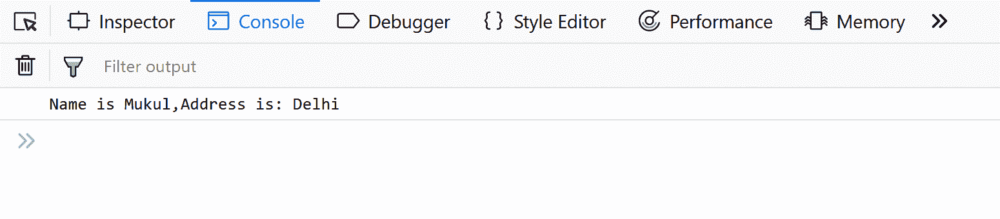
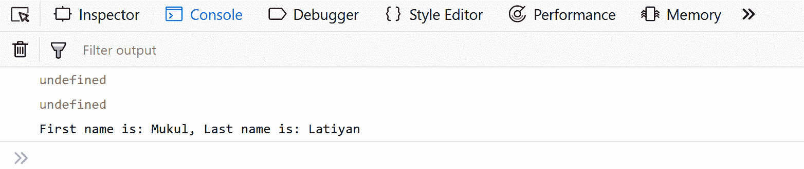
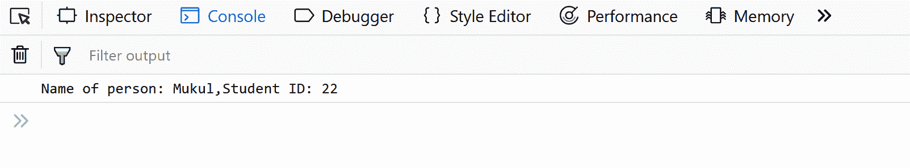

# JavaScript 面向对象编程入门

> 原文:[https://www . geesforgeks . org/introduction-面向对象-编程-javascript/](https://www.geeksforgeeks.org/introduction-object-oriented-programming-javascript/)

由于 JavaScript 在 Web 开发中被广泛使用，在本文中，我们将探索一些由 **JavaScript** 支持的**面向对象**机制，以充分利用它。在 OOPS 上的 JavaScript 中，一些常见的采访问题包括——“面向对象编程是如何在 JavaScript 中实现的？它们与其他语言有何不同？你能在 JavaScript 中实现继承等等吗……”

有一些特性或机制使得面向对象语言像:

*   **物体**
*   **类**
*   **封装**
*   **继承**

让我们深入研究它们的细节，看看它们是如何在 JavaScript 中实现的。

**1。对象**–对象是一个**特有的**实体，包含**属性**和**方法**。例如“汽车”是一个现实生活中的物体，它有一些特征，如颜色、类型、型号、马力，并执行某些动作，如驾驶。在面向对象编程中，对象的特征称为属性，而动作称为方法。对象是类的**实例**。对象在 JavaScript 中无处不在几乎每个元素都是对象，无论它是函数、数组还是字符串。

**注意:**JavaScript 中的方法是一个对象的属性，其值是一个函数。

可以用两种方式在 JavaScript 中创建对象:

*   使用**对象文字**

## java 描述语言

```
//Defining object
let person = {
    first_name:'Mukul',
    last_name: 'Latiyan',

    //method
    getFunction : function(){
        return (`The name of the person is
          ${person.first_name} ${person.last_name}`)
    },
    //object within object
    phone_number : {
        mobile:'12345',
        landline:'6789'
    }
}
console.log(person.getFunction());
console.log(person.phone_number.landline);
```

**输出:**



*   使用**对象构造器:**

## java 描述语言

```
//using a constructor
function person(first_name,last_name){
   this.first_name = first_name;
   this.last_name = last_name;
}
//creating new instances of person object
let person1 = new person('Mukul','Latiyan');
let person2 = new person('Rahul','Avasthi');

console.log(person1.first_name);
console.log(`${person2.first_name} ${person2.last_name}`);
```

**输出:**



*   使用 **Object.create()方法:**object . create()方法创建一个新对象，使用一个现有对象作为新创建对象的原型。

## java 描述语言

```
// Object.create() example a
// simple object with some properties
const coder = {
    isStudying : false,
    printIntroduction : function(){
        console.log(`My name is ${this.name}. Am I
          studying?: ${this.isStudying}.`)
    }
}
// Object.create() method
const me = Object.create(coder);

// "name" is a property set on "me", but not on "coder"
me.name = 'Mukul';

// Inherited properties can be overwritten
me.isStudying = true;

me.printIntroduction();
```

**输出:**



**2。类**–类是对象的**蓝图**。一个类可以有多个对象，因为类是一个**模板**，而对象是类或具体实现的**实例**。
在我们进一步进入实现之前，我们应该知道与其他面向对象语言不同的是，在 JavaScript 中没有类，我们只有对象。更准确地说，JavaScript 是一种基于原型的面向对象语言，这意味着它没有类，而是使用构造函数定义行为，然后使用原型重用它。

**注:**连 ECMA2015 提供的类都是对象。

> 在 ECMAScript 2015 中引入的 JavaScript 类主要是语法上的糖，而不是 JavaScript 现有的基于原型的继承。类语法没有给 JavaScript 引入新的面向对象继承模型。JavaScript 类提供了更简单、更清晰的语法来创建对象和处理继承。
> –[Mozilla 开发者网络](https://developer.mozilla.org/en-US/docs/Web/JavaScript/Reference/Classes)

**示例:**
让我们使用 ES6 类，然后我们将研究定义对象的传统方式，并将它们模拟为类。

## java 描述语言

```
// Defining class using es6
class Vehicle {
  constructor(name, maker, engine) {
    this.name = name;
    this.maker =  maker;
    this.engine = engine;
  }
  getDetails(){
      return (`The name of the bike is ${this.name}.`)
  }
}
// Making object with the help of the constructor
let bike1 = new Vehicle('Hayabusa', 'Suzuki', '1340cc');
let bike2 = new Vehicle('Ninja', 'Kawasaki', '998cc');

console.log(bike1.name);    // Hayabusa
console.log(bike2.maker);   // Kawasaki
console.log(bike1.getDetails());
```

**输出:**


传统方式。

## java 描述语言

```
// Defining class in a Traditional Way.
function Vehicle(name,maker,engine){
    this.name = name,
    this.maker = maker,
    this.engine = engine
};

Vehicle.prototype.getDetails = function(){
    console.log('The name of the bike is '+ this.name);
}

let bike1 = new Vehicle('Hayabusa','Suzuki','1340cc');
let bike2 = new Vehicle('Ninja','Kawasaki','998cc');

console.log(bike1.name);
console.log(bike2.maker);
console.log(bike1.getDetails());
```

**输出:**


如上例所示，在 ES6 中定义和重用对象要简单得多。因此，我们将在所有示例中使用 ES6。

**3。封装**–将**属性和功能**封装在**单个单元**内的过程称为封装。
我们用一个例子来理解封装。

## java 描述语言

```
//encapsulation example
class person{
    constructor(name,id){
        this.name = name;
        this.id = id;
    }
    add_Address(add){
        this.add = add;
    }
    getDetails(){
        console.log(`Name is ${this.name},Address is: ${this.add}`);
    }
}

let person1 = new person('Mukul',21);
person1.add_Address('Delhi');
person1.getDetails();
```

**输出:**



在上面的例子中，我们简单地使用构造函数创建一个*人*对象，初始化它的属性，并使用它的函数，我们不关心实现细节。我们使用的是对象接口，没有考虑实现细节。
有时封装指的是**隐藏数据**或**数据抽象**，这意味着表示隐藏背景细节的基本特征。大多数面向对象语言提供访问修饰符来限制变量的范围，但是它们在 JavaScript 中没有这样的访问修饰符，但是它们是我们可以在类/对象中限制变量范围的特定方式。

**示例:**

## java 描述语言

```
// Abstraction example
function person(fname,lname){
    let firstname = fname;
    let lastname = lname;

    let getDetails_noaccess = function(){
        return (`First name is: ${firstname} Last
            name is: ${lastname}`);
    }

    this.getDetails_access = function(){
        return (`First name is: ${firstname}, Last
            name is: ${lastname}`);
    }
}
let person1 = new person('Mukul','Latiyan');
console.log(person1.firstname);
console.log(person1.getDetails_noaccess);
console.log(person1.getDetails_access());
```

**输出:**



在上面的例子中，我们试图访问一些属性( *person1.firstname* )和函数(*person 1 . getdetails _ no access*)，但是它返回 *undefine* ，而它们是我们可以从 *person* 对象(*person 1 . getdetails _ access()*访问的方法，通过改变定义函数的方式，我们可以限制它的范围。

**4。继承**–这是一个概念，其中一个对象的某些属性和方法正被另一个对象使用。与大多数类继承类的面向对象语言不同，JavaScript 对象继承对象，即一个对象的某些特性(属性和方法)可以被其他对象重用。

让我们用例子来理解继承:

## java 描述语言

```
//Inheritance example
class person{
    constructor(name){
        this.name = name;
    }
    //method to return the string
    toString(){
        return (`Name of person: ${this.name}`);
    }
}
class student extends person{
    constructor(name,id){
        //super keyword to for calling above class constructor
        super(name);
        this.id = id;
    }
    toString(){
        return (`${super.toString()},Student ID: ${this.id}`);
    }
}
let student1 = new student('Mukul',22);
console.log(student1.toString());
```

**输出:**



在上面的例子中，我们用特定的属性和方法定义了一个*人*对象，然后我们*继承了*学生*对象中的*人*对象，并使用了人对象的所有属性和方法，还为*学生*定义了特定的属性和方法。*

**注:**人物和学生对象都有相同的方法，即 toString()，这称为**方法覆盖**。方法重写允许子类中的方法具有与父类相同的名称和方法签名。
在上面的代码中，super 关键字用于引用直接父类实例变量。

在本文中，我们介绍了 JavaScript 中的面向对象特性，有一整本书非常详细地解释了 JavaScript 中的面向对象编程，——《斯托扬·斯特凡诺夫的面向对象 JavaScript》
本文由**苏米特·戈什**供稿。如果你喜欢 GeeksforGeeks 并想投稿，你也可以使用[write.geeksforgeeks.org](https://write.geeksforgeeks.org)写一篇文章或者把你的文章邮寄到 review-team@geeksforgeeks.org。看到你的文章出现在极客博客主页上，帮助其他极客。
如果发现有不正确的地方，或者想分享更多关于上述话题的信息，请写评论。

JavaScript 最出名的是网页开发，但它也用于各种非浏览器环境。您可以通过以下 [JavaScript 教程](https://www.geeksforgeeks.org/javascript-tutorial/)和 [JavaScript 示例](https://www.geeksforgeeks.org/javascript-examples/)从头开始学习 JavaScript。