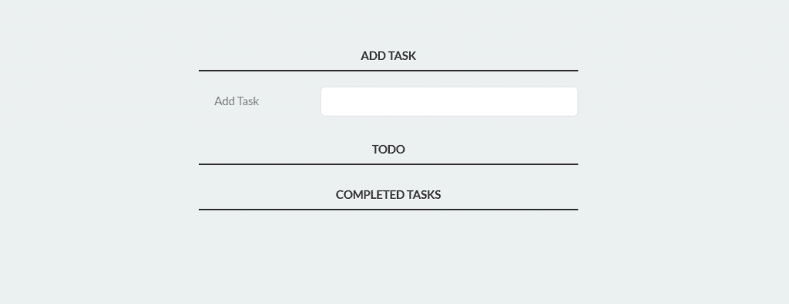

# JavaScript 课程介绍|了解如何使用 JavaScript 构建任务跟踪器

> 原文:[https://www . geesforgeks . org/介绍-JavaScript-课程-学习-如何构建-任务跟踪器-使用-javascript/](https://www.geeksforgeeks.org/introduction-to-javascript-course-learn-how-to-build-a-task-tracker-using-javascript/)

这是一门关于 JavaScript 的入门课程，将帮助您学习 javascript 的基础知识，首先是 web 开发的动态部分。您将学习基本知识，如理解代码结构、循环、对象等。

**这门课讲的是什么？**
在本课程中，我们将教你脚本语言的基础知识，以及构建一个简单的**任务跟踪器**项目。通过学习本课程，您将能够为静态网页添加功能，并通过点击按钮使其执行不同的功能。Javascript 是一个强大的工具，在客户端执行功能。它基本上提供了用户和网页之间的交互。

**结束项目预览**

**Javascript 历史**
Javascript 是由**布兰登·艾奇**在 1995 年开发的。起初，它被称为 LiveScript，但后来被命名为 JavaScript。在早期，它主要用于改善用户体验和使网站更加动态，但如今随着 Nodejs 的发展，javascript 也可以在服务器端使用，也可以作为一种编程语言来开发某些应用程序。

**课程特色:**

*   教你使页面生动所需的所有 JavaScript 基础知识。
*   将获得关于如何使用 JavaScript 的**实用知识**。
*   **Java 和 JavaScript** 有什么不同？
*   这门课会从头开始教你**一切**，所以即使你没有任何关于 Javascript 的先验知识，也完全没问题。
*   本课程结束时，你将有一个自己的**项目**。

**先决条件:**在开始本课程之前，您需要对 HTML、CSS 和静态网页有相当的了解。如果你不知道 HTML 和 CSS，请参考这个[链接。](https://www.geeksforgeeks.org/introduction-to-html-css-learn-to-design-your-first-website-in-just-1-week/)

**开发环境:**学习或练习本课程不需要任何特定的 IDE。你只需要一个文本编辑器来输入你的代码和一个网络浏览器。

**课程指南:**
这里有一些指南可能会帮助你从这门课程中获得更多。

*   **不要着急:**我们建议您不要着急，长时间参加课程，仅用一天时间就完成了整个课程。
*   **边练边练:**一边在自己的代码编辑器中输入代码，一边在浏览器中渲染，一边反复练习课程。
*   **不要复制粘贴:**避免直接将代码从我们的源代码复制粘贴到您的编辑器中。相反，首先，试着理解代码并自己键入代码。如果你犯了一个错误，得到了一个不同的输出，然后回来把你的代码和我们的匹配，找出你哪里出错了。
*   **不要跳过任何部分:**请不要只看标题就跳过任何部分。
*   **不要跳过练习测验:**请不要匆忙跳过分段测验来学习下一节。测验是专门为测试你刚刚完成的部分的知识而设计的。它不仅能检查你的知识，还能促进你学习更多。

### 课程内容

<figure class="table">

| 主题 |
| --- |
| **1。**[JavaScript 课程介绍&#124;概述](https://www.geeksforgeeks.org/introduction-to-javascript-course-overview/) |
| **2。** [JavaScript 课程&#124;什么是 JavaScript？](https://www.geeksforgeeks.org/javascript-course-what-is-javascript/) |
| **3。** [JavaScript 课程&#124;用 JavaScript 打印 Hello World](https://www.geeksforgeeks.org/javascript-course-printing-hello-world-in-javascript/) |
| **4。** [JavaScript 课程&#124;理解 JavaScript 中的代码结构](https://www.geeksforgeeks.org/javascript-course-understanding-code-structure-in-javascript/) |
| **5。** [JavaScript 课程&#124; JavaScript 中的变量](https://www.geeksforgeeks.org/javascript-course-variables-in-javascript/) |
| **6。** [JavaScript 课程&#124; JavaScript 中的数据类型](https://www.geeksforgeeks.org/javascript-course-data-types-in-javascript/) |
| **7。** [JavaScript 课程&#124; JavaScript 中的操作符](https://www.geeksforgeeks.org/javascript-course-operators-in-javascript/) |
| [JavaScript 课程&#124;练习小测验-1](https://www.geeksforgeeks.org/javascript-course-quiz-1/) |
| **8。** [JavaScript 课程&#124;与用户互动](https://www.geeksforgeeks.org/javascript-course-interaction-with-user/) |
| **9。** [JavaScript 教程&#124; JavaScript 中的逻辑运算符](https://www.geeksforgeeks.org/javascript-course-logical-operators-in-javascript/) |
| **10。** [JavaScript 课程&#124; JavaScript 中的条件运算符](https://www.geeksforgeeks.org/javascript-course-conditional-operator-in-javascript/) |
| **11 时。** [JavaScript 课程&#124; JavaScript 提示示例](https://www.geeksforgeeks.org/javascript-course-javascript-prompt-example/) |
| [JavaScript 课程&#124;练习小测验-2](https://www.geeksforgeeks.org/javascript-course-quiz-2/) |
| **12 时。** [JavaScript 课程&#124; JavaScript 中的循环](https://www.geeksforgeeks.org/javascript-course-loops-in-javascript/) |
| **13。** [JavaScript 课程&#124; JavaScript 中的功能](https://www.geeksforgeeks.org/javascript-course-functions-in-javascript/) |
| **14。** [JavaScript 课程&#124; JavaScript 中的对象](https://www.geeksforgeeks.org/javascript-course-objects-in-javascript/) |
| **15。** [JavaScript 课程&#124;任务跟踪器项目](https://www.geeksforgeeks.org/javascript-course-task-tracker-project/) |
| [JavaScript 课程&#124;练习小测验-3](https://www.geeksforgeeks.org/javascript-course-quiz-3/) |

</figure>