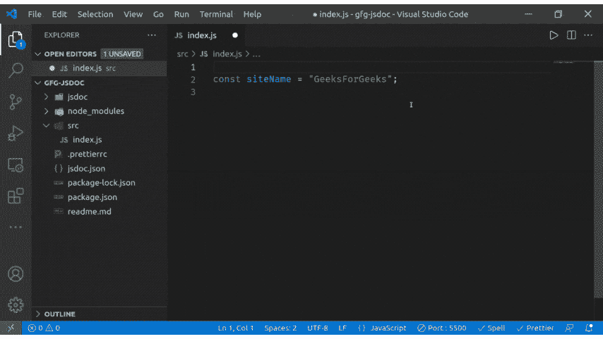
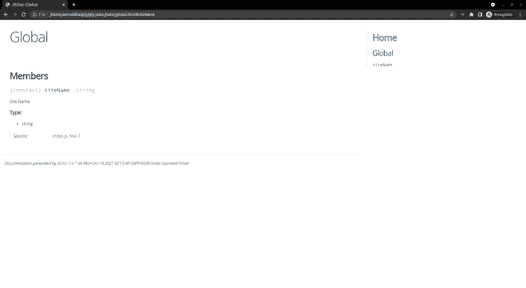

# JSDoc 介绍

> 原文:[https://www.geeksforgeeks.org/introduction-to-jsdoc/](https://www.geeksforgeeks.org/introduction-to-jsdoc/)

在代码库中包含文档有其广泛的好处，其中一些好处包括新程序员和希望重新访问他们过去的代码库的高级程序员容易理解代码，当记录代码时，您需要适当地总结它。这最终有助于适当地理解整个代码库。

### JSDoc——一个 JavaScript 的 API 文档生成器。

JSDoc 是一个 Javascript 的文档生成器，它类似于 [JavaDoc](https://www.geeksforgeeks.org/what-is-javadoc-tool-and-how-to-use-it/) 或者 [Python Docstrings。](https://www.geeksforgeeks.org/python-docstrings/)您需要在代码中包含文档注释，然后 JSDoc 将在这些注释的帮助下生成一个 HTML 文档网站。

#### 安装 JSDoc 的步骤

要全局安装 JSDoc，请运行以下命令

```
npm install -g jsdoc
```

如果您需要在项目中安装 JSDoc 作为开发依赖项，那么运行这个命令

```
npm install -D jsdoc
```

#### 配置 JSDoc

在 *package.json、*的“scripts”属性中，我们需要添加 jsdoc 命令来运行 JSDoc 并生成文档，在 *package.json* 文件中添加类似于下面给出的命令

```
"scripts": {
    "jsdoc": "jsdoc -c jsdoc.json"
    ...
  }
```

这个命令有一个 **-c** 标记，表示 jsdoc 将使用自定义配置文件运行，因此让我们为 JSDoc 创建一个配置文件。

在项目目录的根目录下创建一个名为*“jsdoc . JSON”*的文件，在该文件中添加以下代码:

## java 描述语言

```
{
  "plugins": ["plugins/markdown"],
  "recurseDepth": 10,
  "source": {
    "include": ["src"],
    "includePattern": ".js{content}quot;,
    "excludePattern": "(node_modules/|docs)"
  },
  "templates": {
    "cleverLinks": true,
    "monospaceLinks": true
  },
  "opts": {
    "destination": "./jsdoc",
    "recurse": true,
    "readme": "./readme.md"
  }
}
```

**说明:**

*   已启用标记插件，可将标记格式的文本转换为 HTML
*   recurseDepth 值设置为 10，表示 jsdoc 搜索文件的深度
*   为了指定输入，我们在 **include** 属性中包含了“src”，这意味着 jsdoc 将为 src 目录中的文件生成文档
*   包括模式捐赠选择哪个文件，这里**。js$** 表示将包含**。js，。jsx** & **。jsdoc** 文件
*   Node_modules 和 docs 文件夹被排除
*   模板决定了生成的文档的外观
*   opts 部分包含 JSDoc 命令

#### 运行 JSDoc

让我们在 src 文件夹中创建一个文件 index.js，并在其中声明一个变量来生成文档

## java 描述语言

```
/**
 * Site Name
 * @type {string}
 */
const siteName = "GeeksForGeeks";
```

这里我们已经创建了一个名为“siteName”的字符串，在注释中，我们有一个对变量的简单描述和 **@type** 标记，该标记表示变量的类型
在 VSCode 中写完 **/**** 后，IntelliSense 会自动建议一个 JSDoc 注释，点击 enter，并写下如下所示的注释。



现在我们的代码已经准备好了文档，让我们运行 jsdoc 并创建一个文档

**运行步骤:**要运行 jsdoc，打开终端，写下以下命令

```
npm run jsdoc
```

这个命令会在你的项目目录的根目录下创建一个“ **jsdoc** ”文件夹，在里面会生成一个 index.html 文件，你可以在浏览器中打开它来查看我们生成的文档

**输出:**



生成的 HTML 文档