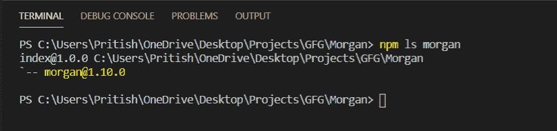
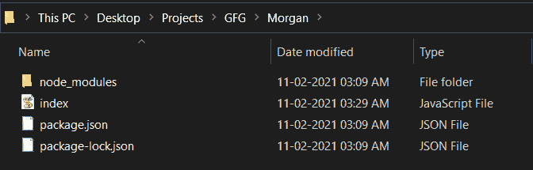

# 摩根. js 简介

> 原文:[https://www.geeksforgeeks.org/introduction-to-morgan-js/](https://www.geeksforgeeks.org/introduction-to-morgan-js/)

Morgan 是一个记录 HTTP 请求和错误的中间件。中间件只是一个能够访问请求和响应生命周期方法的功能。我们可以使用预定义的格式或者创建新的格式来格式化我们的日志。

**摩根安装:**

**第一步:**您可以访问[摩根](https://www.npmjs.com/package/morgan)获取文档。可以使用此命令安装软件包。

```
npm install morgan
```

**步骤 2:** 安装完成后，您可以使用以下命令检查软件包的安装版本:

```
npm ls morgan
```



**第 3 步:**要开始使用 morgan，创建一个名为 index.js 的文件。使用这个命令，包可以包含在 index.js 中。

```
const morgan = require('morgan')
```

**第 4 步:**要使用 morgan，我们必须调用一个实例，并将其作为参数传递给 app.use()，这是 HTTP 请求之前的一个快速中间件。这可以通过以下方式实现:

```
app.use(morgan(string));
```

上面的字符串定义了我们想要记录信息的格式。

**项目结构:**项目结构如下图所示。



摩根有五种预定义的格式，我们可以直接使用它们来获取所需的信息。这些是:

1.  **组合:**给出了 Apache 标准的组合格式日志。
2.  **common:** 给出标准 Apache 公共日志输出。
3.  **dev:** 这是一种彩色编码的日志格式。
4.  **短:**比默认格式短。它还包括响应时间。
5.  **微小:**它是最短的日志，包含的信息很少。

所有这些预定义格式的输出格式可以在[这里](https://www.npmjs.com/package/morgan)找到。

**例 1:**

## index.js

```
// Requiring modules
const express = require("express");
const morgan = require("morgan");
const app = express();

// Using combined predefined format
app.use(morgan("combined"));

// Creating an endpoint where 
// requests can be made and
// we can get logs
app.get("/", (req, res) => {
  res.send("GeeksforGeeks");
});

// Running on PORT
const PORT = 5000;

app.listen(PORT, () => {
  console.log(`Running on PORT: ${PORT}`);
});
```

**运行应用程序的步骤:**在终端运行以下命令执行 index.js 文件。

```
node index.js
```

**输出:**

```
::1 - - [10/Feb/2021:22:18:30 +0000] "GET / HTTP/1.1" 304 - "-" "Mozilla/5.0
(Windows NT 10.0; Win64; x64) AppleWebKit/537.36 (KHTML, like Gecko) 
Chrome/88.0.4324.150 Safari/537.36"
```

当您访问 https://localhost:5000 时，上述日志将出现在控制台中。该日志为我们提供了各种信息，如发出请求的日期和时间、请求的方法(在本例中为 **GET** )、发出请求的网址(即“**/”**)等等。

**例 2:**

## index.js

```
// Requiring modules
const express = require("express");
const morgan = require("morgan");
const app = express();

// Using dev predefined format
// Returns
app.use(morgan("dev"));

// Creating an endpoint where
// requests can be made and
// we can get logs
app.get("/home", (req, res) => {
  res.send("GeeksforGeeks");
});

// Running on PORT
const PORT = 5000;

app.listen(PORT, () => {
  console.log(`Running on PORT: ${PORT}`);
});
```

**输出:**

当您访问“https://localhost:5000”时，输出将是:

```
GET / 404 4.031 ms - 139
```

由于我们没有**/**URL**的任何端点，因此我们最终会使用类型为 **GET** 且响应时间以毫秒为单位的方法得到一个 404 错误。**

**当您访问“https://localhost:5000/home”时，输出将是:**

```
GET /home 200 3.416 ms - 13
```

**在我们的程序中，我们创建了一个端点**“/home”**，因此我们得到的回应是 200。**

****例 3:****

## **index.js**

```
// Requiring modules
const express = require("express");
const morgan = require("morgan");
const app = express();

// Creating customised logs
// :method return method used like - GET,POST
// :url retuns to which url request was made
// :status returns the status returned from req like - 200,404
// :response-time returns the time it took to give response
// Rest things are printed as it is
app.use(
  morgan(
    "Method- :method URL- :url Status- :status ResponseTime-  :response-time ms"
  )
);

// Creating an endpoint where
// requests can be made and
// we can get logs
app.get("/home", (req, res) => {
  res.send("GeeksforGeeks");
});

// Running on PORT
const PORT = 5000;

app.listen(PORT, () => {
  console.log(`Running on PORT: ${PORT}`);
});
```

****输出:****

```
Method- GET URL- /home Status- 200 ResponseTime-  3.392 ms
```

**在上面的程序中，我们定制了我们的输出日志。格式为 **:** 后接信息名称。这些是预定义的令牌，可以使用前面的 **:** 添加。**

**我们还可以在。token()方法。请参见下面的示例:**

****例 4:****

## **index.js**

```
// Requiring modules
const express = require("express");
const morgan = require("morgan");
const app = express();

// Creating custom token
// with name time
morgan.token(
  "time",
  " :method request for :url was received.Response time: :response-time"
);

// Using the name of
// token we created above
app.use(morgan("time"));

// Creating an endpoint where
// requests can be made and
// we can get logs
app.get("/home", (req, res) => {
  res.send("GeeksforGeeks");
});

// Running on PORT
const PORT = 5000;

app.listen(PORT, () => {
  console.log(`Running on PORT: ${PORT}`);
});
```

****输出:****

```
GET request for /home was received.Response time: 5.567
```

**Morgan 是一个非常简单的记录器，它允许在记录 HTTP 请求时具有灵活性，并为我们提供所需的信息。这就是我们如何在应用程序中使用摩根**