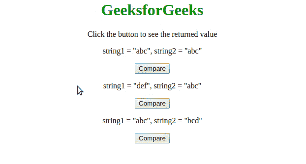

# JavaScript 中有没有类似 PHP strcmp()函数的东西？

> 原文:[https://www . geesforgeks . org/is-what-类似于-PHP-strcmp-function-in-JavaScript/](https://www.geeksforgeeks.org/is-there-anything-similar-to-php-strcmp-function-in-javascript/)

字符串比较功能在很多语言中都有，比如 PHP 中的[**【strcmp()】**](https://www.geeksforgeeks.org/php-strcmp-function/)，C，C++，(<，>，==，！Python 中的运算符等。在 JavaScript 中，要比较两个字符串我们使用[**localCompare()方法**](https://www.geeksforgeeks.org/javascript-string-localecompare/) 。 **localCompare()** **方法**比较当前或当前区域中的两个字符串。它返回一个整数来指示字符串是否相等，或者一个字符串是按照排序顺序出现在另一个字符串之前还是之后。

**语法**:

```html
string1.localCompare(string2)

```

**返回值:****本地比较()**方法返回

*   **0** ，如果两个字符串:string1 和 string2 相等
*   **1** ，如果 string1 在 string2 之后排序
*   **-1** ，如果字符串 1 在字符串 2 之前排序

**示例:**

## Java Script 语言

```html
<!DOCTYPE html>
<html>

<head>
    <title>
        Similar in JavaScript like PHP strcmp() Function
    </title>
    <style>
        h1 {
            color: green;
        }
    </style>
</head>

<body>
    <center>
        <h1>GeeksforGeeks</h1>
        <p>
            Click the button to see the returned value
        </p>

        <p>string1 = "abc", string2 = "abc"</p>
        <button onclick="Comparison1()">
            Compare
        </button>

        <p>string1 = "def", string2 = "abc"</p>
        <button onclick="Comparison2()">
            Compare
        </button>

        <p>string1 = "abc", string2 = "bcd"</p>
        <button onclick="Comparison3()">
          Compare
        </button>

        <p id="compare"></p>
    </center>

    <script>
        function Comparison1() {
            var string1 = "abc";
            var string2 = "abc";
            var return_val = string1.localeCompare(string2);
            document.getElementById("compare").innerHTML = 
              return_val;
        }

        function Comparison2() {
            var string1 = "def";
            var string2 = "abc";
            var return_val = string1.localeCompare(string2);
            document.getElementById("compare").innerHTML = 
              return_val;
        }

        function Comparison3() {
            var string1 = "abc";
            var string2 = "def";
            var return_val = string1.localeCompare(string2);
            document.getElementById("compare").innerHTML = 
              return_val;
        }
    </script>
</body>

</html>
```

**输出:**

