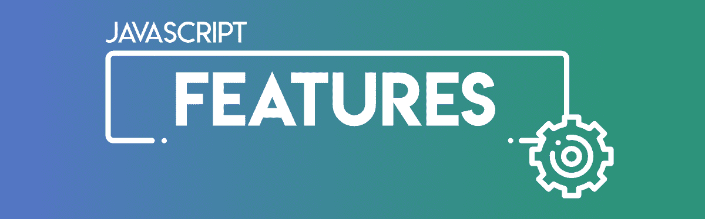

# JavaScript |每一个问题的良药

> 原文:[https://www . geeksforgeeks . org/JavaScript-一药解决一切问题/](https://www.geeksforgeeks.org/javascript-a-medicine-to-every-problem/)

在这个充满不同语言的世界里，知道什么该选，什么不该选是很令人困惑的。大多数时候，学生们想开始做一些事情，但是当他们搜索时，他们有很多选择，市场上有很多技术。有选择是好的，但有时候很多选择也会在大脑中制造洪水，不是吗？

JavaScript 是一种灵活而强大的编程语言。除了 HTML 和 CSS，JavaScript 也是网络技术的核心组件。在它诞生的早期，JavaScript 只是用来提供客户端(用户视图)的交互性，但是为什么它在今天的时代获得了如此大的人气，成为了开发者的最爱呢？

**JavaScript 的使用:**

*   你正在开发一个网站，你写了 HTML 和 CSS 代码，或者你可能使用了一些像 Bootstrap 这样的框架，但是你不想要那个无聊的静态网站，你想让它成为一个交互式的(意味着你想如果那个事件发生了，那么它应该发生，就像那样)网站。不用担心，很明显 JavaScript 就在那里。它旨在为静态网站增加交互性。
*   有两种类型的编程语言，客户端和服务器端编程语言。你已经做了很多客户端编程，现在你想尝试一些服务器端的东西，但是当你一想到服务器端，一个想法就浮现在脑海中，现在我必须学习一种新的服务器端编程语言，比如 Python、PHP、Ruby on Rails 等等，但是现在情况不是这样，这里的 JavaScript 附带了 Node.js(它是一个事件驱动的 JavaScript 平台，可以进行非阻塞的 I/O)一个 JavaScript 框架，可以用来编写服务器端编程。它还可以用来编写自己的 web 服务器(通过响应用户的请求向用户提供内容)。Express.js 是另一个用几行代码创建 web 服务器的框架。太棒了，不是吗？您正在学习一门单一的语言，并且正在使用相同的编程语言编写交互式客户端和服务器端。
*   你已经做了很多网页开发，现在你想尝试一些安卓开发。安卓意味着你必须学习 Java 和安卓，如果你想学习它们，那很好，但是当 JavaScript 在那里的时候，不要害怕，这是你能用 JavaScript 做的最强大的事情。它可以为手机构建应用程序。Phone gap 是该领域最古老、最成熟的框架之一。虽然现在 React Native，NativeScript 也开始出现，并且越来越受欢迎。排名前 3 的 React 和 Node.js。
*   做了网页开发，安卓开发，现在剩下的就是桌面应用。JavaScript 包含另一个框架，称为 Electron.js。Electron 使用 Chromium 和 Node.js，因此它可以用来构建带有 HTML、CSS 和 JavaScript 的桌面应用程序。它处理困难的部分，所以你可以专注于核心功能。
*   你是一个 javaScript 爱好者，你总是喜欢 Java 脚本，在这里你也可以用像 deck.js、impress.js、REFLOW . js 等 JavaScript 框架创建令人敬畏的演示文稿。
*   这是一个非常非常神奇的东西，赛昂。js 是一个用于机器人、物理计算和物联网的 JavaScript 框架。这使得指挥机器人和设备变得非常容易。

从上面的阅读中，毫无疑问，为什么 JavaScript 变得如此流行，它几乎可以做任何事情。学习 JavaScript 可以给你提供很多机会，所以你可以用 JavaScript 做一些非常神奇的事情。