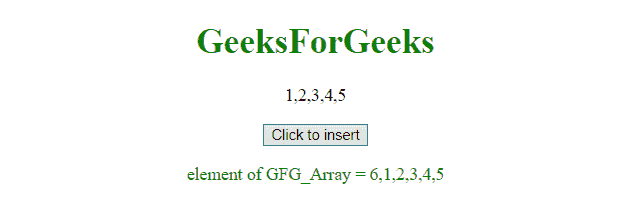
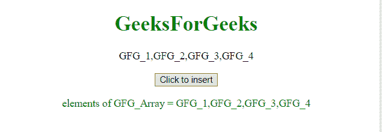
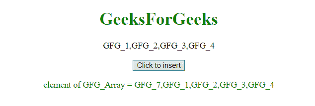

# JavaScript |在数组开头添加新元素

> 原文:[https://www . geeksforgeeks . org/JavaScript-add-new-elements-在数组开头/](https://www.geeksforgeeks.org/javascript-add-new-elements-at-the-beginning-of-an-array/)

在已有数组的开头添加新元素可以使用 **[数组 unshift()方法](https://www.geeksforgeeks.org/javascript-array-prototype-unshift-function/)** 完成。这个方法类似于 **push()** 方法，但是它在数组的开头添加了元素。

**语法:**

```
ArrayObject.unshift( arrayElement );
```

*   **ArrayObject:** 是数组，插入元素的位置。
*   **arrayElement:** 是要插入的元素。

**示例:**本示例在数组**GFG _ 数组**的开头插入元素 **6** 。

```
<!DOCTYPE html> 
<html> 

<head> 
    <title> 
        JavaScript | Insert at beginning
    </title>
</head> 

<body style = "text-align:center;"> 

    <h1 style = "color:green;" > 
        GeeksForGeeks 
    </h1> 

    <p id="up"></p>

    <button onclick="myGFG()"> 
        Click to insert
    </button> 

    <p id="down" style="color: green"></p>

    <!-- Script to add element at beginning of array -->
    <script> 
        var GFG_Array = [1, 2, 3, 4, 5];
        var up = document.getElementById("up");
        up.innerHTML = GFG_Array;
        var down = document.getElementById("down");
        down.innerHTML = "elements of GFG_Array = "
                + GFG_Array;

        function myGFG() {
            GFG_Array.unshift("6");
            down = document.getElementById("down");
            down.innerHTML = "element of GFG_Array = "
                    + GFG_Array;
        }
    </script> 
</body> 

</html>                    
```

**输出:**

*   **点击按钮前:**
    
*   **点击按钮后:**
    

**示例:**本示例在 GFG 数组的开头插入元素 **GFG_7** 。

```
<!DOCTYPE html> 
<html> 

<head> 
    <title> 
        JavaScript | Insert at beginning
    </title>
</head> 

<body style = "text-align:center;"> 

    <h1 style = "color:green;" > 
        GeeksForGeeks 
    </h1> 

    <p id="up"></p>

    <button onclick="myGFG()"> 
        Click to insert
    </button> 

    <p id="down" style="color: green"></p>

    <script> 
        var GFG_Array = ["GFG_1", "GFG_2", "GFG_3", "GFG_4"];
        var up = document.getElementById("up");
        up.innerHTML = GFG_Array;
        var down = document.getElementById("down");
        down.innerHTML = "elements of GFG_Array = "
                + GFG_Array;

        function myGFG() {
            GFG_Array.unshift("GFG_7");
            down = document.getElementById("down");
            down.innerHTML = "element of GFG_Array = "
                    + GFG_Array;
        }
    </script> 
</body> 

</html>                    
```

**输出:**

*   **点击按钮前:**
    
*   **点击按钮后:**
    