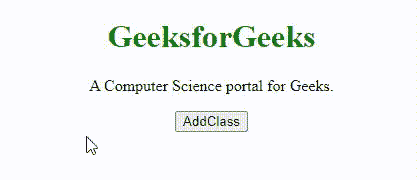
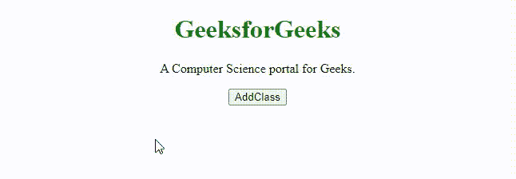

# 给元素添加类名的 JavaScript】

> 原文:[https://www . geesforgeks . org/JavaScript-向元素添加类名/](https://www.geeksforgeeks.org/javascript-adding-a-class-name-to-the-element/)

在本文中，我们将学习如何将**类名属性**添加到元素中，并通过示例了解实现。**类名属性**可以被 CSS 和 JavaScript 用来为具有指定类名的元素执行某些任务。使用 JavaScript 添加类名可以通过多种方式完成。

**使用。** [**类名属性**](https://www.geeksforgeeks.org/html-dom-classname-property/#:~:text=In%20the%20HTML%20document%2C%20the,Syntax%3A&text=Get%20hold%20of%20all%20the,Design%20for%20Beginners%20%7C%20HTML%20course.) **:** 该属性用于向所选元素添加类名。

**语法:**

它用于设置类名属性。

```
element.className += "newClass";
```

它用于返回类名属性。

```
element.className;
```

**属性值:**

*   **newClass** :指定元素的类名。对于应用多个类，需要用空格分隔。

**返回值:**为字符串类型，表示元素的类或类列表，用空格分隔。

**示例:**此示例使用。属性添加类名。

## 超文本标记语言

```
<!DOCTYPE html>
<html>

<head>
    <title>JavaScript to add class name</title>
    <style>
    .addCSS {
        color: green;
        font-size: 25px;
    }
    </style>
</head>

<body style="text-align:center;">
    <h1 style="color:green;"> 
        GeeksforGeeks 
    </h1>
    <p id="p"> A Computer Science portal for Geeks. </p>

    <button onclick="addClass()"> AddClass </button>

    <!-- Script to add class name -->
    <script>
    function addClass() {
        var v = document.getElementById("p");
        v.className += "addCSS";
    }
    </script>
</body>

</html>
```

**输出:**



。类名属性

**使用** [**。add()方法**](https://www.geeksforgeeks.org/how-to-add-a-class-to-dom-element-in-javascript/) **:** 此方法用于向所选元素添加类名。

**语法:**

```
element.classList.add("newClass");
```

**例:**本例使用。add()方法添加类名。

## 超文本标记语言

```
<!DOCTYPE html>
<html>

<head>
    <style>
    .addCSS {
        background-color: green;
        color: white;
        padding: 20px;
        font-size: 25px;
    }
    </style>
</head>

<body style="text-align:center;">
    <h1 style="color:green;"> 
        GeeksforGeeks 
    </h1>
    <p id="p"> A Computer Science portal for Geeks. </p>

    <button onclick="addClass()"> AddClass </button>

    <!-- Script to add class name -->
    <script>
    function addClass() {
        var elem = document.getElementById("p");
        elem.classList.add("addCSS");
    }
    </script>
</body>

</html>
```

**输出:**



。add()方法

**支持的浏览器:**

*   谷歌 Chrome 22.0
*   微软边缘 12.0
*   Internet Explorer 5.0
*   Firefox 1.0
*   Opera 8.0
*   Safari 1.0

JavaScript 最出名的是网页开发，但它也用于各种非浏览器环境。您可以通过以下 [JavaScript 教程](https://www.geeksforgeeks.org/javascript-tutorial/)和 [JavaScript 示例](https://www.geeksforgeeks.org/javascript-examples/)从头开始学习 JavaScript。